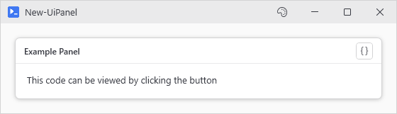
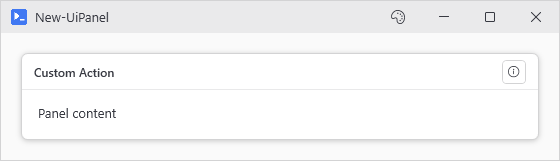
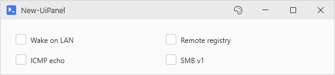

# New-UiPanel

## SYNOPSIS
Creates a panel container for organizing child controls.

## SYNTAX

```
New-UiPanel [-Content] <ScriptBlock> [[-Header] <String>] [[-Type] <String>] [[-LayoutStyle] <String>]
 [[-Orientation] <Orientation>] [-FullWidth] [[-MaxColumns] <Int32>] [[-HeaderAction] <Hashtable>]
 [-ShowSourceButton] [[-WPFProperties] <Hashtable>] [<CommonParameters>]
```

## DESCRIPTION
The workhorse container. Stacks children vertically or horizontally, or wraps them into responsive columns with -LayoutStyle Wrap (-MaxColumns caps the count). -Header puts it in a themed GroupBox. In a horizontal or wrapped row, buttons beside a labeled input line up with its box.

## EXAMPLES

### EXAMPLE 1
```
New-UiPanel -Header "Example Panel" -ShowSourceButton -Content {
    New-UiLabel -Text "This code can be viewed by clicking the button"
}
```

<p align="center"></p>

### EXAMPLE 2
```
New-UiPanel -Header "Custom Action" -HeaderAction (
    New-UiHeaderAction -Icon Info -Tooltip 'Show Help' -Action { Show-UiMessageDialog -Message 'Help text' }
) -Content {
    New-UiLabel -Text "Panel content"
}
```

The legacy hashtable form still works: -HeaderAction @{ Icon = 'Info'; Tooltip = 'Show Help'; Action = { ... } }

<p align="center"></p>

### EXAMPLE 3
```
# Wrap layout flows children into columns, capped at two here.
New-UiPanel -LayoutStyle Wrap -MaxColumns 2 -Content {
    New-UiToggle -Label 'Wake on LAN' -Variable 'wol'
    New-UiToggle -Label 'Remote registry' -Variable 'remoteReg'
    New-UiToggle -Label 'ICMP echo' -Variable 'icmp'
    New-UiToggle -Label 'SMB v1' -Variable 'smb1'
}
```

<p align="center"></p>

### EXAMPLE 4
```
New-UiPanel -Content { } -WPFProperties @{
    "Grid.Row" = 1
    "Grid.Column" = 2
}
```

## PARAMETERS

### -Content
ScriptBlock containing child controls to render inside the panel.

<details><summary>Type: ScriptBlock (required)</summary>

```yaml
Type: ScriptBlock
Parameter Sets: (All)
Aliases:

Required: True
Position: 1
Default value: None
Accept pipeline input: False
Accept wildcard characters: False
```

</details>

### -Header
Optional header text. Wraps the panel in a themed GroupBox when set.

<details><summary>Type: String (optional)</summary>

```yaml
Type: String
Parameter Sets: (All)
Aliases:

Required: False
Position: 2
Default value: None
Accept pipeline input: False
Accept wildcard characters: False
```

</details>

### -Type
Container type: Stack (default), Tab, or Wrap.

<details><summary>Type: String (optional)</summary>

```yaml
Type: String
Parameter Sets: (All)
Aliases:

Required: False
Position: 3
Default value: Stack
Accept pipeline input: False
Accept wildcard characters: False
```

</details>

### -LayoutStyle
Child layout mode: Stack (default) or Wrap.

<details><summary>Type: String (optional)</summary>

```yaml
Type: String
Parameter Sets: (All)
Aliases:

Required: False
Position: 4
Default value: Stack
Accept pipeline input: False
Accept wildcard characters: False
```

</details>

### -Orientation
Stack direction when Type is Stack. Defaults to Vertical.

<details><summary>Type: Orientation (optional)</summary>

```yaml
Type: Orientation
Parameter Sets: (All)
Aliases:
Accepted values: Horizontal, Vertical

Required: False
Position: 5
Default value: Vertical
Accept pipeline input: False
Accept wildcard characters: False
```

</details>

### -FullWidth
Forces the panel to take full width in WrapPanel layouts.

<details><summary>Type: SwitchParameter (optional)</summary>

```yaml
Type: SwitchParameter
Parameter Sets: (All)
Aliases:

Required: False
Position: Named
Default value: False
Accept pipeline input: False
Accept wildcard characters: False
```

</details>

### -MaxColumns
Maximum responsive columns for Wrap layout (1-4). Children resize automatically.

<details><summary>Type: Int32 (optional)</summary>

```yaml
Type: Int32
Parameter Sets: (All)
Aliases:

Required: False
Position: 6
Default value: 0
Accept pipeline input: False
Accept wildcard characters: False
```

</details>

### -HeaderAction
Optional action button in the panel header. Requires -Header to be set. Pass New-UiHeaderAction output, or the legacy hashtable containing: Icon (string), Tooltip (string), Action (scriptblock).

<details><summary>Type: Hashtable (optional)</summary>

```yaml
Type: Hashtable
Parameter Sets: (All)
Aliases:

Required: False
Position: 7
Default value: None
Accept pipeline input: False
Accept wildcard characters: False
```

</details>

### -ShowSourceButton
When used with -Header, automatically adds a "View Source Code" button that displays the Content scriptblock in a PowerShell-styled dialog.

<details><summary>Type: SwitchParameter (optional)</summary>

```yaml
Type: SwitchParameter
Parameter Sets: (All)
Aliases:

Required: False
Position: Named
Default value: False
Accept pipeline input: False
Accept wildcard characters: False
```

</details>

### -WPFProperties
Hashtable of additional WPF properties to set on the control. Allows setting any valid WPF property not explicitly exposed as a parameter. Bad values warn and get skipped. A property name that does not exist on the control is skipped silently (-Verbose shows it). Nothing stops execution. Supports attached properties using dot notation (e.g., "Grid.Row").

<details><summary>Type: Hashtable (optional)</summary>

```yaml
Type: Hashtable
Parameter Sets: (All)
Aliases:

Required: False
Position: 8
Default value: None
Accept pipeline input: False
Accept wildcard characters: False
```

</details>

### CommonParameters
This cmdlet supports the common parameters: -Debug, -ErrorAction, -ErrorVariable, -InformationAction, -InformationVariable, -OutVariable, -OutBuffer, -PipelineVariable, -Verbose, -WarningAction, and -WarningVariable. For more information, see [about_CommonParameters](http://go.microsoft.com/fwlink/?LinkID=113216).

## INPUTS

## OUTPUTS

## NOTES

## RELATED LINKS
