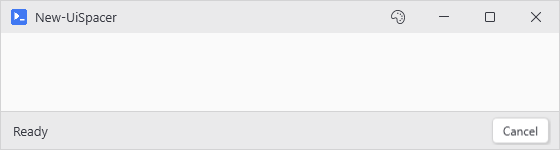
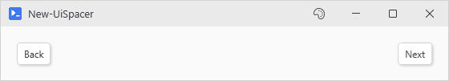

# New-UiSpacer

## SYNOPSIS
Creates a transparent spacer that fills remaining space in the current parent.

## SYNTAX

```
New-UiSpacer [<CommonParameters>]
```

## DESCRIPTION
A layout helper that consumes available space, pushing the controls around it apart. It needs a parent that actually hands out leftover room: a star sized New-UiGrid cell or a DockPanel. A plain stacking panel gives children only the space they ask for, so a spacer there collapses to nothing.

In a DockPanel with LastChildFill = true, add as the last child (no dock) to fill the gap between left- and right-docked controls.

In a StatusBar (which uses a DockPanel internally), drop New-UiSpacer between left content and right content.

## EXAMPLES

### EXAMPLE 1
```
# Push Cancel button to the right side of a status bar
New-UiStatusBar -Content {
    New-UiLabel -Text 'Ready'
    New-UiSpacer
    New-UiButton -Text 'Cancel' -NoOutput -Action { }
}
# Result: [Ready                        Cancel]
```

<p align="center"></p>

### EXAMPLE 2
```
# Push Back and Next to opposite edges of the row
New-UiGrid -Columns 'Auto, *, Auto' -Content {
    New-UiButton -Text 'Back' -Action { }
    New-UiSpacer
    New-UiButton -Text 'Next' -Action { }
}
```

<p align="center"></p>

## PARAMETERS

### CommonParameters
This cmdlet supports the common parameters: -Debug, -ErrorAction, -ErrorVariable, -InformationAction, -InformationVariable, -OutVariable, -OutBuffer, -PipelineVariable, -Verbose, -WarningAction, and -WarningVariable. For more information, see [about_CommonParameters](http://go.microsoft.com/fwlink/?LinkID=113216).

## INPUTS

## OUTPUTS

## NOTES

## RELATED LINKS
