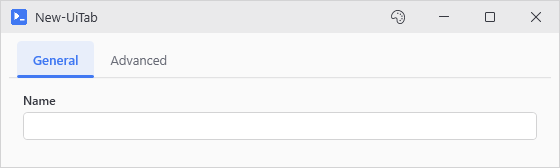
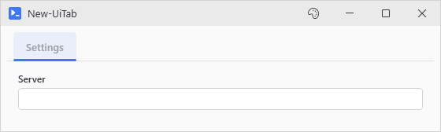
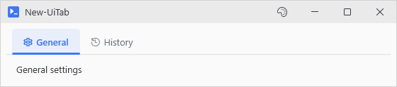

# New-UiTab

<p align="center"></p>

## SYNOPSIS
Creates a tab with an optional header icon. Content scrolls if it overflows.

## SYNTAX

```
New-UiTab [-Header] <String> [-Content] <ScriptBlock> [[-EnabledWhen] <Object>] [[-WPFProperties] <Hashtable>]
 [-Icon <String>] [<CommonParameters>]
```

## DESCRIPTION
Tabs declared at the same level share one TabControl, so a window becomes tabbed just by listing New-UiTab blocks in its Content. -EnabledWhen gates a tab until another control or captured variable turns truthy (locking later tabs until a connection exists, say).

## EXAMPLES

### EXAMPLE 1
```
New-UiTab -Header "Settings" -EnabledWhen 'isConnected' -Content {
    New-UiInput -Label "Server" -Variable "server"
}
```

Creates a tab that is disabled until the 'isConnected' variable is truthy.

<p align="center"></p>

### EXAMPLE 2
```
# Tabs listed together share one TabControl. -Icon puts a glyph on the header
New-UiTab -Header 'General' -Icon 'Settings' -Content {
    New-UiLabel -Text 'General settings'
}
New-UiTab -Header 'History' -Icon 'History' -Content {
    New-UiLabel -Text 'Run history'
}
```

<p align="center"></p>

## PARAMETERS

### -Header
The text label displayed on the tab header.

<details><summary>Type: String (required)</summary>

```yaml
Type: String
Parameter Sets: (All)
Aliases:

Required: True
Position: 1
Default value: None
Accept pipeline input: False
Accept wildcard characters: False
```

</details>

### -Content
ScriptBlock containing the tab's child controls.

<details><summary>Type: ScriptBlock (required)</summary>

```yaml
Type: ScriptBlock
Parameter Sets: (All)
Aliases:

Required: True
Position: 2
Default value: None
Accept pipeline input: False
Accept wildcard characters: False
```

</details>

### -EnabledWhen
Control name, session variable name, or scriptblock. Truthy enables the tab, falsy disables it. Control references ('showAdvanced') and -Capture variables ('VCSAConnection') both work. A scriptblock re-evaluates whenever the controls it names change: { $serverName -and $environment } needs both. A scriptblock reads controls only, never -Capture variables.

<details><summary>Type: Object (optional)</summary>

```yaml
Type: Object
Parameter Sets: (All)
Aliases:

Required: False
Position: 3
Default value: None
Accept pipeline input: False
Accept wildcard characters: False
```

</details>

### -WPFProperties
Hashtable of additional WPF properties to set on the control. Allows setting any valid WPF property not explicitly exposed as a parameter. Bad values warn and get skipped. A property name that does not exist on the control is skipped silently (-Verbose shows it). Nothing stops execution. Supports attached properties using dot notation (e.g., "Grid.Row").

<details><summary>Type: Hashtable (optional)</summary>

```yaml
Type: Hashtable
Parameter Sets: (All)
Aliases:

Required: False
Position: 4
Default value: None
Accept pipeline input: False
Accept wildcard characters: False
```

</details>

### -Icon
Optional icon name shown on the tab header. Use Show-UiGlyphBrowser to browse names.

<details><summary>Type: String (optional)</summary>

```yaml
Type: String
Parameter Sets: (All)
Aliases:

Required: False
Position: Named
Default value: None
Accept pipeline input: False
Accept wildcard characters: False
```

</details>

### CommonParameters
This cmdlet supports the common parameters: -Debug, -ErrorAction, -ErrorVariable, -InformationAction, -InformationVariable, -OutVariable, -OutBuffer, -PipelineVariable, -Verbose, -WarningAction, and -WarningVariable. For more information, see [about_CommonParameters](http://go.microsoft.com/fwlink/?LinkID=113216).

## INPUTS

## OUTPUTS

## NOTES

## RELATED LINKS
