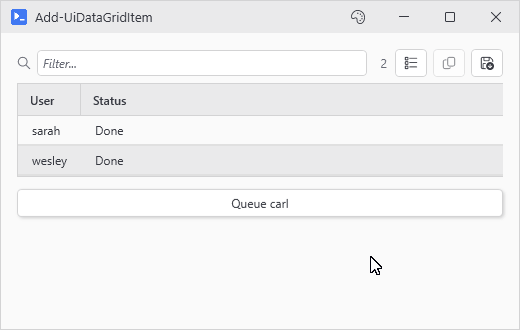

# Add-UiDataGridItem

## SYNOPSIS
Appends a row to a New-UiDataGrid.

## SYNTAX

```
Add-UiDataGridItem [-Variable] <String> [-Item] <Object> [-PassThru]
 [<CommonParameters>]
```

## DESCRIPTION
Appends a row to the grid identified by -Variable. Works on both -Items grids (PsUi owns the collection) and -ItemsSource grids (PsUi shares your collection). Hashtables convert to PSCustomObject. PowerShell added properties (Process.Company, Service.DisplayName, etc.) stay visible. Filter and sort apply to the new row.

## EXAMPLES

### EXAMPLE 1
```
Add-UiDataGridItem -Variable queue -Item @{ User='carl'; Status='Pending' }
```

<p align="center"></p>

### EXAMPLE 2
```
$row = Add-UiDataGridItem -Variable queue -Item $entry -PassThru
$row.Status = 'Done'   # updates the object - set the grid again to show the change
```

## PARAMETERS

### -Variable
The -Variable name passed to the originating New-UiDataGrid.

<details><summary>Type: String (required)</summary>

```yaml
Type: String
Parameter Sets: (All)
Aliases:

Required: True
Position: 1
Default value: None
Accept pipeline input: False
Accept wildcard characters: False
```

</details>

### -Item
The row object to append. Hashtables get converted to PSCustomObject. Everything else is added as is.

<details><summary>Type: Object (required)</summary>

```yaml
Type: Object
Parameter Sets: (All)
Aliases:

Required: True
Position: 2
Default value: None
Accept pipeline input: False
Accept wildcard characters: False
```

</details>

### -PassThru
Return the row as it shows up. On -Items grids that's the copy PsUi displays. On -ItemsSource grids it's the object you passed in (hashtables come back as the converted PSCustomObject). Changing a property on the returned row won't refresh the cell by itself, PSCustomObject rows raise no change notifications, so rerun Set-UiDataGridItems (or remove and add it again) to show the new value.

<details><summary>Type: SwitchParameter (optional)</summary>

```yaml
Type: SwitchParameter
Parameter Sets: (All)
Aliases:

Required: False
Position: Named
Default value: False
Accept pipeline input: False
Accept wildcard characters: False
```

</details>

### CommonParameters
This cmdlet supports the common parameters: -Debug, -ErrorAction, -ErrorVariable, -InformationAction, -InformationVariable, -OutVariable, -OutBuffer, -PipelineVariable, -Verbose, -WarningAction, and -WarningVariable. For more information, see [about_CommonParameters](http://go.microsoft.com/fwlink/?LinkID=113216).

## INPUTS

## OUTPUTS

## NOTES

## RELATED LINKS
