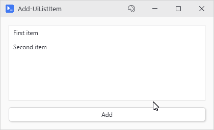
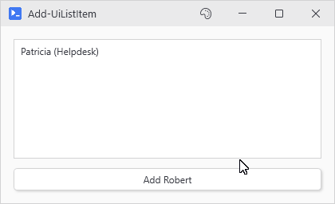

# Add-UiListItem

## SYNOPSIS
Adds an item to a list or dropdown.

## SYNTAX

```
Add-UiListItem [-Variable] <String> [-Item] <Object> [<CommonParameters>]
```

## DESCRIPTION
Adds an item to a list. If the list has a -DisplayFormat and you pass a hashtable, the display text is automatically generated. No need to manually create PSCustomObjects.

## EXAMPLES

### EXAMPLE 1
```
Add-UiListItem 'myList' 'Simple string item'
```

<p align="center"></p>

### EXAMPLE 2
```
# With a list that has -DisplayFormat "{Name} ({Role})"
Add-UiListItem 'userQueue' @{ Name = 'Robert'; Role = 'Admin'; Email = 'robert@example.com' }
# Displays as "Robert (Admin)" but full object is available when selected
```

<p align="center"></p>

## PARAMETERS

### -Variable
The -Variable name of the list or dropdown.

<details><summary>Type: String (required)</summary>

```yaml
Type: String
Parameter Sets: (All)
Aliases:

Required: True
Position: 1
Default value: None
Accept pipeline input: False
Accept wildcard characters: False
```

</details>

### -Item
The item to add. Can be a string, hashtable, or PSCustomObject. Hashtables are converted to objects automatically.

<details><summary>Type: Object (required)</summary>

```yaml
Type: Object
Parameter Sets: (All)
Aliases:

Required: True
Position: 2
Default value: None
Accept pipeline input: False
Accept wildcard characters: False
```

</details>

### CommonParameters
This cmdlet supports the common parameters: -Debug, -ErrorAction, -ErrorVariable, -InformationAction, -InformationVariable, -OutVariable, -OutBuffer, -PipelineVariable, -Verbose, -WarningAction, and -WarningVariable. For more information, see [about_CommonParameters](http://go.microsoft.com/fwlink/?LinkID=113216).

## INPUTS

## OUTPUTS

## NOTES

## RELATED LINKS
