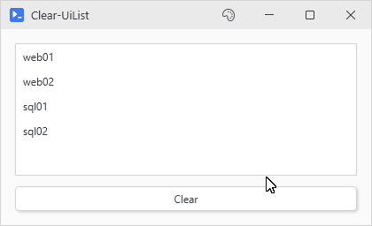

# Clear-UiList

## SYNOPSIS
Clears all items from a list or dropdown.

## SYNTAX

```
Clear-UiList [-Variable] <String> [<CommonParameters>]
```

## DESCRIPTION
On a list built with -ItemsSource this empties your own collection, not a copy of it. Rebuild with Add-UiListItem.

## EXAMPLES

### EXAMPLE 1
```
Clear-UiList 'myList'
```

<p align="center"></p>

## PARAMETERS

### -Variable
The -Variable name of the list or dropdown.

<details><summary>Type: String (required)</summary>

```yaml
Type: String
Parameter Sets: (All)
Aliases:

Required: True
Position: 1
Default value: None
Accept pipeline input: False
Accept wildcard characters: False
```

</details>

### CommonParameters
This cmdlet supports the common parameters: -Debug, -ErrorAction, -ErrorVariable, -InformationAction, -InformationVariable, -OutVariable, -OutBuffer, -PipelineVariable, -Verbose, -WarningAction, and -WarningVariable. For more information, see [about_CommonParameters](http://go.microsoft.com/fwlink/?LinkID=113216).

## INPUTS

## OUTPUTS

## NOTES

## RELATED LINKS
