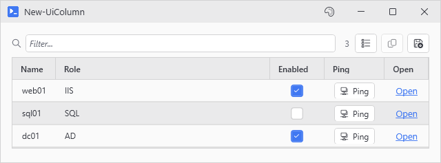
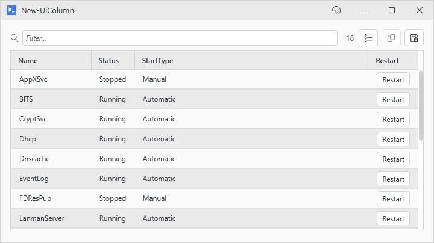
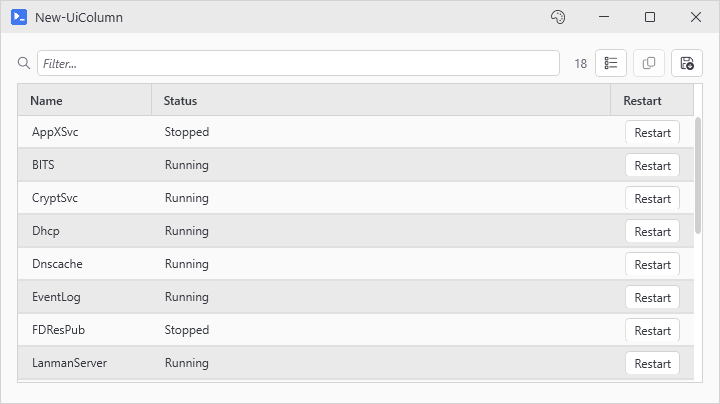
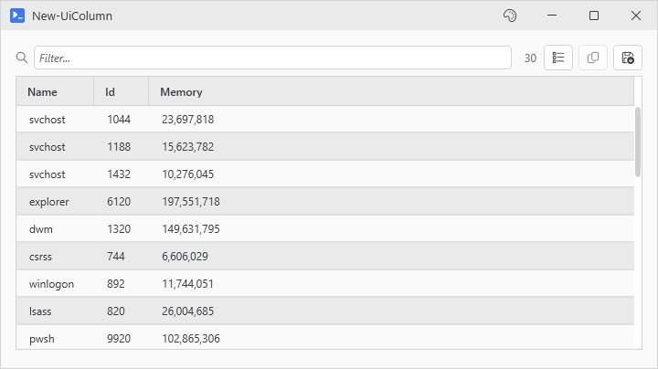

# New-UiColumn

<p align="center"></p>

## SYNOPSIS
Defines one column for New-UiDataGrid -Columns.

## SYNTAX

```
New-UiColumn [[-Name] <String>] [-Type <String>] [-Header <String>] [-Width <Object>] [-MinWidth <Int32>]
 [-Format <String>] [-ReadOnly] [-Editable <Object>] [-EditorType <String>] [-Choices <Object[]>]
 [-Validator <ScriptBlock>] [-Action <ScriptBlock>] [-OnChange <ScriptBlock>] [-Binding <String>]
 [-Text <String>] [-Url <String>] [-AllowFileScheme] [-NoAsync]
 [-Icon <String>] [<CommonParameters>]
```

## DESCRIPTION
Builder for the -Columns parameter on New-UiDataGrid. Covers all four column kinds: Text (the default, reads a row property), Button, Toggle, and Link. Pass the calls inside a scriptblock or an array; column order follows call order, and plain property-name strings still work alongside builder calls. Emits a definition object only - it does not add anything to the window.

Equivalent to the column hashtable form (@{ Name; Header; Type; ... }), which -Columns still accepts.

## EXAMPLES

### EXAMPLE 1
```
New-UiDataGrid -Variable 'svc' -Items (Get-Service) -Editable -Columns {
    New-UiColumn Name -ReadOnly
    New-UiColumn Status -Editable $true
    New-UiColumn StartType -Editable $true -EditorType ComboBox -Choices 'Automatic', 'Manual', 'Disabled'
    New-UiColumn -Header 'Restart' -Type Button -Text 'Restart' -Action { Restart-Service $_.Name }
}
```

<p align="center"></p>

### EXAMPLE 2
```
# Legacy hashtable form, still supported
New-UiDataGrid -Variable 'svc' -Items (Get-Service) -Editable -Columns @(
    @{ Name = 'Name'; ReadOnly = $true }
    @{ Name = 'Status'; Editable = $true }
    @{ Header = 'Restart'; Type = 'Button'; Text = 'Restart'; Action = { Restart-Service $_.Name } }
)
```

<p align="center"></p>

### EXAMPLE 3
```
# Builder calls and plain property-name strings mix freely
New-UiDataGrid -Variable 'proc' -Items (Get-Process) -Columns @(
    'Name'
    'Id'
    (New-UiColumn WorkingSet -Header 'Memory' -Format '{0:N0}')
)
```

<p align="center"></p>

## PARAMETERS

### -Name
Row property this column binds to. Text columns need it; Button, Toggle, and Link columns can run on -Header alone.

<details><summary>Type: String (optional)</summary>

```yaml
Type: String
Parameter Sets: (All)
Aliases:

Required: False
Position: 1
Default value: None
Accept pipeline input: False
Accept wildcard characters: False
```

</details>

### -Type
Column kind: Text (default), Button, Toggle, or Link.

<details><summary>Type: String (optional)</summary>

```yaml
Type: String
Parameter Sets: (All)
Aliases:

Required: False
Position: Named
Default value: None
Accept pipeline input: False
Accept wildcard characters: False
```

</details>

### -Header
Column header text. Defaults to -Name.

<details><summary>Type: String (optional)</summary>

```yaml
Type: String
Parameter Sets: (All)
Aliases:

Required: False
Position: Named
Default value: None
Accept pipeline input: False
Accept wildcard characters: False
```

</details>

### -Width
Column width: a number, 'Auto', 'Star', `'*'`, or star notation like `'2*'`.

<details><summary>Type: Object (optional)</summary>

```yaml
Type: Object
Parameter Sets: (All)
Aliases:

Required: False
Position: Named
Default value: None
Accept pipeline input: False
Accept wildcard characters: False
```

</details>

### -MinWidth
Minimum width in pixels. Overrides the computed floor.

<details><summary>Type: Int32 (optional)</summary>

```yaml
Type: Int32
Parameter Sets: (All)
Aliases:

Required: False
Position: Named
Default value: 0
Accept pipeline input: False
Accept wildcard characters: False
```

</details>

### -Format
StringFormat for the cell text, e.g. '{0:N2}' or '{0:yyyy-MM-dd}'.

<details><summary>Type: String (optional)</summary>

```yaml
Type: String
Parameter Sets: (All)
Aliases:

Required: False
Position: Named
Default value: None
Accept pipeline input: False
Accept wildcard characters: False
```

</details>

### -ReadOnly
Lock the column even when the grid is -Editable.

<details><summary>Type: SwitchParameter (optional)</summary>

```yaml
Type: SwitchParameter
Parameter Sets: (All)
Aliases:

Required: False
Position: Named
Default value: False
Accept pipeline input: False
Accept wildcard characters: False
```

</details>

### -Editable
Per-column edit rule: $true/$false, a row property name, or a scriptblock probed per cell with $_ bound to the row.

<details><summary>Type: Object (optional)</summary>

```yaml
Type: Object
Parameter Sets: (All)
Aliases:

Required: False
Position: Named
Default value: None
Accept pipeline input: False
Accept wildcard characters: False
```

</details>

### -EditorType
Editor used when the cell enters edit mode: Auto (default), Text, CheckBox, ComboBox, or DatePicker.

<details><summary>Type: String (optional)</summary>

```yaml
Type: String
Parameter Sets: (All)
Aliases:

Required: False
Position: Named
Default value: None
Accept pipeline input: False
Accept wildcard characters: False
```

</details>

### -Choices
ComboBox editor items, plain values. Omitted on an enum property, the enum's own values fill the list.

<details><summary>Type: Object[] (optional)</summary>

```yaml
Type: Object[]
Parameter Sets: (All)
Aliases:

Required: False
Position: Named
Default value: None
Accept pipeline input: False
Accept wildcard characters: False
```

</details>

### -Validator
Scriptblock run before an edit commits: param($newValue, $row), return $false to reject and roll the cell back.

<details><summary>Type: ScriptBlock (optional)</summary>

```yaml
Type: ScriptBlock
Parameter Sets: (All)
Aliases:

Required: False
Position: Named
Default value: None
Accept pipeline input: False
Accept wildcard characters: False
```

</details>

### -Action
Click scriptblock for Button and Link columns. $_ is the row.

<details><summary>Type: ScriptBlock (optional)</summary>

```yaml
Type: ScriptBlock
Parameter Sets: (All)
Aliases:

Required: False
Position: Named
Default value: None
Accept pipeline input: False
Accept wildcard characters: False
```

</details>

### -OnChange
Scriptblock for Toggle columns, run after the checkbox flips: param($row, $checked).

<details><summary>Type: ScriptBlock (optional)</summary>

```yaml
Type: ScriptBlock
Parameter Sets: (All)
Aliases:

Required: False
Position: Named
Default value: None
Accept pipeline input: False
Accept wildcard characters: False
```

</details>

### -Binding
Row property backing the cell control. Required for Toggle (the bool the checkbox reads and writes); optional label binding for Button and Link.

<details><summary>Type: String (optional)</summary>

```yaml
Type: String
Parameter Sets: (All)
Aliases:

Required: False
Position: Named
Default value: None
Accept pipeline input: False
Accept wildcard characters: False
```

</details>

### -Text
Static label for Button and Link cells. -Binding wins over it when both are set.

<details><summary>Type: String (optional)</summary>

```yaml
Type: String
Parameter Sets: (All)
Aliases:

Required: False
Position: Named
Default value: None
Accept pipeline input: False
Accept wildcard characters: False
```

</details>

### -Url
Link target with {PropertyName} row substitution, e.g. 'https://{Host}/status'.

<details><summary>Type: String (optional)</summary>

```yaml
Type: String
Parameter Sets: (All)
Aliases:

Required: False
Position: Named
Default value: None
Accept pipeline input: False
Accept wildcard characters: False
```

</details>

### -AllowFileScheme
Let Link columns open file: URLs. Without it only http, https, mailto, and tel pass.

<details><summary>Type: SwitchParameter (optional)</summary>

```yaml
Type: SwitchParameter
Parameter Sets: (All)
Aliases:

Required: False
Position: Named
Default value: False
Accept pipeline input: False
Accept wildcard characters: False
```

</details>

### -NoAsync
Run -Action on the UI thread instead of a background runspace. Accepts -Sync, the name this switch had before.

<details><summary>Type: SwitchParameter (optional)</summary>

```yaml
Type: SwitchParameter
Parameter Sets: (All)
Aliases: Sync

Required: False
Position: Named
Default value: False
Accept pipeline input: False
Accept wildcard characters: False
```

</details>

### -Icon
Icon name for Button cells. Tab completion lists the valid names.

<details><summary>Type: String (optional)</summary>

```yaml
Type: String
Parameter Sets: (All)
Aliases:

Required: False
Position: Named
Default value: None
Accept pipeline input: False
Accept wildcard characters: False
```

</details>

### CommonParameters
This cmdlet supports the common parameters: -Debug, -ErrorAction, -ErrorVariable, -InformationAction, -InformationVariable, -OutVariable, -OutBuffer, -PipelineVariable, -Verbose, -WarningAction, and -WarningVariable. For more information, see [about_CommonParameters](http://go.microsoft.com/fwlink/?LinkID=113216).

## INPUTS

## OUTPUTS

## NOTES

## RELATED LINKS
