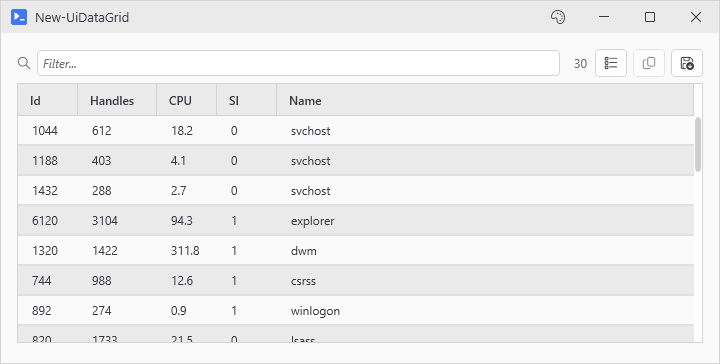
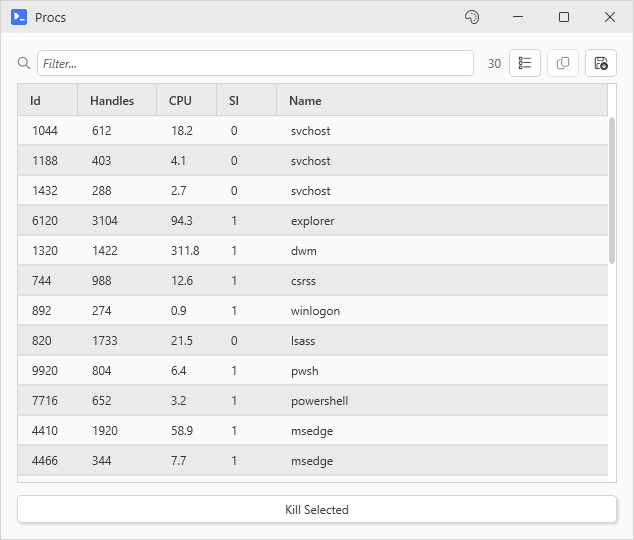
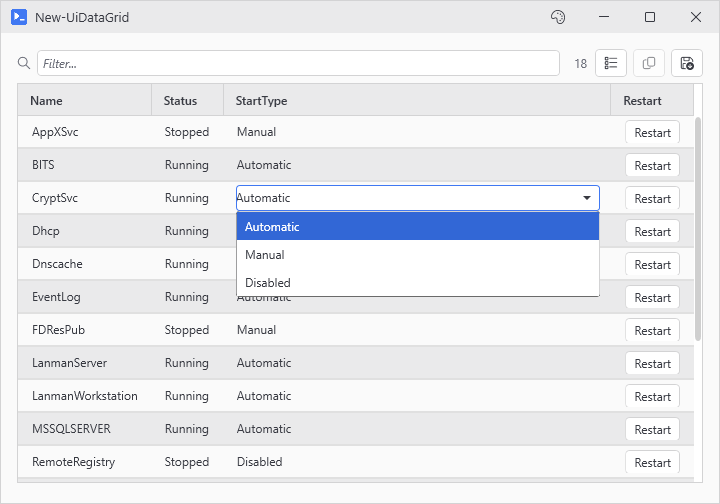
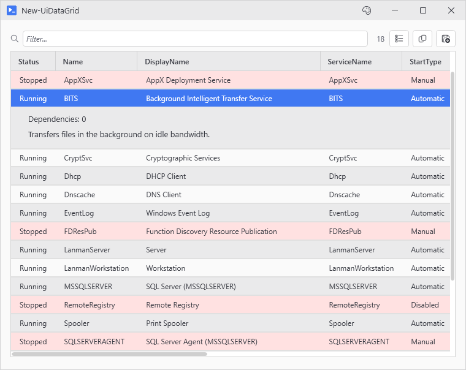
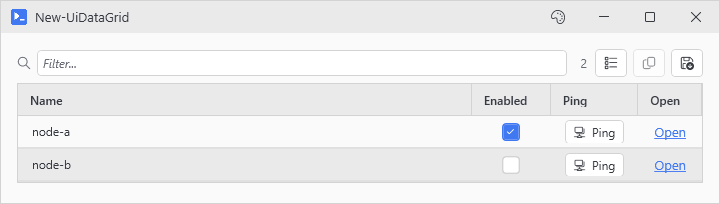
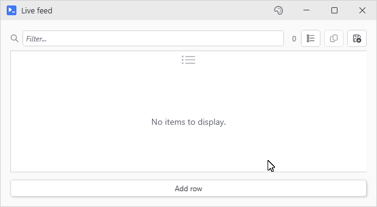
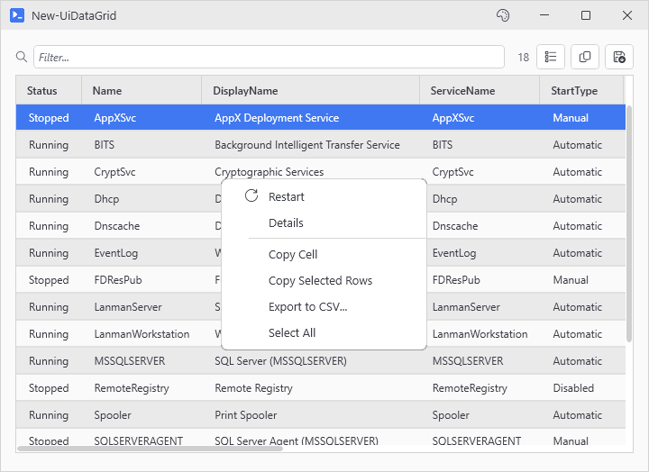
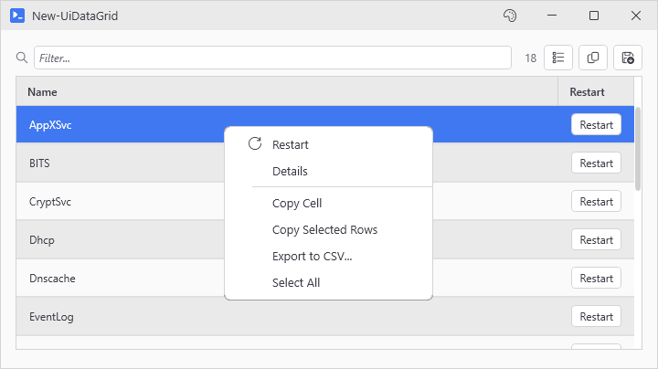

# New-UiDataGrid

<p align="center"></p>

## SYNOPSIS
Themed datagrid. Drops inside a New-UiWindow next to other controls.

## SYNTAX

```
New-UiDataGrid [-Variable] <String> [[-Items] <Object[]>] [[-ItemsSource] <Object>] [[-Columns] <Object>]
 [[-Height] <Int32>] [[-Width] <Int32>] [-FullWidth] [-Fill] [[-MaxFillHeight] <Double>]
 [[-MinFillHeight] <Double>] [[-SelectionMode] <String>] [-DefaultPropertiesOnly] [-HideEmptyColumns]
 [-NoArrayPopup] [-NoDictionaryPopup] [-NoSafeWrap] [-NoBind] [-Editable] [[-OnCellEdit] <ScriptBlock>]
 [[-OnRowEdit] <ScriptBlock>] [-NoToolbar] [-NoFilter] [-NoExport] [-NoCopy] [-NoSort] [-NoContextMenu]
 [-NoColumnPicker] [-NoStretchLastColumn] [-NoVisualValues] [-NoMarkEmptyCells] [-CaptureScrollWheel]
 [[-OnSelectionChanged] <ScriptBlock>] [[-OnDoubleClick] <ScriptBlock>] [[-EnabledWhen] <Object>]
 [[-WPFProperties] <Hashtable>] [[-RowDetailsTemplate] <ScriptBlock>] [[-RowBackground] <ScriptBlock>]
 [[-FrozenColumns] <Int32>] [[-EmptyMessage] <String>] [-NoAlternatingRowBrush] [[-DefaultSort] <Object>]
 [[-RowHeight] <Double>] [[-RowContextMenu] <Object>] [-SanitizeFormulas] [[-ScrollWheel] <String>]
 [<CommonParameters>]
```

## DESCRIPTION
Drop a grid into a window, get the selected rows back in a button action via -Variable hydration. Columns auto-generate from the first row's properties, or specify them explicitly with -Columns.

Cells can be text, checkbox, dropdown, date picker, or button/checkbox/link controls. OnCellEdit / OnRowEdit callbacks run when edits commit.

A toolbar with basic filter, copy, export, and column picker is on by default, opt out of any with the matching -No* switch.

Replace, append, or clear rows from a button action with Set-/Add-/Clear-UiDataGridItems.

## EXAMPLES

### EXAMPLE 1
```
New-UiWindow -Title 'Procs' -Content {
    Get-Process | New-UiDataGrid -Variable procs -Height 400 -DefaultPropertiesOnly
    New-UiButton -Text 'Kill Selected' -Action {
        foreach ($p in $procs) { Stop-Process -Id $p.Id }
    }
}
```

<p align="center"></p>

### EXAMPLE 2
```
# Editable grid with mixed cell types
New-UiDataGrid -Variable svc -Items (Get-Service) -Editable -Columns {
    New-UiColumn Name -ReadOnly
    New-UiColumn Status -Editable $true
    New-UiColumn StartType -Editable $true -EditorType ComboBox -Choices 'Automatic', 'Manual', 'Disabled'
    New-UiColumn -Header 'Restart' -Type Button -Text 'Restart' -Action { Restart-Service $_.Name }
} -OnCellEdit {
    param($row, $col, $new, $old)
    Write-Host "$($row.Name): $col $old -> $new"
}
```

<p align="center"></p>

### EXAMPLE 3
```
# Row details with conditional row coloring
$gridParams = @{
    Variable           = 'svc'
    Items              = Get-Service
    Height             = 500
    RowBackground      = { if ($_.Status -eq 'Stopped') { '#33FF6B6B' } }
    RowDetailsTemplate = {
        New-UiLabel -Text "Dependencies: $($_.DependentServices.Count)"
        New-UiLabel -Text $_.Description
    }
}
New-UiDataGrid @gridParams
```

<p align="center"></p>

### EXAMPLE 4
```
# Controls that live in a cell are Toggle (two way), Button (per row) and Link (a clickable URL).
$rows = @(
    [pscustomobject]@{ Name='node-a'; Online=$true;  Url='https://node-a.local' }
    [pscustomobject]@{ Name='node-b'; Online=$false; Url='https://node-b.local' }
)
New-UiDataGrid -Variable nodes -Items $rows -Editable -Columns {
    New-UiColumn Name -ReadOnly
    New-UiColumn -Header 'Enabled' -Type Toggle -Binding Online -OnChange { Write-Host "$($_.Name) -> $($_.Online)" }
    New-UiColumn -Header 'Ping' -Type Button -Text 'Ping' -Icon NetworkAdapter -Action { Test-Connection $_.Name -Count 1 }
    New-UiColumn -Header 'Open' -Type Link -Text 'Open' -Url '{Url}'
}
```

<p align="center"></p>

### EXAMPLE 5
```
# Live updates via -ItemsSource. A plain ArrayList works because PsUi binds $rows to
# the wrap - $rows after the call IS the threadsafe list, so $rows.Add() from
# a button action lands in the grid without ceremony.
$rows = [System.Collections.ArrayList]::new()
New-UiWindow -Title 'Live feed' -Content {
    New-UiDataGrid -Variable feed -ItemsSource $rows -Fill
    New-UiButton -Text 'Add row' -NoOutput -Action {
        [void]$rows.Add([pscustomobject]@{ Time = Get-Date; Value = Get-Random })
    }
}
```

<p align="center"></p>

### EXAMPLE 6
```
# Right-click actions per row
New-UiDataGrid -Variable svc -Items (Get-Service) -RowContextMenu {
    New-UiMenuItem 'Restart' -Icon Refresh -Action { Restart-Service $_.Name } -Enabled { $_.Status -eq 'Stopped' }
    New-UiMenuItem 'Details' -NoAsync -Action { Show-UiMessageDialog -Message ($_ | Format-List | Out-String) }
}
```

<p align="center"></p>

### EXAMPLE 7
```
# Legacy hashtable forms (still supported), columns and menu items alike
New-UiDataGrid -Variable svc -Items (Get-Service) -Columns @(
    @{ Name='Name'; ReadOnly=$true }
    @{ Header='Restart'; Type='Button'; Text='Restart'; Action={ Restart-Service $_.Name } }
) -RowContextMenu ([ordered]@{
    'Restart' = @{ Action = { Restart-Service $_.Name }; Icon = 'Refresh'; Enabled = { $_.Status -eq 'Stopped' } }
    'Details' = @{ Action = { Show-UiMessageDialog -Message ($_ | Format-List | Out-String) }; NoAsync = $true }
})
```

<p align="center"></p>

## PARAMETERS

### -Variable
Hydration name. The selected rows show up as $varName in button actions, and the Set-/Add-/Clear-UiDataGridItems helpers look the grid up by this name.

<details><summary>Type: String (required)</summary>

```yaml
Type: String
Parameter Sets: (All)
Aliases:

Required: True
Position: 1
Default value: None
Accept pipeline input: False
Accept wildcard characters: False
```

</details>

### -Items
Row objects to show. Take from the pipeline or pass directly. Can't be combined with -ItemsSource.

<details><summary>Type: Object[] (optional)</summary>

```yaml
Type: Object[]
Parameter Sets: (All)
Aliases:

Required: False
Position: 2
Default value: None
Accept pipeline input: True (ByValue)
Accept wildcard characters: False
```

</details>

### -ItemsSource
Point the grid at a collection you own. After the call, $list.Add() from anywhere lands in the grid, whether from a button action or the console. Accepted inputs:
  - any of the usual list types: array, ArrayList, List\<T>, ObservableCollection, the PsUi async collection. Everything except the async collection gets wrapped, and PsUi walks the calling scope to repoint every variable holding the original at the wrap. The async collection already is the wrap, so it binds as is.
  - \[ref] to any of the above

The variable bind can't reach:
  - a collection held by a property: $obj.Items
  - a collection held inside a hashtable or dictionary: $state.list
  - a collection passed as a literal expression: -ItemsSource (Get-Thing)
  - a variable rebound to a different value after the call: $list = Get-Process
  - a variable captured by a closure built before the call

In all of those the grid still binds, but you have no handle. Use a local variable, or pass an ObservableCollection, which the grid follows wherever it lives. A \[ref] helps only when it points at a variable: a \[ref] built from a property or a hashtable entry fills the holder and leaves the original where it was, and the grid warns when it spots one. Can't be combined with -Items.

<details><summary>Type: Object (optional)</summary>

```yaml
Type: Object
Parameter Sets: (All)
Aliases:

Required: False
Position: 3
Default value: None
Accept pipeline input: False
Accept wildcard characters: False
```

</details>

### -Columns
How to lay out columns. Three options:
  - omit it: auto-generate from the first row
  - string\[]: limit auto-generated columns to these property names, in this order
  - full control: a { New-UiColumn ... } definition block, an array of New-UiColumn output, or the equivalent hashtables. Each column can set Name, Header, Width, Format, ReadOnly, Editable ($true/$false/scriptblock/property name), EditorType (Auto/Text/CheckBox/ComboBox/DatePicker), Choices, Validator, plus Type=Button/Toggle/Link for live controls in the cell (with Text, Icon, Action, Binding, OnChange, Url as needed). Button and Link actions run in a background runspace by default; -NoAsync (or NoAsync = $true in the hashtable form) keeps one on the UI thread (dialogs or clipboard work). Link cells default to http/https/mailto/tel schemes only; -AllowFileScheme permits file: URLs (off by default because {Prop} substitution into a file: template lets row content launch arbitrary executables). Property-name strings and full column definitions mix in one array.

<details><summary>Type: Object (optional)</summary>

```yaml
Type: Object
Parameter Sets: (All)
Aliases:

Required: False
Position: 4
Default value: None
Accept pipeline input: False
Accept wildcard characters: False
```

</details>

### -Height
Height cap in pixels. Defaults to 300. The grid scrolls internally once row count pushes past it. Pass -Fill to lift the cap and grow with the window.

<details><summary>Type: Int32 (optional)</summary>

```yaml
Type: Int32
Parameter Sets: (All)
Aliases:

Required: False
Position: 5
Default value: 300
Accept pipeline input: False
Accept wildcard characters: False
```

</details>

### -Width
Fixed width in pixels. Optional.

<details><summary>Type: Int32 (optional)</summary>

```yaml
Type: Int32
Parameter Sets: (All)
Aliases:

Required: False
Position: 6
Default value: 0
Accept pipeline input: False
Accept wildcard characters: False
```

</details>

### -FullWidth
In a wrapping layout, stretch to fill the available width.

<details><summary>Type: SwitchParameter (optional)</summary>

```yaml
Type: SwitchParameter
Parameter Sets: (All)
Aliases:

Required: False
Position: Named
Default value: False
Accept pipeline input: False
Accept wildcard characters: False
```

</details>

### -Fill
Grow to the rest of the window's available height, lifting the -Height cap. The grid claims whatever space the window has left below it and resizes with the window. Use when the DataGrid is the dominant content. Several -Fill controls in one window split the leftover height evenly, each held to its own -MinFillHeight and -MaxFillHeight.

<details><summary>Type: SwitchParameter (optional)</summary>

```yaml
Type: SwitchParameter
Parameter Sets: (All)
Aliases:

Required: False
Position: Named
Default value: False
Accept pipeline input: False
Accept wildcard characters: False
```

</details>

### -MaxFillHeight
Cap on -Fill growth in pixels. Defaults to no cap. Useful on 4K / multi-monitor setups where unbounded fill looks too tall.

<details><summary>Type: Double (optional)</summary>

```yaml
Type: Double
Parameter Sets: (All)
Aliases:

Required: False
Position: 7
Default value: Infinity
Accept pipeline input: False
Accept wildcard characters: False
```

</details>

### -MinFillHeight
Floor on -Fill height in pixels. Defaults to 50. Raises the minimum so a tall sibling above can't pulverize the grid to a slim little slice.

<details><summary>Type: Double (optional)</summary>

```yaml
Type: Double
Parameter Sets: (All)
Aliases:

Required: False
Position: 8
Default value: 50
Accept pipeline input: False
Accept wildcard characters: False
```

</details>

### -SelectionMode
Single (one row), Extended (Ctrl/Shift multi-select, default), or None (rows still highlight on click but OnSelectionChanged won't fire).

<details><summary>Type: String (optional)</summary>

```yaml
Type: String
Parameter Sets: (All)
Aliases:

Required: False
Position: 9
Default value: Extended
Accept pipeline input: False
Accept wildcard characters: False
```

</details>

### -DefaultPropertiesOnly
Show only the object's default display properties, in the set's order, and hide the rest behind the column picker. Files show Mode, LastWriteTime, Length and Name, and folders the same without Length. Without it every column shows with the defaults first.

<details><summary>Type: SwitchParameter (optional)</summary>

```yaml
Type: SwitchParameter
Parameter Sets: (All)
Aliases:

Required: False
Position: Named
Default value: False
Accept pipeline input: False
Accept wildcard characters: False
```

</details>

### -HideEmptyColumns
Hide columns where every value is null or empty.

<details><summary>Type: SwitchParameter (optional)</summary>

```yaml
Type: SwitchParameter
Parameter Sets: (All)
Aliases:

Required: False
Position: Named
Default value: False
Accept pipeline input: False
Accept wildcard characters: False
```

</details>

### -NoArrayPopup
Don't pop a viewer when an array cell is clicked.

<details><summary>Type: SwitchParameter (optional)</summary>

```yaml
Type: SwitchParameter
Parameter Sets: (All)
Aliases:

Required: False
Position: Named
Default value: False
Accept pipeline input: False
Accept wildcard characters: False
```

</details>

### -NoDictionaryPopup
Don't pop a viewer when a nested hashtable / dictionary cell is clicked.

<details><summary>Type: SwitchParameter (optional)</summary>

```yaml
Type: SwitchParameter
Parameter Sets: (All)
Aliases:

Required: False
Position: Named
Default value: False
Accept pipeline input: False
Accept wildcard characters: False
```

</details>

### -NoSafeWrap
Skip the protective wrap done on input objects. Faster on big clean datasets, but one throwing property getter takes the whole grid down.

<details><summary>Type: SwitchParameter (optional)</summary>

```yaml
Type: SwitchParameter
Parameter Sets: (All)
Aliases:

Required: False
Position: Named
Default value: False
Accept pipeline input: False
Accept wildcard characters: False
```

</details>

### -NoBind
Skip the variable bind step. -ItemsSource still wraps the collection and points the grid at the wrap, but the variable you passed in keeps its original value, and a \[ref] keeps pointing where it pointed. The two only stay in step while the mirror holds, so an ObservableCollection carries its own changes across and a plain list does not. Drive it through Set-UiDataGridItems, Add-UiDataGridItem and Clear-UiDataGridItems. Off by default.

<details><summary>Type: SwitchParameter (optional)</summary>

```yaml
Type: SwitchParameter
Parameter Sets: (All)
Aliases:

Required: False
Position: Named
Default value: False
Accept pipeline input: False
Accept wildcard characters: False
```

</details>

### -Editable
Make the whole grid editable. Text cells write back to the property, and Editable = $false on a column wins. A property without a setter, or marked \[ReadOnly], stays read-only. Edits reach the objects you passed in, -Items grids included, so editing a file's timestamps changes the file on disk.

<details><summary>Type: SwitchParameter (optional)</summary>

```yaml
Type: SwitchParameter
Parameter Sets: (All)
Aliases:

Required: False
Position: Named
Default value: False
Accept pipeline input: False
Accept wildcard characters: False
```

</details>

### -OnCellEdit
Runs after a cell edit commits. Usage: param($row, $columnName, $newValue, $oldValue) $newValue is the editor's raw value (string from TextBox, bool from CheckBox, date from DatePicker, ComboBox SelectedItem). For typed row properties, read $row.$columnName inside the callback for the post-coercion value. Example: -OnCellEdit { param($r, $c, $new, $old) Write-Host "$($r.Id): $c $old -> $new" }

<details><summary>Type: ScriptBlock (optional)</summary>

```yaml
Type: ScriptBlock
Parameter Sets: (All)
Aliases:

Required: False
Position: 10
Default value: None
Accept pipeline input: False
Accept wildcard characters: False
```

</details>

### -OnRowEdit
Runs after the last cell in a row commits. Usage: param($row, $changedColumns) Example: -OnRowEdit { param($r, $c) Save-Item $r; Write-Host "$($r.Id): $($c -join ',')" }

<details><summary>Type: ScriptBlock (optional)</summary>

```yaml
Type: ScriptBlock
Parameter Sets: (All)
Aliases:

Required: False
Position: 11
Default value: None
Accept pipeline input: False
Accept wildcard characters: False
```

</details>

### -NoToolbar
Kill the toolbar entirely.

<details><summary>Type: SwitchParameter (optional)</summary>

```yaml
Type: SwitchParameter
Parameter Sets: (All)
Aliases:

Required: False
Position: Named
Default value: False
Accept pipeline input: False
Accept wildcard characters: False
```

</details>

### -NoFilter
Hide the filter textbox.

<details><summary>Type: SwitchParameter (optional)</summary>

```yaml
Type: SwitchParameter
Parameter Sets: (All)
Aliases:

Required: False
Position: Named
Default value: False
Accept pipeline input: False
Accept wildcard characters: False
```

</details>

### -NoExport
Kill the Export-to-CSV button.

<details><summary>Type: SwitchParameter (optional)</summary>

```yaml
Type: SwitchParameter
Parameter Sets: (All)
Aliases:

Required: False
Position: Named
Default value: False
Accept pipeline input: False
Accept wildcard characters: False
```

</details>

### -NoCopy
Kill the copy button.

<details><summary>Type: SwitchParameter (optional)</summary>

```yaml
Type: SwitchParameter
Parameter Sets: (All)
Aliases:

Required: False
Position: Named
Default value: False
Accept pipeline input: False
Accept wildcard characters: False
```

</details>

### -NoSort
Kill click-to-sort on column headers.

<details><summary>Type: SwitchParameter (optional)</summary>

```yaml
Type: SwitchParameter
Parameter Sets: (All)
Aliases:

Required: False
Position: Named
Default value: False
Accept pipeline input: False
Accept wildcard characters: False
```

</details>

### -NoContextMenu
Kill the right-click Copy/Export/Select-All menu.

<details><summary>Type: SwitchParameter (optional)</summary>

```yaml
Type: SwitchParameter
Parameter Sets: (All)
Aliases:

Required: False
Position: Named
Default value: False
Accept pipeline input: False
Accept wildcard characters: False
```

</details>

### -NoColumnPicker
Kill the show/hide columns button.

<details><summary>Type: SwitchParameter (optional)</summary>

```yaml
Type: SwitchParameter
Parameter Sets: (All)
Aliases:

Required: False
Position: Named
Default value: False
Accept pipeline input: False
Accept wildcard characters: False
```

</details>

### -NoStretchLastColumn
Don't stretch the rightmost column to fill the grid. Use when every column should size to its content and trailing whitespace is fine.

<details><summary>Type: SwitchParameter (optional)</summary>

```yaml
Type: SwitchParameter
Parameter Sets: (All)
Aliases:

Required: False
Position: Named
Default value: False
Accept pipeline input: False
Accept wildcard characters: False
```

</details>

### -NoVisualValues
Render bool and null values as plain text. By default bool columns show a green check or red cross, and nulls show a dash instead of "True"/"False"/blank. Editable bools show the glyph normally and swap to a themed checkbox on edit, double-click or F2 to flip.

<details><summary>Type: SwitchParameter (optional)</summary>

```yaml
Type: SwitchParameter
Parameter Sets: (All)
Aliases:

Required: False
Position: Named
Default value: False
Accept pipeline input: False
Accept wildcard characters: False
```

</details>

### -NoMarkEmptyCells
Don't mark empty cells. By default null / empty-string cells get a subtle diagonal hatch so empty data is easier to spot at a glance. Only applies to text columns.

<details><summary>Type: SwitchParameter (optional)</summary>

```yaml
Type: SwitchParameter
Parameter Sets: (All)
Aliases:

Required: False
Position: Named
Default value: False
Accept pipeline input: False
Accept wildcard characters: False
```

</details>

### -CaptureScrollWheel
Keep every mouse-wheel event inside the grid, ends included. Same as -ScrollWheel Capture.

<details><summary>Type: SwitchParameter (optional)</summary>

```yaml
Type: SwitchParameter
Parameter Sets: (All)
Aliases:

Required: False
Position: Named
Default value: False
Accept pipeline input: False
Accept wildcard characters: False
```

</details>

### -OnSelectionChanged
Runs when the selected row(s) change. Usage: param($selectedItems) Example: -OnSelectionChanged { param($sel) Write-Host "Selected $($sel.Count) row(s)" }

<details><summary>Type: ScriptBlock (optional)</summary>

```yaml
Type: ScriptBlock
Parameter Sets: (All)
Aliases:

Required: False
Position: 12
Default value: None
Accept pipeline input: False
Accept wildcard characters: False
```

</details>

### -OnDoubleClick
Runs on row double-click. Usage: param($row) Example: -OnDoubleClick { param($r) Show-UiMessageDialog -Message ($r|Out-String) }

<details><summary>Type: ScriptBlock (optional)</summary>

```yaml
Type: ScriptBlock
Parameter Sets: (All)
Aliases:

Required: False
Position: 13
Default value: None
Accept pipeline input: False
Accept wildcard characters: False
```

</details>

### -EnabledWhen
Variable name (or scriptblock). The grid is enabled while it's truthy.

<details><summary>Type: Object (optional)</summary>

```yaml
Type: Object
Parameter Sets: (All)
Aliases:

Required: False
Position: 14
Default value: None
Accept pipeline input: False
Accept wildcard characters: False
```

</details>

### -WPFProperties
Extra properties to set on the grid (or its toolbar host if there's a toolbar). Hashtable of property name to value.

<details><summary>Type: Hashtable (optional)</summary>

```yaml
Type: Hashtable
Parameter Sets: (All)
Aliases:

Required: False
Position: 15
Default value: None
Accept pipeline input: False
Accept wildcard characters: False
```

</details>

### -RowDetailsTemplate
Scriptblock that builds the expandable detail panel under the selected row. `$_`/`$row` inside are the row data. Runs on the UI thread when the row expands, use Invoke-UiAsync inside for anything slow.

Example: `{ New-UiLabel -Text $_.Description; New-UiLabel -Text $_.Notes }`

Example: `{ New-UiTextArea -Default ($_|Out-String) -ReadOnly }`

<details><summary>Type: ScriptBlock (optional)</summary>

```yaml
Type: ScriptBlock
Parameter Sets: (All)
Aliases:

Required: False
Position: 16
Default value: None
Accept pipeline input: False
Accept wildcard characters: False
```

</details>

### -RowBackground
Scriptblock that colors rows. Returns a color string (e.g. '#33FF6B6B') or `$null`. `$_`/`$row` is the row data. Runs as rows scroll into view.

<details><summary>Type: ScriptBlock (optional)</summary>

```yaml
Type: ScriptBlock
Parameter Sets: (All)
Aliases:

Required: False
Position: 17
Default value: None
Accept pipeline input: False
Accept wildcard characters: False
```

</details>

### -FrozenColumns
How many columns to pin on the left during horizontal scroll. Useful when the leftmost columns have identifying info and the grid is wide enough to need horizontal scroll.

<details><summary>Type: Int32 (optional)</summary>

```yaml
Type: Int32
Parameter Sets: (All)
Aliases:

Required: False
Position: 18
Default value: 0
Accept pipeline input: False
Accept wildcard characters: False
```

</details>

### -EmptyMessage
Text shown over the grid when the collection is empty.

<details><summary>Type: String (optional)</summary>

```yaml
Type: String
Parameter Sets: (All)
Aliases:

Required: False
Position: 19
Default value: No items to display.
Accept pipeline input: False
Accept wildcard characters: False
```

</details>

### -NoAlternatingRowBrush
Kill the alternating row stripe. The default striping uses a theme color that flips direction across light/dark themes so the stripe stays readable either way; the built-in WPF stripe is too subtle in most themes.

<details><summary>Type: SwitchParameter (optional)</summary>

```yaml
Type: SwitchParameter
Parameter Sets: (All)
Aliases:

Required: False
Position: Named
Default value: False
Accept pipeline input: False
Accept wildcard characters: False
```

</details>

### -DefaultSort
Sort the grid before showing it. Accepts:
  - 'PropName' (ascending)
  - 'PropName -Descending'
  - @{ Property = 'PropName'; Direction = 'Ascending'|'Descending' }
  - an array of any of the above for multi-key sorting

<details><summary>Type: Object (optional)</summary>

```yaml
Type: Object
Parameter Sets: (All)
Aliases:

Required: False
Position: 20
Default value: None
Accept pipeline input: False
Accept wildcard characters: False
```

</details>

### -RowHeight
Fixed pixel row height. Default sizes rows to their content.

<details><summary>Type: Double (optional)</summary>

```yaml
Type: Double
Parameter Sets: (All)
Aliases:

Required: False
Position: 21
Default value: 0
Accept pipeline input: False
Accept wildcard characters: False
```

</details>

### -RowContextMenu
Custom items to add to the right-click menu, shown above the standard Copy/Export entries. Pass a { New-UiMenuItem ... } definition block (menu order follows call order), or the legacy hashtable mapping a label to an action, where the action is:
  - a scriptblock: { Restart-Service $_.Name }
  - a hashtable: @{ Action = {}; Enabled = {} or $bool; Icon = 'Name'; NoAsync = $false }

Inside the action, $_ is the row being acted upon. The grid refreshes itself after the action runs, so $_.Status = 'Stopped' actually shows up. Write-Host goes wherever PsUi normally puts host output (the output window, the active status bar).

Multi-select: if the right-click lands on a row that's part of a multi-selection, the action fans out across every selected row (Excel / Explorer convention). Right-clicking outside the selection acts on just the click target. With a multi-selection, Enabled runs twice: once for the menu (enabled while at least one of the first 20 selected rows qualifies; bigger selections enable without probing and the click still filters) and once per row as the action fans out (ineligible rows are skipped silently).

Actions run in a background runspace by default so the UI stays responsive during slow work (Restart-Service, Invoke-WebRequest, etc.). Use -NoAsync on New-UiMenuItem (NoAsync = $true in the hashtable form) for actions that have to stay on the UI thread (Show-UiMessageDialog or clipboard stuff).

Background action variable capture: PsUi grabs the values of the variables your action mentions by name and injects them into the background runspace. A local secret with a name that collides with something in the action body ($cred is the common one) rides along too. Sync actions skip the injection entirely.

<details><summary>Type: Object (optional)</summary>

```yaml
Type: Object
Parameter Sets: (All)
Aliases:

Required: False
Position: 22
Default value: None
Accept pipeline input: False
Accept wildcard characters: False
```

</details>

### -SanitizeFormulas
Prefix exported / copied cells whose first character is =/+/-/@/tab/CR/LF with an apostrophe so Excel (assuming it's the default) treats them as literal text. Off by default. Clean data roundtrips (export then re-import) stay byte identical without this. Flip it on when the grid is showing values from untrusted sources (user-supplied filenames, log lines, anything off the network) that a downstream user might open in Excel.

<details><summary>Type: SwitchParameter (optional)</summary>

```yaml
Type: SwitchParameter
Parameter Sets: (All)
Aliases:

Required: False
Position: Named
Default value: False
Accept pipeline input: False
Accept wildcard characters: False
```

</details>

### -ScrollWheel
Says what gets the wheel while the cursor is over the grid. Page, the default, hands every wheel event to the page, so a window full of them still scrolls. Edge scrolls the grid's own rows until it reaches the top or bottom and gives the page the wheel from there. Capture holds on at the ends as well, so the page stays put while the cursor is here. A -Fill grid starts on Edge instead, since it holds the viewport and the page behind it has almost no scroll of its own left. Pass -ScrollWheel to override that.

<details><summary>Type: String (optional)</summary>

```yaml
Type: String
Parameter Sets: (All)
Aliases:

Required: False
Position: 23
Default value: Page
Accept pipeline input: False
Accept wildcard characters: False
```

</details>

### CommonParameters
This cmdlet supports the common parameters: -Debug, -ErrorAction, -ErrorVariable, -InformationAction, -InformationVariable, -OutVariable, -OutBuffer, -PipelineVariable, -Verbose, -WarningAction, and -WarningVariable. For more information, see [about_CommonParameters](http://go.microsoft.com/fwlink/?LinkID=113216).

## INPUTS

## OUTPUTS

## NOTES
Variable binding: -ItemsSource wraps your list in a threadsafe one and repoints the scope variables that hold the original at the wrap. End result, $list IS the wrap afterwards. Five cases the rebind can't reach (see -ItemsSource). When none of your scope variables get rebound, a warning fires. Pass -NoBind to opt out and manage the binding yourself.

Async by default actions: cell embedded Button actions and -RowContextMenu items run in a background runspace so slow work doesn't freeze the grid. Use -NoAsync on New-UiColumn / New-UiMenuItem (NoAsync = $true in the hashtable forms) for actions that have to stay on the UI thread (dialogs and clipboard work). The switch answers to -Sync and the hashtables to Sync = $true, which is what both were called before.

First-row column seeding: if the grid starts empty and rows arrive later, columns are built from the first row with readable properties. Once columns exist, additional properties on later rows won't add columns. Pass -Columns explicitly for grids whose schema isn't uniform across rows.

Plain .NET objects in an -ItemsSource list don't carry what PowerShell adds, such as PSPath, Mode or a process's CPU, so those columns start hidden.

## RELATED LINKS
