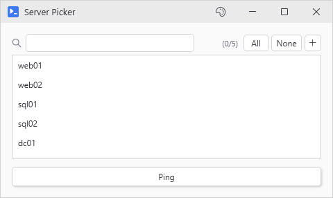
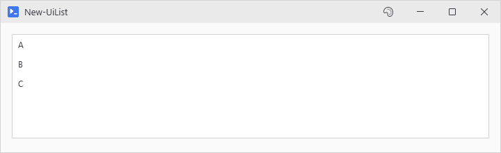
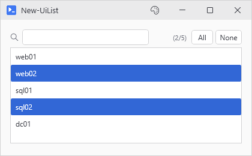
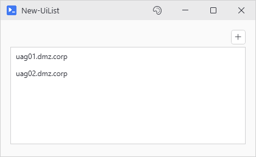
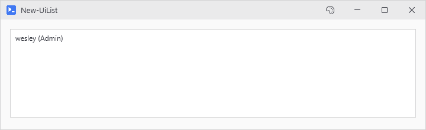

# New-UiList

<p align="center"></p>

## SYNOPSIS
Themed listbox. Optional filter box and select-all/none buttons.

## SYNTAX

```
New-UiList [-Variable] <String> [[-Items] <String[]>] [[-ItemsSource] <Object>] [-NoBind]
 [[-DisplayFormat] <String>] [-MultiSelect] [-Filterable] [-SelectionControls] [-AllowAdd]
 [[-AddPrompt] <String>] [[-Height] <Int32>] [-Fill] [-CaptureScrollWheel] [-FullWidth]
 [[-EnabledWhen] <Object>] [[-WPFProperties] <Hashtable>] [[-ScrollWheel] <String>]
 [<CommonParameters>]
```

## DESCRIPTION
Builds a themed ListBox with opt-in toolbar controls: a real-time filter box, select-all/none buttons, a manual add button. Supports both static arrays and dynamic ObservableCollection binding. Use -DisplayFormat for object lists where each item is a hashtable with named properties.

## EXAMPLES

### EXAMPLE 1
```
New-UiList -Variable "list" -Items @('A','B','C')
```

<p align="center"></p>

### EXAMPLE 2
```
# Filterable multi-select list with selection controls
New-UiList -Variable "servers" -MultiSelect -Filterable -SelectionControls
```

<p align="center"></p>

### EXAMPLE 3
```
# List with manual add button for items that can't be auto-discovered
New-UiList -Variable "uags" -MultiSelect -AllowAdd -AddPrompt "Enter UAG hostname:"
```

<p align="center"></p>

### EXAMPLE 4
```
# Object list with auto-formatted display
New-UiList -Variable "queue" -DisplayFormat "{Username} ({AccountType})"
# Then just pass hashtables - display text is automatic:
Add-UiListItem 'queue' @{ Username = 'wesley'; FullName = 'Wesley'; AccountType = 'Admin' }
```

<p align="center"></p>

## PARAMETERS

### -Variable
Variable name for the list.

<details><summary>Type: String (required)</summary>

```yaml
Type: String
Parameter Sets: (All)
Aliases:

Required: True
Position: 1
Default value: None
Accept pipeline input: False
Accept wildcard characters: False
```

</details>

### -Items
Array of static items to display. Mutually exclusive with ItemsSource.

<details><summary>Type: String[] (optional)</summary>

```yaml
Type: String[]
Parameter Sets: (All)
Aliases:

Required: False
Position: 2
Default value: None
Accept pipeline input: False
Accept wildcard characters: False
```

</details>

### -ItemsSource
A collection to bind as the list's data source, for lists that change at runtime. Anything that isn't already a PsUi threadsafe collection gets wrapped in one, and the variable is repointed at the wrap so $list.Add() from a background action keeps working. The wrap is no longer the type passed in, so .AddRange(), .Sort() and -is \[ArrayList] stop working. A \[ref] has its .Value repointed instead. -NoBind skips the repoint.

<details><summary>Type: Object (optional)</summary>

```yaml
Type: Object
Parameter Sets: (All)
Aliases:

Required: False
Position: 3
Default value: None
Accept pipeline input: False
Accept wildcard characters: False
```

</details>

### -NoBind
Skip the repoint. The list still binds the wrap, the original keeps its own identity, and the two only stay in step while the mirror holds.

<details><summary>Type: SwitchParameter (optional)</summary>

```yaml
Type: SwitchParameter
Parameter Sets: (All)
Aliases:

Required: False
Position: Named
Default value: False
Accept pipeline input: False
Accept wildcard characters: False
```

</details>

### -DisplayFormat
Format string for displaying objects. Use property names in braces. Example: "{Username} ({AccountType})" shows "wesley (Admin)". When specified, Add-UiListItem automatically generates display text from hashtables.

<details><summary>Type: String (optional)</summary>

```yaml
Type: String
Parameter Sets: (All)
Aliases:

Required: False
Position: 4
Default value: None
Accept pipeline input: False
Accept wildcard characters: False
```

</details>

### -MultiSelect
Allow multiple selection.

<details><summary>Type: SwitchParameter (optional)</summary>

```yaml
Type: SwitchParameter
Parameter Sets: (All)
Aliases:

Required: False
Position: Named
Default value: False
Accept pipeline input: False
Accept wildcard characters: False
```

</details>

### -Filterable
Adds a filter textbox above the list. As the user types, items are filtered in real time. Includes a clear button (X) that appears when text is entered.

<details><summary>Type: SwitchParameter (optional)</summary>

```yaml
Type: SwitchParameter
Parameter Sets: (All)
Aliases:

Required: False
Position: Named
Default value: False
Accept pipeline input: False
Accept wildcard characters: False
```

</details>

### -SelectionControls
Adds "All" and "None" buttons for quick select/deselect operations. Most useful with -MultiSelect. Buttons appear in the filter toolbar.

<details><summary>Type: SwitchParameter (optional)</summary>

```yaml
Type: SwitchParameter
Parameter Sets: (All)
Aliases:

Required: False
Position: Named
Default value: False
Accept pipeline input: False
Accept wildcard characters: False
```

</details>

### -AllowAdd
Adds a "+" button to the toolbar that opens an input dialog for manually adding items to the list. Useful when items can't be auto-discovered. The new item comes up selected. With -MultiSelect it joins the current selection.

<details><summary>Type: SwitchParameter (optional)</summary>

```yaml
Type: SwitchParameter
Parameter Sets: (All)
Aliases:

Required: False
Position: Named
Default value: False
Accept pipeline input: False
Accept wildcard characters: False
```

</details>

### -AddPrompt
Custom prompt text for the add item dialog. Defaults to "Enter item to add:".

<details><summary>Type: String (optional)</summary>

```yaml
Type: String
Parameter Sets: (All)
Aliases:

Required: False
Position: 5
Default value: Enter item to add:
Accept pipeline input: False
Accept wildcard characters: False
```

</details>

### -Height
Fixed height in pixels. Defaults to 150. Ignored when -Fill is set.

<details><summary>Type: Int32 (optional)</summary>

```yaml
Type: Int32
Parameter Sets: (All)
Aliases:

Required: False
Position: 6
Default value: 150
Accept pipeline input: False
Accept wildcard characters: False
```

</details>

### -Fill
Grow to the rest of the window's vertical viewport instead of the fixed -Height. List resizes with the window. Use when the list is the dominant content in the view.

<details><summary>Type: SwitchParameter (optional)</summary>

```yaml
Type: SwitchParameter
Parameter Sets: (All)
Aliases:

Required: False
Position: Named
Default value: False
Accept pipeline input: False
Accept wildcard characters: False
```

</details>

### -CaptureScrollWheel
Keep every mouse-wheel event inside the list, ends included. Same as -ScrollWheel Capture.

<details><summary>Type: SwitchParameter (optional)</summary>

```yaml
Type: SwitchParameter
Parameter Sets: (All)
Aliases:

Required: False
Position: Named
Default value: False
Accept pipeline input: False
Accept wildcard characters: False
```

</details>

### -FullWidth
Stretches the list to fill available width.

<details><summary>Type: SwitchParameter (optional)</summary>

```yaml
Type: SwitchParameter
Parameter Sets: (All)
Aliases:

Required: False
Position: Named
Default value: False
Accept pipeline input: False
Accept wildcard characters: False
```

</details>

### -EnabledWhen
Variable name that controls whether the list is enabled. Truthy value = enabled.

<details><summary>Type: Object (optional)</summary>

```yaml
Type: Object
Parameter Sets: (All)
Aliases:

Required: False
Position: 7
Default value: None
Accept pipeline input: False
Accept wildcard characters: False
```

</details>

### -WPFProperties
Hashtable of additional WPF properties to set on the control.

<details><summary>Type: Hashtable (optional)</summary>

```yaml
Type: Hashtable
Parameter Sets: (All)
Aliases:

Required: False
Position: 8
Default value: None
Accept pipeline input: False
Accept wildcard characters: False
```

</details>

### -ScrollWheel
Says who gets the wheel while the cursor is over the list. Page, the default, hands every wheel event to the page, so a window full of them still scrolls. Edge scrolls the list's own rows until it reaches the top or bottom and gives the page the wheel from there. Capture holds on at the ends as well, so the page stays put while the cursor is here. A -Fill list starts on Edge instead, since it holds the viewport and the page behind it has almost no scroll of its own left. Pass -ScrollWheel to override that.

<details><summary>Type: String (optional)</summary>

```yaml
Type: String
Parameter Sets: (All)
Aliases:

Required: False
Position: 9
Default value: Page
Accept pipeline input: False
Accept wildcard characters: False
```

</details>

### CommonParameters
This cmdlet supports the common parameters: -Debug, -ErrorAction, -ErrorVariable, -InformationAction, -InformationVariable, -OutVariable, -OutBuffer, -PipelineVariable, -Verbose, -WarningAction, and -WarningVariable. For more information, see [about_CommonParameters](http://go.microsoft.com/fwlink/?LinkID=113216).

## INPUTS

## OUTPUTS

## NOTES

## RELATED LINKS
