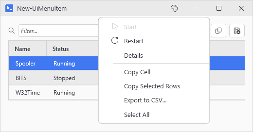
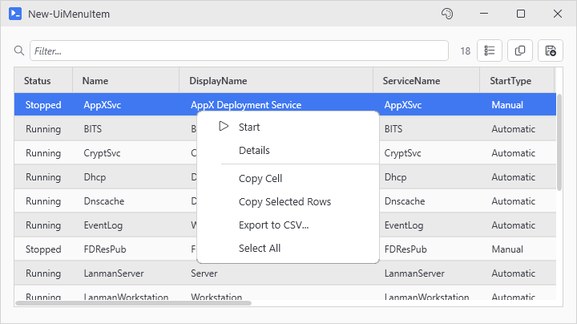
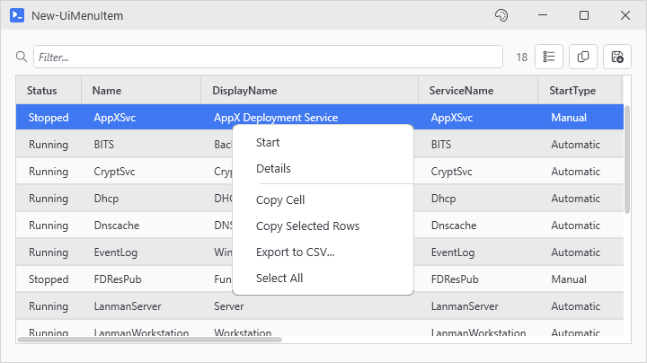

# New-UiMenuItem

<p align="center"></p>

## SYNOPSIS
Defines one entry for a data grid's right-click menu.

## SYNTAX

```
New-UiMenuItem [-Text] <String> [-Action] <ScriptBlock> [-Enabled <Object>] [-NoAsync]
 [-Icon <String>] [<CommonParameters>]
```

## DESCRIPTION
Builder for the -RowContextMenu parameter on New-UiDataGrid. Each call becomes one menu item; pass the calls inside a scriptblock or an array and the menu keeps their order. Emits a definition object only - it does not add anything to the window.

The action runs with $_ bound to the clicked row. When the click lands inside a multi-selection, the action runs once per selected row.

Equivalent to one entry of the legacy label-keyed hashtable form, which -RowContextMenu still accepts.

## EXAMPLES

### EXAMPLE 1
```
New-UiDataGrid -Variable 'svc' -Items (Get-Service) -RowContextMenu {
    New-UiMenuItem 'Start' -Icon Play -Action { Start-Service $_.Name } -Enabled { $_.Status -eq 'Stopped' }
    New-UiMenuItem 'Details' -NoAsync -Action { Show-UiMessageDialog -Message ($_ | Out-String) }
}
```

<p align="center"></p>

### EXAMPLE 2
```
# Legacy hashtable form, still supported
New-UiDataGrid -Variable 'svc' -Items (Get-Service) -RowContextMenu ([ordered]@{
    'Start' = @{ Action = { Start-Service $_.Name }; Enabled = { $_.Status -eq 'Stopped' } }
    'Details' = @{ Action = { Show-UiMessageDialog -Message ($_ | Out-String) }; NoAsync = $true }
})
```

<p align="center"></p>

## PARAMETERS

### -Text
Menu item label. Labels must be unique within one menu (case-insensitive).

<details><summary>Type: String (required)</summary>

```yaml
Type: String
Parameter Sets: (All)
Aliases:

Required: True
Position: 1
Default value: None
Accept pipeline input: False
Accept wildcard characters: False
```

</details>

### -Action
Scriptblock to run when the item is clicked. $_ is the target row. On multi-select the action reruns once per selected row.

<details><summary>Type: ScriptBlock (required)</summary>

```yaml
Type: ScriptBlock
Parameter Sets: (All)
Aliases:

Required: True
Position: 2
Default value: None
Accept pipeline input: False
Accept wildcard characters: False
```

</details>

### -Enabled
$true, $false, or a scriptblock probed per row every time the menu opens ($_ = row). The item grays out when no targeted row passes. Probing caps at 20 rows on big selections; past that the item stays enabled and the click still skips ineligible rows.

<details><summary>Type: Object (optional)</summary>

```yaml
Type: Object
Parameter Sets: (All)
Aliases:

Required: False
Position: Named
Default value: None
Accept pipeline input: False
Accept wildcard characters: False
```

</details>

### -NoAsync
Run the action on the UI thread instead of a background runspace. For actions that open dialogs or child windows. Accepts -Sync as an alias, the parameter this switch had used before.

<details><summary>Type: SwitchParameter (optional)</summary>

```yaml
Type: SwitchParameter
Parameter Sets: (All)
Aliases: Sync

Required: False
Position: Named
Default value: False
Accept pipeline input: False
Accept wildcard characters: False
```

</details>

### -Icon
Icon name shown ahead of the label. Tab completion lists the valid names.

<details><summary>Type: String (optional)</summary>

```yaml
Type: String
Parameter Sets: (All)
Aliases:

Required: False
Position: Named
Default value: None
Accept pipeline input: False
Accept wildcard characters: False
```

</details>

### CommonParameters
This cmdlet supports the common parameters: -Debug, -ErrorAction, -ErrorVariable, -InformationAction, -InformationVariable, -OutVariable, -OutBuffer, -PipelineVariable, -Verbose, -WarningAction, and -WarningVariable. For more information, see [about_CommonParameters](http://go.microsoft.com/fwlink/?LinkID=113216).

## INPUTS

## OUTPUTS

## NOTES

## RELATED LINKS
