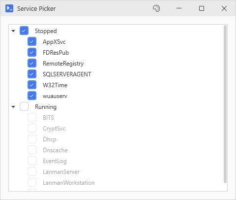
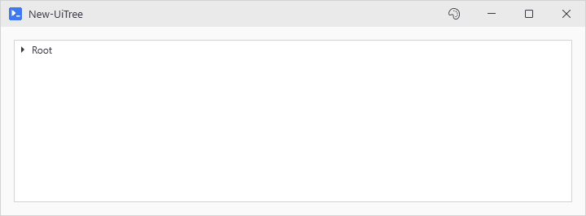
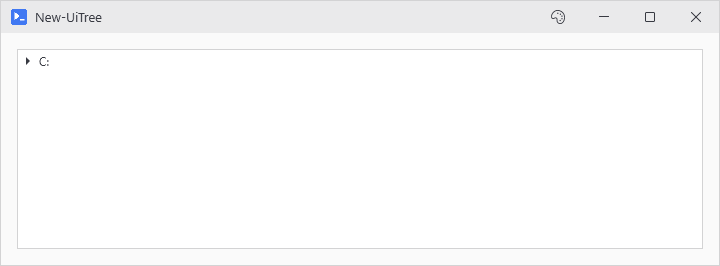
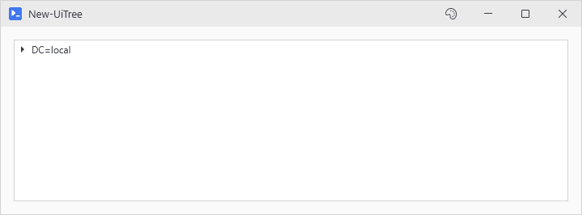
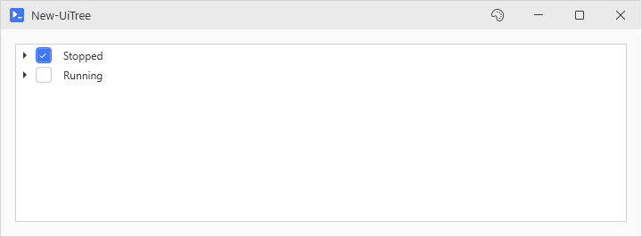

# New-UiTree

<p align="center"></p>

## SYNOPSIS
Creates a hierarchical tree view for displaying nested data.

## SYNTAX

```
New-UiTree [-Variable] <String> [[-Items] <Object[]>] [[-DisplayProperty] <String>]
 [[-ChildrenProperty] <String>] [[-PathProperty] <String>] [[-PathSeparator] <String>] [-ReversePath]
 [[-IdProperty] <String>] [[-ParentIdProperty] <String>] [[-Height] <Int32>] [-Fill] [-CaptureScrollWheel]
 [-NoContextMenu] [-ExpandAll] [-ParentCheckBoxes] [-ChildCheckBoxes] [[-WhenEnabled] <ScriptBlock>]
 [[-Checked] <ScriptBlock>] [-NoCascade] [[-WPFProperties] <Hashtable>] [[-ScrollWheel] <String>]
 [<CommonParameters>]
```

## DESCRIPTION
Builds a WPF TreeView from nested hashtables, objects, or flat path-based data. For nested data, each item's display text comes from -DisplayProperty and children from -ChildrenProperty. For flat data like Get-ChildItem output, use -PathProperty to specify which property contains the hierarchical path (e.g., FullName).

For parent-child relationships (like processes), use -IdProperty and -ParentIdProperty.

Right-click for the context menu, which opens or shuts a branch or the whole tree, copies a node's text, and on a checkbox tree checks or clears a node and everything beneath it. -ExpandAll only applies as the tree is built, so use the menu once it is on screen.

## EXAMPLES

### EXAMPLE 1
```
# Nested hashtable data
$data = @(
    @{ Name = 'Root'; Children = @(
        @{ Name = 'Child 1' }
        @{ Name = 'Child 2'; Children = @(
            @{ Name = 'Grandchild' }
        )}
    )}
)
New-UiTree -Variable 'tree' -Items $data
```

<p align="center"></p>

### EXAMPLE 2
```
# Filesystem
Get-ChildItem C:\Temp -Recurse -Directory | New-UiTree -Variable 'folders' -PathProperty 'FullName'
```

<p align="center"></p>

### EXAMPLE 3
```
# Active Directory OUs - DN is reversed, comma-separated
Get-ADOrganizationalUnit -Filter * | New-UiTree -Variable 'ous' -PathProperty 'DistinguishedName' -PathSeparator ',' -ReversePath
```

<p align="center"></p>

### EXAMPLE 4
```
# Org chart - parent/child by ID using a dotted property path on the parent reference
$employees = @(
    [PSCustomObject]@{ EmployeeId = 1; Name = 'CEO';    Manager = $null }
    [PSCustomObject]@{ EmployeeId = 2; Name = 'VP Eng'; Manager = [PSCustomObject]@{ EmployeeId = 1 } }
    [PSCustomObject]@{ EmployeeId = 3; Name = 'Dev';    Manager = [PSCustomObject]@{ EmployeeId = 2 } }
)
$employees | New-UiTree -Variable 'org' -IdProperty 'EmployeeId' -ParentIdProperty 'Manager.EmployeeId' -DisplayProperty 'Name'
```

<p align="center"></p>

### EXAMPLE 5
```
# .NET namespaces in the PowerShell engine
[psobject].Assembly.GetExportedTypes() |
    New-UiTree -Variable 'types' -PathProperty 'FullName' -PathSeparator '.'
```

### EXAMPLE 6
```
# Services by status. Auto start protected, stopped preselected.
Get-Service | Group-Object Status | ForEach-Object {
    [PSCustomObject]@{ Name = $_.Name; Children = $_.Group }
} | New-UiTree -Variable 'svc' -ParentCheckBoxes -ChildCheckBoxes `
      -WhenEnabled { $_.StartType -ne 'Automatic' } -Checked { $_.Status -eq 'Stopped' }
```

<p align="center"></p>

## PARAMETERS

### -Variable
Variable name for accessing this tree in button actions.

<details><summary>Type: String (required)</summary>

```yaml
Type: String
Parameter Sets: (All)
Aliases:

Required: True
Position: 1
Default value: None
Accept pipeline input: False
Accept wildcard characters: False
```

</details>

### -Items
Array of tree items. Can be nested (with Children property) or flat with paths.

<details><summary>Type: Object[] (optional)</summary>

```yaml
Type: Object[]
Parameter Sets: (All)
Aliases:

Required: False
Position: 2
Default value: None
Accept pipeline input: True (ByValue)
Accept wildcard characters: False
```

</details>

### -DisplayProperty
Property name to display as the node text. Defaults to 'Name'.

<details><summary>Type: String (optional)</summary>

```yaml
Type: String
Parameter Sets: (All)
Aliases:

Required: False
Position: 3
Default value: Name
Accept pipeline input: False
Accept wildcard characters: False
```

</details>

### -ChildrenProperty
Property name containing child items for nested data. Defaults to 'Children'.

<details><summary>Type: String (optional)</summary>

```yaml
Type: String
Parameter Sets: (All)
Aliases:

Required: False
Position: 4
Default value: Children
Accept pipeline input: False
Accept wildcard characters: False
```

</details>

### -PathProperty
Property containing a hierarchical path (e.g., FullName for FileInfo objects). When specified, the tree builds hierarchy from path segments instead of nested data.

<details><summary>Type: String (optional)</summary>

```yaml
Type: String
Parameter Sets: (All)
Aliases:

Required: False
Position: 5
Default value: None
Accept pipeline input: False
Accept wildcard characters: False
```

</details>

### -PathSeparator
Separator character for path segments. Defaults to '\' for filesystem paths. Use ',' for AD Distinguished Names, '.' for namespaces.

<details><summary>Type: String (optional)</summary>

```yaml
Type: String
Parameter Sets: (All)
Aliases:

Required: False
Position: 6
Default value: \
Accept pipeline input: False
Accept wildcard characters: False
```

</details>

### -ReversePath
Reverse the path segment order. Use for AD Distinguished Names where leaf is first (CN=User,OU=Sales,DC=corp,DC=com becomes DC=com > DC=corp > OU=Sales > CN=User).

<details><summary>Type: SwitchParameter (optional)</summary>

```yaml
Type: SwitchParameter
Parameter Sets: (All)
Aliases:

Required: False
Position: Named
Default value: False
Accept pipeline input: False
Accept wildcard characters: False
```

</details>

### -IdProperty
Property containing unique ID for parent-child relationships (e.g., Id for processes).

<details><summary>Type: String (optional)</summary>

```yaml
Type: String
Parameter Sets: (All)
Aliases:

Required: False
Position: 7
Default value: None
Accept pipeline input: False
Accept wildcard characters: False
```

</details>

### -ParentIdProperty
Property containing parent's ID (e.g., ParentProcessId for processes).

<details><summary>Type: String (optional)</summary>

```yaml
Type: String
Parameter Sets: (All)
Aliases:

Required: False
Position: 8
Default value: None
Accept pipeline input: False
Accept wildcard characters: False
```

</details>

### -Height
Height of the tree control. Defaults to 200. Ignored when -Fill is set.

<details><summary>Type: Int32 (optional)</summary>

```yaml
Type: Int32
Parameter Sets: (All)
Aliases:

Required: False
Position: 9
Default value: 200
Accept pipeline input: False
Accept wildcard characters: False
```

</details>

### -Fill
Grow to the rest of the window's vertical viewport instead of the fixed -Height. Tree resizes with the window. Use when the tree is the dominant content in the view.

<details><summary>Type: SwitchParameter (optional)</summary>

```yaml
Type: SwitchParameter
Parameter Sets: (All)
Aliases:

Required: False
Position: Named
Default value: False
Accept pipeline input: False
Accept wildcard characters: False
```

</details>

### -CaptureScrollWheel
Keep every mouse-wheel event inside the tree. Same as -ScrollWheel Capture.

<details><summary>Type: SwitchParameter (optional)</summary>

```yaml
Type: SwitchParameter
Parameter Sets: (All)
Aliases:

Required: False
Position: Named
Default value: False
Accept pipeline input: False
Accept wildcard characters: False
```

</details>

### -NoContextMenu
Kill the right-click menu: Expand All, Collapse All, Expand, Collapse and Copy, plus Check All Below and Uncheck All Below on a checkbox tree.

<details><summary>Type: SwitchParameter (optional)</summary>

```yaml
Type: SwitchParameter
Parameter Sets: (All)
Aliases:

Required: False
Position: Named
Default value: False
Accept pipeline input: False
Accept wildcard characters: False
```

</details>

### -ExpandAll
Expand all nodes on load. That is the only time it applies. Use the right-click menu to open and shut nodes afterwards.

<details><summary>Type: SwitchParameter (optional)</summary>

```yaml
Type: SwitchParameter
Parameter Sets: (All)
Aliases:

Required: False
Position: Named
Default value: False
Accept pipeline input: False
Accept wildcard characters: False
```

</details>

### -ParentCheckBoxes
Checkbox on every item with children. Alone, each box flips only itself. With -ChildCheckBoxes alongside, clicking a parent toggles enabled descendants (the full picker).

<details><summary>Type: SwitchParameter (optional)</summary>

```yaml
Type: SwitchParameter
Parameter Sets: (All)
Aliases:

Required: False
Position: Named
Default value: False
Accept pipeline input: False
Accept wildcard characters: False
```

</details>

### -ChildCheckBoxes
Checkbox on every leaf. Alone, parents become unselectable - the box is the only way in.

<details><summary>Type: SwitchParameter (optional)</summary>

```yaml
Type: SwitchParameter
Parameter Sets: (All)
Aliases:

Required: False
Position: Named
Default value: False
Accept pipeline input: False
Accept wildcard characters: False
```

</details>

### -WhenEnabled
Scriptblock run per item. Returns $false and the box renders disabled; cascade skips it.

<details><summary>Type: ScriptBlock (optional)</summary>

```yaml
Type: ScriptBlock
Parameter Sets: (All)
Aliases:

Required: False
Position: 10
Default value: None
Accept pipeline input: False
Accept wildcard characters: False
```

</details>

### -Checked
Scriptblock run per item at build time. Returns $true and the box starts checked.

<details><summary>Type: ScriptBlock (optional)</summary>

```yaml
Type: ScriptBlock
Parameter Sets: (All)
Aliases:

Required: False
Position: 11
Default value: None
Accept pipeline input: False
Accept wildcard characters: False
```

</details>

### -NoCascade
Independent boxes - parent clicks don't cascade. For tagging workflows.

<details><summary>Type: SwitchParameter (optional)</summary>

```yaml
Type: SwitchParameter
Parameter Sets: (All)
Aliases:

Required: False
Position: Named
Default value: False
Accept pipeline input: False
Accept wildcard characters: False
```

</details>

### -WPFProperties
Hashtable of additional WPF properties to set on the control.

<details><summary>Type: Hashtable (optional)</summary>

```yaml
Type: Hashtable
Parameter Sets: (All)
Aliases:

Required: False
Position: 12
Default value: None
Accept pipeline input: False
Accept wildcard characters: False
```

</details>

### -ScrollWheel
Says who gets the wheel while the cursor is over the tree. Page, the default, hands every wheel event to the page (the main window), so a window full of them still scrolls. Edge scrolls the tree's own nodes until it reaches the top or bottom and gives the page the wheel from there. Capture holds on at the ends as well, so the page stays put while the cursor is here. A -Fill tree starts on Edge instead, since it holds the viewport and the page behind it has almost no scroll of its own left. Pass -ScrollWheel to override that.

<details><summary>Type: String (optional)</summary>

```yaml
Type: String
Parameter Sets: (All)
Aliases:

Required: False
Position: 13
Default value: Page
Accept pipeline input: False
Accept wildcard characters: False
```

</details>

### CommonParameters
This cmdlet supports the common parameters: -Debug, -ErrorAction, -ErrorVariable, -InformationAction, -InformationVariable, -OutVariable, -OutBuffer, -PipelineVariable, -Verbose, -WarningAction, and -WarningVariable. For more information, see [about_CommonParameters](http://go.microsoft.com/fwlink/?LinkID=113216).

## INPUTS

## OUTPUTS

## NOTES

## RELATED LINKS
