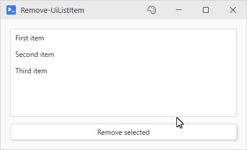

# Remove-UiListItem

## SYNOPSIS
Removes an item from a list or dropdown.

## SYNTAX

```
Remove-UiListItem [-Variable] <String> [[-Item] <Object>]
 [<CommonParameters>]
```

## DESCRIPTION
Removes one item: a specific one when -Item is passed, otherwise whatever row is currently selected.

## EXAMPLES

### EXAMPLE 1
```
Remove-UiListItem 'myList'  # Removes selected item
```

<p align="center"></p>

## PARAMETERS

### -Variable
The -Variable name of the list or dropdown.

<details><summary>Type: String (required)</summary>

```yaml
Type: String
Parameter Sets: (All)
Aliases:

Required: True
Position: 1
Default value: None
Accept pipeline input: False
Accept wildcard characters: False
```

</details>

### -Item
The item to remove. If not specified, removes the currently selected item.

<details><summary>Type: Object (optional)</summary>

```yaml
Type: Object
Parameter Sets: (All)
Aliases:

Required: False
Position: 2
Default value: None
Accept pipeline input: False
Accept wildcard characters: False
```

</details>

### CommonParameters
This cmdlet supports the common parameters: -Debug, -ErrorAction, -ErrorVariable, -InformationAction, -InformationVariable, -OutVariable, -OutBuffer, -PipelineVariable, -Verbose, -WarningAction, and -WarningVariable. For more information, see [about_CommonParameters](http://go.microsoft.com/fwlink/?LinkID=113216).

## INPUTS

## OUTPUTS

## NOTES

## RELATED LINKS
