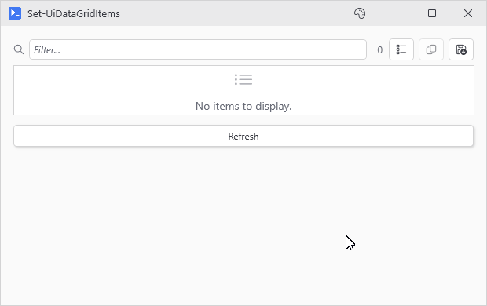

# Set-UiDataGridItems

## SYNOPSIS
Replaces every row in a New-UiDataGrid.

## SYNTAX

```
Set-UiDataGridItems [-Variable] <String> [-Items] <Object[]> [-PassThru]
 [<CommonParameters>]
```

## DESCRIPTION
Swaps the entire row set on the grid identified by -Variable. Works on both -Items grids (PsUi owns the collection) and -ItemsSource grids (PsUi shares your collection). One Reset for the whole swap, not one per row. PowerShell added properties stay visible. Filter and sort reapply.

## EXAMPLES

### EXAMPLE 1
```
New-UiButton -Text 'Refresh' -NoOutput -Action {
    Set-UiDataGridItems -Variable procs -Items (Get-Process)
}
```

<p align="center"></p>

### EXAMPLE 2
```
$liveRows = Set-UiDataGridItems -Variable procs -Items $batch -PassThru
$liveRows[0].Status = 'Reviewed'   # updates the object. Set the grid again to show it
```

## PARAMETERS

### -Variable
The -Variable name passed to the originating New-UiDataGrid.

<details><summary>Type: String (required)</summary>

```yaml
Type: String
Parameter Sets: (All)
Aliases:

Required: True
Position: 1
Default value: None
Accept pipeline input: False
Accept wildcard characters: False
```

</details>

### -Items
The new rows. Pass @() (or $null) to wipe the grid - both mean "no rows", the same as anywhere else in PowerShell, so a filter that matched nothing clears the grid instead of throwing. Null elements inside the array are dropped: a null row is unrenderable.

<details><summary>Type: Object[] (required)</summary>

```yaml
Type: Object[]
Parameter Sets: (All)
Aliases:

Required: True
Position: 2
Default value: None
Accept pipeline input: False
Accept wildcard characters: False
```

</details>

### -PassThru
Return the rows as they ended up in the grid. On -Items grids that's the copies PsUi displays. On -ItemsSource grids it's your array with null rows removed and any hashtable rows swapped for their converted PSCustomObjects. Changing a property on a returned row won't show in the cell on its own - PSCustomObject rows raise no change notifications, so rerun Set-UiDataGridItems to show the change.

<details><summary>Type: SwitchParameter (optional)</summary>

```yaml
Type: SwitchParameter
Parameter Sets: (All)
Aliases:

Required: False
Position: Named
Default value: False
Accept pipeline input: False
Accept wildcard characters: False
```

</details>

### CommonParameters
This cmdlet supports the common parameters: -Debug, -ErrorAction, -ErrorVariable, -InformationAction, -InformationVariable, -OutVariable, -OutBuffer, -PipelineVariable, -Verbose, -WarningAction, and -WarningVariable. For more information, see [about_CommonParameters](http://go.microsoft.com/fwlink/?LinkID=113216).

## INPUTS

## OUTPUTS

## NOTES

## RELATED LINKS
