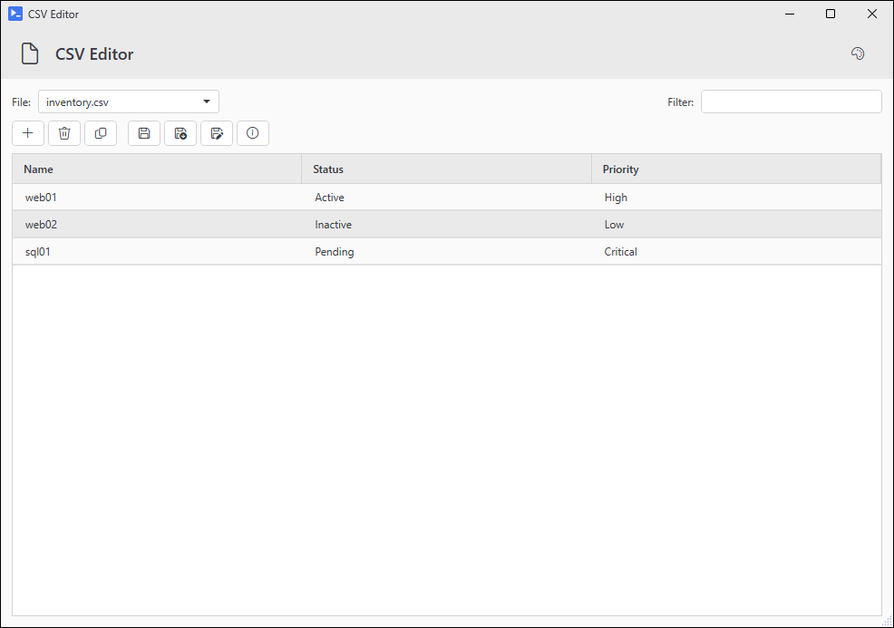
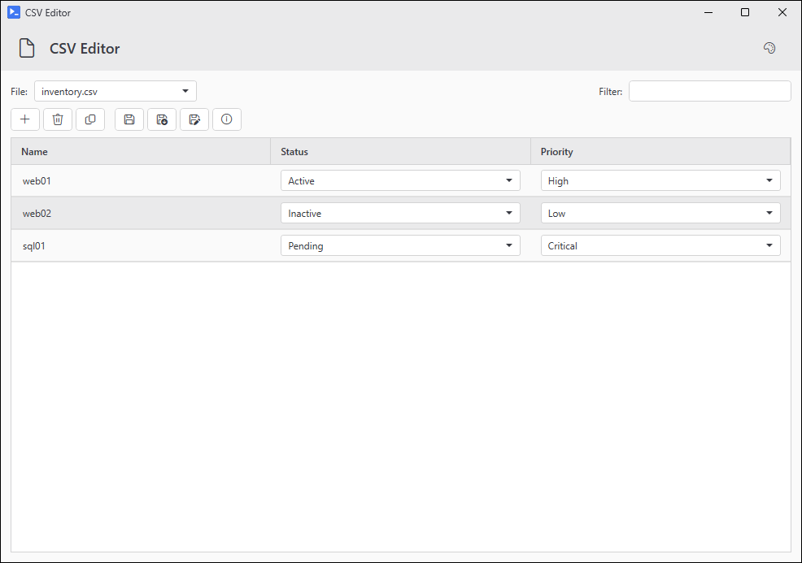

# Out-CSVDataGrid

## SYNOPSIS
Opens CSV files for viewing and editing. Save writes back to disk.

## SYNTAX

### Directory (Default)
```
Out-CSVDataGrid [-CSVDirectory <String>] [-TitleText <String>] [-IsFilterable] [-IsResizeable]
 [-ColumnsToPopupOnSelection <String[]>] [-ColumnComboBoxes <Hashtable>] [-ReadOnlyColumns <String[]>]
 [-ForceTextWrap] [-Width <Int32>] [-Height <Int32>] [-Theme <String>] [-Delimiter <Char>] [-NoHeader]
 [-IconFont <String>] [-NoIconFontFallback] [<CommonParameters>]
```

### Files
```
Out-CSVDataGrid [-CSVFiles <String[]>] [-TitleText <String>] [-IsFilterable] [-IsResizeable]
 [-ColumnsToPopupOnSelection <String[]>] [-ColumnComboBoxes <Hashtable>] [-ReadOnlyColumns <String[]>]
 [-ForceTextWrap] [-Width <Int32>] [-Height <Int32>] [-Theme <String>] [-Delimiter <Char>] [-NoHeader]
 [-IconFont <String>] [-NoIconFontFallback] [<CommonParameters>]
```

## DESCRIPTION
A bulk CSV editor. Point it at one or more CSVs and you get a window that opens, sorts, filters, and edits them. Saves go back to the file they came from, or to a new path if you use Save As.

Internals use $script: scoped state, so opening two CSV grids from the same session at the same time can step on itself. Modal dialogs keep this from happening in normal use. Avoid calling this in parallel runspaces sharing the module.

## EXAMPLES

### EXAMPLE 1
```
Out-CSVDataGrid -CSVDirectory 'C:\Data' -IsFilterable -IsResizeable
```

<p align="center"></p>

### EXAMPLE 2
```
Get-ChildItem C:\Logs -Filter *.csv | Out-CSVDataGrid -IsFilterable
```

### EXAMPLE 3
```
Out-CSVDataGrid -CSVFiles 'inventory.csv' -ColumnComboBoxes @{
    Status = @('Active', 'Inactive', 'Pending')
    Priority = @('Low', 'Medium', 'High', 'Critical')
}
```

<p align="center"></p>

## PARAMETERS

### -CSVDirectory
Folder to load every .csv file from. Top level only, no recursion - pipe Get-ChildItem -Recurse output to -CSVFiles for that.

<details><summary>Type: String (optional)</summary>

```yaml
Type: String
Parameter Sets: Directory
Aliases:

Required: False
Position: Named
Default value: None
Accept pipeline input: False
Accept wildcard characters: False
```

</details>

### -CSVFiles
One or more CSV file paths. Also takes pipeline input from Get-ChildItem.

<details><summary>Type: String[] (optional)</summary>

```yaml
Type: String[]
Parameter Sets: Files
Aliases: FullName

Required: False
Position: Named
Default value: None
Accept pipeline input: True (ByPropertyName, ByValue)
Accept wildcard characters: False
```

</details>

### -TitleText
Window title.

<details><summary>Type: String (optional)</summary>

```yaml
Type: String
Parameter Sets: (All)
Aliases: Title

Required: False
Position: Named
Default value: CSV Editor
Accept pipeline input: False
Accept wildcard characters: False
```

</details>

### -IsFilterable
Kept for scripts written against an earlier build. The filter box is always on now, so this switch changes nothing.

<details><summary>Type: SwitchParameter (optional)</summary>

```yaml
Type: SwitchParameter
Parameter Sets: (All)
Aliases:

Required: False
Position: Named
Default value: False
Accept pipeline input: False
Accept wildcard characters: False
```

</details>

### -IsResizeable
Adds the corner resize grip. The window resizes either way. Kept for scripts written against an earlier build.

<details><summary>Type: SwitchParameter (optional)</summary>

```yaml
Type: SwitchParameter
Parameter Sets: (All)
Aliases:

Required: False
Position: Named
Default value: False
Accept pipeline input: False
Accept wildcard characters: False
```

</details>

### -ColumnsToPopupOnSelection
Column names that pop a separate viewer when clicked. Use for long values you can't easily edit inline.

<details><summary>Type: String[] (optional)</summary>

```yaml
Type: String[]
Parameter Sets: (All)
Aliases:

Required: False
Position: Named
Default value: None
Accept pipeline input: False
Accept wildcard characters: False
```

</details>

### -ColumnComboBoxes
Columns you want edited via a dropdown instead of a textbox. Key is the column name, value is either an array of allowed values or a hashtable @{ Values = @(...); DefaultValue = '...' }.

Example: @{ Priority = @{ Values = @('Low', 'High'); DefaultValue = 'Low' } }

A column can't be in both this and ColumnsToPopupOnSelection - that throws at startup.

<details><summary>Type: Hashtable (optional)</summary>

```yaml
Type: Hashtable
Parameter Sets: (All)
Aliases:

Required: False
Position: Named
Default value: None
Accept pipeline input: False
Accept wildcard characters: False
```

</details>

### -ReadOnlyColumns
Columns that can't be edited. If a column is also in ColumnsToPopupOnSelection, the popup viewer goes read-only too.

<details><summary>Type: String[] (optional)</summary>

```yaml
Type: String[]
Parameter Sets: (All)
Aliases:

Required: False
Position: Named
Default value: None
Accept pipeline input: False
Accept wildcard characters: False
```

</details>

### -ForceTextWrap
Wrap text inside cells instead of clipping it.

<details><summary>Type: SwitchParameter (optional)</summary>

```yaml
Type: SwitchParameter
Parameter Sets: (All)
Aliases:

Required: False
Position: Named
Default value: False
Accept pipeline input: False
Accept wildcard characters: False
```

</details>

### -Width
Window width in pixels (400-2000). Defaults to 1000.

<details><summary>Type: Int32 (optional)</summary>

```yaml
Type: Int32
Parameter Sets: (All)
Aliases:

Required: False
Position: Named
Default value: 1000
Accept pipeline input: False
Accept wildcard characters: False
```

</details>

### -Height
Window height in pixels (300-1500). Defaults to 700.

<details><summary>Type: Int32 (optional)</summary>

```yaml
Type: Int32
Parameter Sets: (All)
Aliases:

Required: False
Position: Named
Default value: 700
Accept pipeline input: False
Accept wildcard characters: False
```

</details>

### -Theme
Color theme. See Get-UiThemeTemplate for the list. When not given, follows the session's active theme if one is loaded, otherwise Light.

<details><summary>Type: String (optional)</summary>

```yaml
Type: String
Parameter Sets: (All)
Aliases:

Required: False
Position: Named
Default value: Light
Accept pipeline input: False
Accept wildcard characters: False
```

</details>

### -Delimiter
Column separator character. Defaults to comma. Use ';' for semicolon-delimited files or ``"`t"`` for tab-delimited files.

<details><summary>Type: Char (optional)</summary>

```yaml
Type: Char
Parameter Sets: (All)
Aliases:

Required: False
Position: Named
Default value: ,
Accept pipeline input: False
Accept wildcard characters: False
```

</details>

### -NoHeader
Treat the first row as data, not headers. Columns get named Column1..ColumnN.

<details><summary>Type: SwitchParameter (optional)</summary>

```yaml
Type: SwitchParameter
Parameter Sets: (All)
Aliases:

Required: False
Position: Named
Default value: False
Accept pipeline input: False
Accept wildcard characters: False
```

</details>

### -IconFont
Which icon font to use for the toolbar: Inherit (default), Auto, SegoeMDL2 (Win10), or SegoeFluentIcons (Win11). Only matters when this is the top-level window. When hosted inside another PsUi window, that window's font wins.

<details><summary>Type: String (optional)</summary>

```yaml
Type: String
Parameter Sets: (All)
Aliases:

Required: False
Position: Named
Default value: Inherit
Accept pipeline input: False
Accept wildcard characters: False
```

</details>

### -NoIconFontFallback
Don't borrow glyphs from the other Segoe icon font when the active one is missing them. Absent toolbar icons render as empty boxes instead.

<details><summary>Type: SwitchParameter (optional)</summary>

```yaml
Type: SwitchParameter
Parameter Sets: (All)
Aliases:

Required: False
Position: Named
Default value: False
Accept pipeline input: False
Accept wildcard characters: False
```

</details>

### CommonParameters
This cmdlet supports the common parameters: -Debug, -ErrorAction, -ErrorVariable, -InformationAction, -InformationVariable, -OutVariable, -OutBuffer, -PipelineVariable, -Verbose, -WarningAction, and -WarningVariable. For more information, see [about_CommonParameters](http://go.microsoft.com/fwlink/?LinkID=113216).

## INPUTS

## OUTPUTS

## NOTES

## RELATED LINKS
