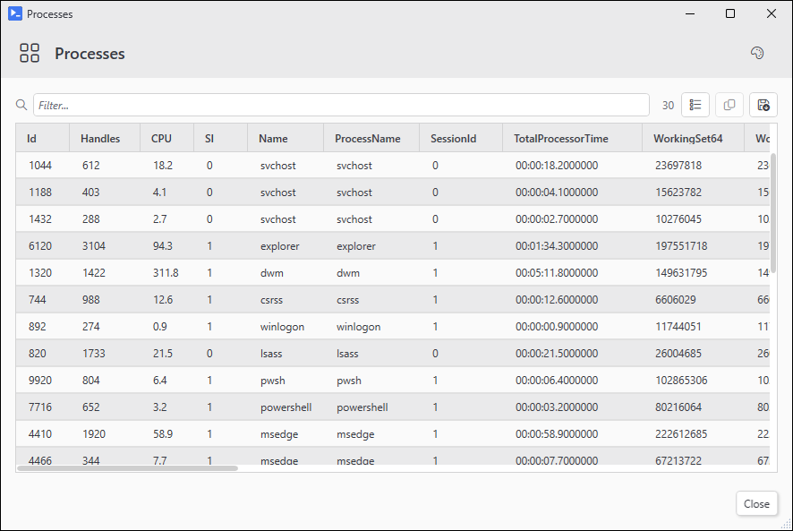
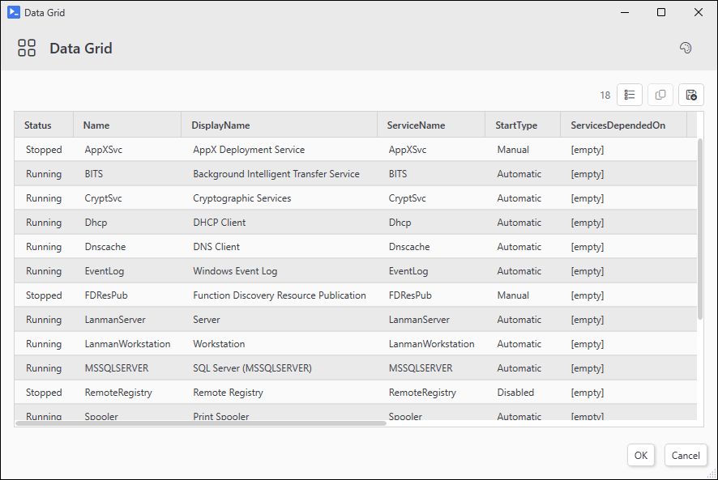
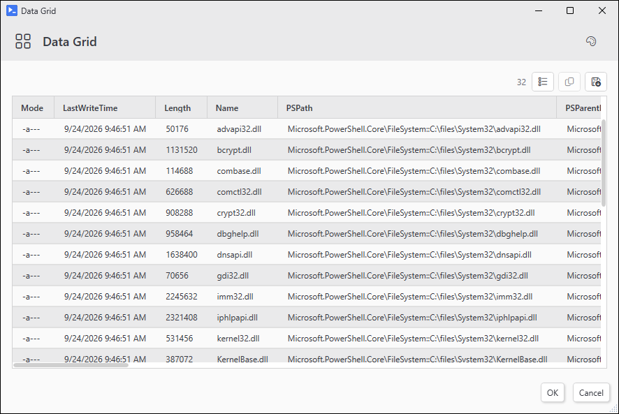
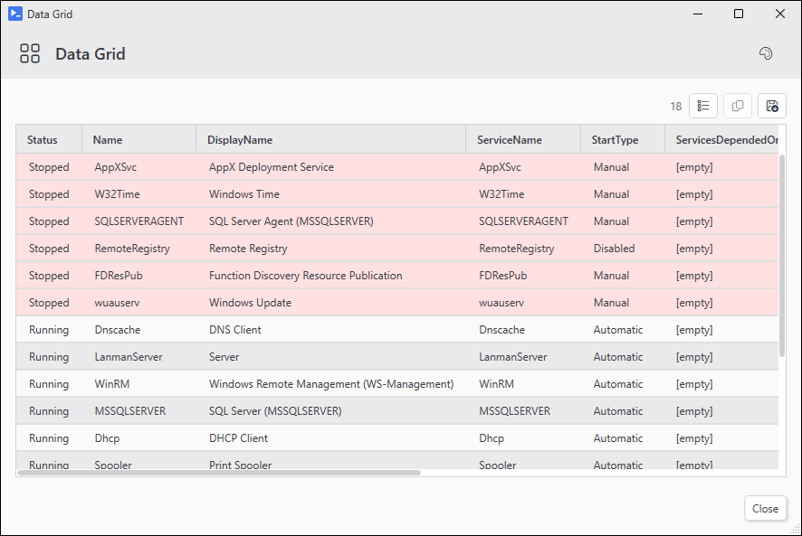

# Out-Datagrid

## SYNOPSIS
A sortable and filterable data grid.

## SYNTAX

```
Out-Datagrid [[-Data] <Object[]>] [[-TitleText] <String>] [-IsFilterable] [-PassThru] [[-OutputMode] <String>]
 [[-Theme] <String>] [[-Width] <Int32>] [[-Height] <Int32>] [[-IconFont] <String>] [-NoIconFontFallback]
 [[-RowBackground] <ScriptBlock>] [[-DefaultSort] <Object>] [-NoSafeWrap]
 [<CommonParameters>]
```

## DESCRIPTION
Pipe objects in and receive a sortable filterable grid. Add -PassThru and you get the selected rows back on OK. Closing the window or clicking Cancel returns nothing.

Filter, copy, export to CSV, and a column picker are in the toolbar. Sort by clicking column headers.

Opens the window in place when the calling session can host one directly (ISE, PsUi -NoAsync actions). From a console session that can't, spins up a dedicated UI host and shows the window there. Either way the call blocks until you close it.

Can't be called from inside an async button action. Use -NoAsync on the button.

## EXAMPLES

### EXAMPLE 1
```
Get-Process | Out-Datagrid -TitleText 'Processes' -IsFilterable
```

<p align="center"></p>

### EXAMPLE 2
```
Get-Service | Out-Datagrid -PassThru | Restart-Service
```

<p align="center"></p>

### EXAMPLE 3
```
Get-ChildItem $env:WINDIR\System32 -Filter *.dll | Out-Datagrid -PassThru -OutputMode Single
```

<p align="center"></p>

### EXAMPLE 4
```
$rowBg   = { if ($_.Status -eq 'Stopped') { '#33FF6B6B' } }
$dgSplat = @{ RowBackground = $rowBg; DefaultSort = 'Status' }
Get-Service | Out-Datagrid @dgSplat
```

<p align="center"></p>

## PARAMETERS

### -Data
The objects to show. Take from the pipeline or pass directly.

<details><summary>Type: Object[] (optional)</summary>

```yaml
Type: Object[]
Parameter Sets: (All)
Aliases:

Required: False
Position: 1
Default value: None
Accept pipeline input: True (ByValue)
Accept wildcard characters: False
```

</details>

### -TitleText
Window title.

<details><summary>Type: String (optional)</summary>

```yaml
Type: String
Parameter Sets: (All)
Aliases: Title

Required: False
Position: 2
Default value: Data Grid
Accept pipeline input: False
Accept wildcard characters: False
```

</details>

### -IsFilterable
Show the filter textbox.

<details><summary>Type: SwitchParameter (optional)</summary>

```yaml
Type: SwitchParameter
Parameter Sets: (All)
Aliases:

Required: False
Position: Named
Default value: False
Accept pipeline input: False
Accept wildcard characters: False
```

</details>

### -PassThru
Return the selected rows on OK.

<details><summary>Type: SwitchParameter (optional)</summary>

```yaml
Type: SwitchParameter
Parameter Sets: (All)
Aliases:

Required: False
Position: Named
Default value: False
Accept pipeline input: False
Accept wildcard characters: False
```

</details>

### -OutputMode
How many rows can be selected: None, Single, or Multiple (default - Ctrl/Shift to extend).

<details><summary>Type: String (optional)</summary>

```yaml
Type: String
Parameter Sets: (All)
Aliases:

Required: False
Position: 3
Default value: Multiple
Accept pipeline input: False
Accept wildcard characters: False
```

</details>

### -Theme
Color theme. See Get-UiThemeTemplate for the list.

<details><summary>Type: String (optional)</summary>

```yaml
Type: String
Parameter Sets: (All)
Aliases:

Required: False
Position: 4
Default value: Light
Accept pipeline input: False
Accept wildcard characters: False
```

</details>

### -Width
Window width in pixels (400-2000).

<details><summary>Type: Int32 (optional)</summary>

```yaml
Type: Int32
Parameter Sets: (All)
Aliases:

Required: False
Position: 5
Default value: 900
Accept pipeline input: False
Accept wildcard characters: False
```

</details>

### -Height
Window height in pixels (300-1500).

<details><summary>Type: Int32 (optional)</summary>

```yaml
Type: Int32
Parameter Sets: (All)
Aliases:

Required: False
Position: 6
Default value: 600
Accept pipeline input: False
Accept wildcard characters: False
```

</details>

### -IconFont
Which icon font to use for the toolbar: Inherit (default), Auto, SegoeMDL2 (Win10), or SegoeFluentIcons (Win11). Only matters when this is the top-level window. When hosted inside another PsUi window, that window's font wins.

<details><summary>Type: String (optional)</summary>

```yaml
Type: String
Parameter Sets: (All)
Aliases:

Required: False
Position: 7
Default value: Inherit
Accept pipeline input: False
Accept wildcard characters: False
```

</details>

### -NoIconFontFallback
Don't fall back to other icon fonts for missing glyphs. Mostly useful for tightening Tab completion on -Icon parameters.

<details><summary>Type: SwitchParameter (optional)</summary>

```yaml
Type: SwitchParameter
Parameter Sets: (All)
Aliases:

Required: False
Position: Named
Default value: False
Accept pipeline input: False
Accept wildcard characters: False
```

</details>

### -RowBackground
Scriptblock that colors rows. Returns a color string (e.g. '#33FF6B6B') or $null. `$_` is the row inside the scriptblock. Runs as rows scroll into view.

<details><summary>Type: ScriptBlock (optional)</summary>

```yaml
Type: ScriptBlock
Parameter Sets: (All)
Aliases:

Required: False
Position: 8
Default value: None
Accept pipeline input: False
Accept wildcard characters: False
```

</details>

### -DefaultSort
Sort the grid before showing it. Accepts:
  - 'PropName'
  - 'PropName -Descending'
  - @{ Property = 'PropName'; Direction = 'Descending' }
  - an array of any of the above for multi-key sorting

<details><summary>Type: Object (optional)</summary>

```yaml
Type: Object
Parameter Sets: (All)
Aliases:

Required: False
Position: 9
Default value: None
Accept pipeline input: False
Accept wildcard characters: False
```

</details>

### -NoSafeWrap
Skip the protective wrapping done on input items. Faster, but if a property getter on one of your objects throws, the whole grid blows up.

<details><summary>Type: SwitchParameter (optional)</summary>

```yaml
Type: SwitchParameter
Parameter Sets: (All)
Aliases:

Required: False
Position: Named
Default value: False
Accept pipeline input: False
Accept wildcard characters: False
```

</details>

### CommonParameters
This cmdlet supports the common parameters: -Debug, -ErrorAction, -ErrorVariable, -InformationAction, -InformationVariable, -OutVariable, -OutBuffer, -PipelineVariable, -Verbose, -WarningAction, and -WarningVariable. For more information, see [about_CommonParameters](http://go.microsoft.com/fwlink/?LinkID=113216).

## INPUTS

## OUTPUTS

## NOTES

## RELATED LINKS
