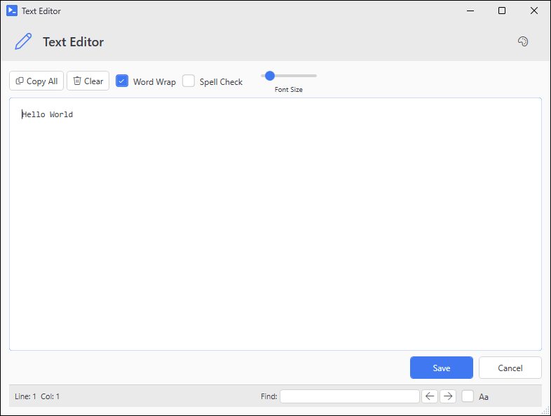
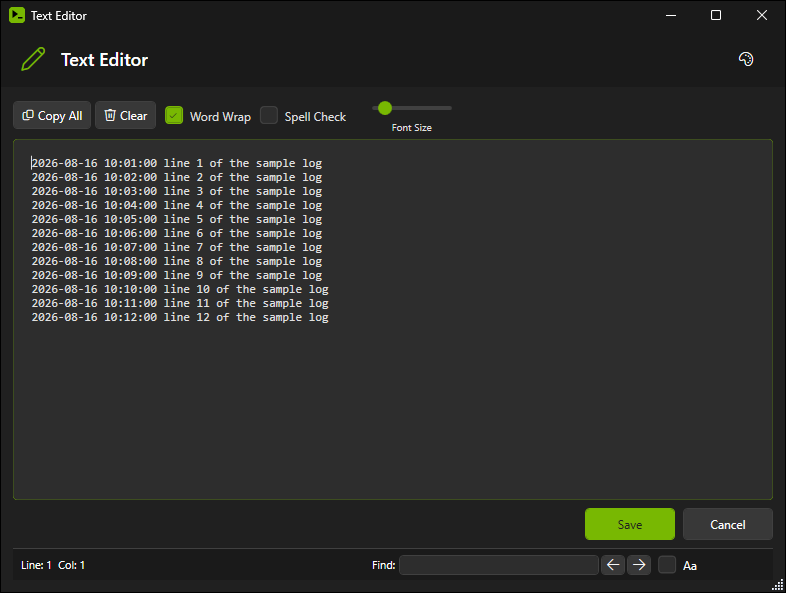

# Out-TextEditor

## SYNOPSIS
Opens a themed text editor window.

## SYNTAX

```
Out-TextEditor [[-InputObject] <String[]>] [[-InitialText] <String>] [[-TitleText] <String>]
 [[-Theme] <String>] [[-Width] <Int32>] [[-Height] <Int32>] [[-FontFamily] <String>] [[-FontSize] <Int32>]
 [[-IconFont] <String>] [-NoIconFontFallback] [-ReadOnly] [-NoWordWrap] [-SpellCheck]
 [<CommonParameters>]
```

## DESCRIPTION
Displays text in a themed editor window. Find and copy are built in, and save is optional. Accepts input via parameter or pipeline.

## EXAMPLES

### EXAMPLE 1
```
Out-TextEditor -InitialText "Hello World"
```

<p align="center"></p>

### EXAMPLE 2
```
Get-Content C:\file.txt | Out-TextEditor -Theme Dark
```

<p align="center"></p>

### EXAMPLE 3
```
"Line 1", "Line 2", "Line 3" | Out-TextEditor
```

<p align="center"></p>

### EXAMPLE 4
```
Out-TextEditor -InitialText 'Modern' -IconFont SegoeFluentIcons
# Render chrome icons in Fluent for this window only.
```

## PARAMETERS

### -InputObject
Text to display. Accepts string array from pipeline.

<details><summary>Type: String[] (optional)</summary>

```yaml
Type: String[]
Parameter Sets: (All)
Aliases:

Required: False
Position: 1
Default value: None
Accept pipeline input: True (ByValue)
Accept wildcard characters: False
```

</details>

### -InitialText
Initial text content. Kept for older call sites; pipeline input wins when both are given.

<details><summary>Type: String (optional)</summary>

```yaml
Type: String
Parameter Sets: (All)
Aliases:

Required: False
Position: 2
Default value: None
Accept pipeline input: False
Accept wildcard characters: False
```

</details>

### -TitleText
Window title.

<details><summary>Type: String (optional)</summary>

```yaml
Type: String
Parameter Sets: (All)
Aliases: Title

Required: False
Position: 3
Default value: Text Editor
Accept pipeline input: False
Accept wildcard characters: False
```

</details>

### -Theme
Color theme. When not given, follows the session's active theme if one is loaded, otherwise Light.

<details><summary>Type: String (optional)</summary>

```yaml
Type: String
Parameter Sets: (All)
Aliases:

Required: False
Position: 4
Default value: Light
Accept pipeline input: False
Accept wildcard characters: False
```

</details>

### -Width
Window width in pixels.

<details><summary>Type: Int32 (optional)</summary>

```yaml
Type: Int32
Parameter Sets: (All)
Aliases:

Required: False
Position: 5
Default value: 800
Accept pipeline input: False
Accept wildcard characters: False
```

</details>

### -Height
Window height in pixels.

<details><summary>Type: Int32 (optional)</summary>

```yaml
Type: Int32
Parameter Sets: (All)
Aliases:

Required: False
Position: 6
Default value: 600
Accept pipeline input: False
Accept wildcard characters: False
```

</details>

### -FontFamily
Font face for the editor. Defaults to Consolas.

<details><summary>Type: String (optional)</summary>

```yaml
Type: String
Parameter Sets: (All)
Aliases:

Required: False
Position: 7
Default value: Consolas
Accept pipeline input: False
Accept wildcard characters: False
```

</details>

### -FontSize
Font size in points.

<details><summary>Type: Int32 (optional)</summary>

```yaml
Type: Int32
Parameter Sets: (All)
Aliases:

Required: False
Position: 8
Default value: 12
Accept pipeline input: False
Accept wildcard characters: False
```

</details>

### -IconFont
Icon font to use for the editor's chrome (header, find, save, etc): Inherit (default - keep whatever Set-PsUiIconFont last established), Auto (re-detect), SegoeMDL2, or SegoeFluentIcons. Honored only when launched standalone - when hosted inside a parent New-UiWindow the parent's font wins. Restored to the previous active font on close.

<details><summary>Type: String (optional)</summary>

```yaml
Type: String
Parameter Sets: (All)
Aliases:

Required: False
Position: 9
Default value: Inherit
Accept pipeline input: False
Accept wildcard characters: False
```

</details>

### -NoIconFontFallback
Pin to the chosen icon font with no WPF fallback chain. Honored only when standalone. On Win10 with only MDL2 installed this changes nothing visually (no secondary to fall back to). The remaining effect is tighter IntelliSense for -Icon names.

<details><summary>Type: SwitchParameter (optional)</summary>

```yaml
Type: SwitchParameter
Parameter Sets: (All)
Aliases:

Required: False
Position: Named
Default value: False
Accept pipeline input: False
Accept wildcard characters: False
```

</details>

### -ReadOnly
When specified, the text editor opens in read-only mode. The Save button is hidden and the Cancel button becomes "Close" with accent styling.

<details><summary>Type: SwitchParameter (optional)</summary>

```yaml
Type: SwitchParameter
Parameter Sets: (All)
Aliases:

Required: False
Position: Named
Default value: False
Accept pipeline input: False
Accept wildcard characters: False
```

</details>

### -NoWordWrap
When specified, disables word wrap (shows horizontal scrollbar for long lines). Word wrap is enabled by default.

<details><summary>Type: SwitchParameter (optional)</summary>

```yaml
Type: SwitchParameter
Parameter Sets: (All)
Aliases:

Required: False
Position: Named
Default value: False
Accept pipeline input: False
Accept wildcard characters: False
```

</details>

### -SpellCheck
When specified, enables spell checking with red underlines for misspelled words. Spell check is disabled by default.

<details><summary>Type: SwitchParameter (optional)</summary>

```yaml
Type: SwitchParameter
Parameter Sets: (All)
Aliases:

Required: False
Position: Named
Default value: False
Accept pipeline input: False
Accept wildcard characters: False
```

</details>

### CommonParameters
This cmdlet supports the common parameters: -Debug, -ErrorAction, -ErrorVariable, -InformationAction, -InformationVariable, -OutVariable, -OutBuffer, -PipelineVariable, -Verbose, -WarningAction, and -WarningVariable. For more information, see [about_CommonParameters](http://go.microsoft.com/fwlink/?LinkID=113216).

## INPUTS

## OUTPUTS

## NOTES

## RELATED LINKS
