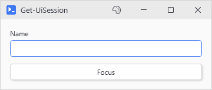
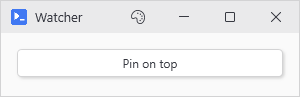
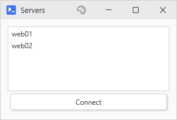
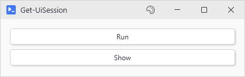

# Get-UiSession

## SYNOPSIS
The live session object for the window your code is running in.

## SYNTAX

```
Get-UiSession [<CommonParameters>]
```

## DESCRIPTION
Returns the session PsUi built for the current window. Most scripts should never need it. Control values arrive in an action as variables already, and Get-UiValue and Set-UiValue read and write them from anywhere without a session in sight. That is usually enough.

This is for the cases those leave uncovered, such as a raw WPF control behind a -Variable, a panel currently taking children, the Window itself, or a value that has to outlive the action that produced it.

It resolves inside anything PsUi runs. The -Content block while the window builds, button and menu actions, -OnChange handlers, and event handlers attached manually. At a console prompt, or in a script that never opened a window, there is no session to return and the result will always be empty.

Every window owns a separate session. A child window from New-UiChildWindow gets its own, and cannot see the parent's controls. Every control's actions run against the session of the window that built it so a parent button still finds the parent while a child is open. Inside the -NoAsync action that opens a nonmodal child, though, the child is the current session from then on, so read $session = Get-UiSession before opening one rather than after. -Modal is fine, since ShowDialog blocks until the parent is back.

The returned PsUI.SessionContext object exposes numerous members. These are the members worth knowing:

- Window, the WPF Window, live from the moment -Content starts running
- CurrentParent, the panel accepting children right now, during -Content
- GetControl('name'), the control registered under a -Variable name
- GetRegisteredButton('name'), because buttons keep a registry of their own
- AddControlSafe('name', $control), enrolls a control you built by hand
- SetCapturedVariable('name', $value), stores a value later actions receive by that name. Captured names share one namespace with -Variable names and override them, so pick a name no control is using. The store this is added into beats a variable of the same name an action picked up from scope, and loses to one passed through -Variables or -LinkedVariables
- GetCapturedVariable('name'), reads a variable value back

Everything else on the object backs the module and can change between releases. Variables, for example, looks like the obvious place for values and is not. It is the control registry, one entry per -Variable name, scanned at click time for credential controls. A colliding key overwrites the control's entry.

The rest of the members, named here to aid in any debugging, are:

- The other registries:
    - Controls: the same controls as Variables, without the proxies.
    - SafeVariables: one ThreadSafeControlProxy per name, and what the hydration engine walks to build the variables an action receives.
    - CapturedVariables: the raw store behind SetCapturedVariable. Writing to it directly skips the -EnabledWhen notification.
- Identity and lifetime:
    - SessionId: the Guid.
    - Id: its first eight characters.
    - Created: when the session was made.
    - Clear(): empties every registry and drops Window, CurrentParent, TabControl, CurrentDefinition and ActiveExecutor.
- Layout, live only while -Content is still running:
    - TabControl: the TabControl, once the window has tabs.
    - LayoutMode: Responsive unless something set it otherwise.
    - TabAlignment: Left by default.
    - MaxColumns: 2 by default.
- Settings carried from New-UiWindow:
    - DebugMode: true when the window was opened with -Debug.
    - ExportOnClose: true when captured values reach global scope as the window closes.
    - CustomLogo: a path that overrides the themed window icon.
    - UseMtaThreading: true for pool threads, false for STA ones.
    - ActiveDialogParent: the window a dialog centers on.
- Error reporting:
    - CallerScriptName: the file PsUi names with an error thrown inside -Content.
    - CallerScriptLine: the line it counts from.
- Async and tools:
    - ActiveExecutor: the background run in progress, and what Stop-UiAsync cancels.
    - CurrentDefinition: where New-UiTool sets its definition so its own handlers read it without a closure.
- Behind the list builders (New-UiList, New-UiDropdown, New-UiDataGrid):
    - RegisterListCollection: stores the list behind a -Variable name.
    - GetListCollection: reads that list back.
    - RegisterListDisplayFormat: stores the display template for that name.
    - GetListDisplayFormat: reads that template back.
    - GetAllListKeys: every registered list name.
    - ClearListRegistry: drops every list and template at once.
- Behind -SubmitButton and window hotkeys:
    - RegisterButton: enrolls a button so Enter can find it.
    - RegisterHotkey: binds a key combination to an action.
    - GetHotkeyAction: the action behind one combination.
    - GetRegisteredHotkeys: every combination registered.
- Behind -EnabledWhen:
    - RegisterVariableBinding: enrolls a control that enables and disables with a captured variable.
    - OnCapturedVariableChanged: the event that fires every time SetCapturedVariable runs.
- Deprecated but left for scripts that already call them:
    - AddControl: AddControlSafe does the same and adds the proxy.
    - GetSafeVariable: hands back the proxy, where Get-UiValue hands back the value.
- Allocated with the session and read by nothing in the module:
    - ParentStack
    - SyncTable

## EXAMPLES

### EXAMPLE 1
```
New-UIInput -Label Name -Variable userName
New-UiButton -Text 'Focus' -NoAsync -Action {
    (Get-UiSession).GetControl('userName').Focus()
}
```

Takes the TextBox behind -Variable 'userName' and focuses it. No parameter covers focus, so the control itself does the work.

<p align="center"></p>

### EXAMPLE 2
```
New-UiWindow -Title 'Watcher' -Content {
    New-UiButton -Text 'Pin on top' -NoAsync -Action {
        (Get-UiSession).Window.Topmost = $true
    }
}
```

Reaches the live Window from an action. For a property you want to set immediately, New-UiWindow -WPFProperties @{ Topmost = $true } does it with no session involved.

<p align="center"></p>

### EXAMPLE 3
```
New-UiWindow -Title 'Servers' -Content {
    $session = Get-UiSession
    $picker  = [System.Windows.Controls.ListView]@{ Height = 110; ItemsSource = @('web01', 'web02') }
    [void]$session.CurrentParent.Children.Add($picker)
    $session.AddControlSafe('server', $picker)
    [PsUi.ThemeEngine]::RegisterElement($picker)
    New-UiButton -Text 'Connect' -Action { Write-Host $server.SelectedItem }
}
```

Enrolls a control PsUi has no command for. CurrentParent puts it in the layout, AddControlSafe puts it in hydration, RegisterElement puts it on the theme engine's list, and the action then receives $server like any other control. Name the local something other than the registered name.

<p align="center"></p>

### EXAMPLE 4
```
New-UiButton -Text 'Run' -Action {
    (Get-UiSession).SetCapturedVariable('lastRun', (Get-Date))
}
New-UiButton -Text 'Show' -Action { Write-Host "Last run $lastRun" }
```

Hands a value from one action to another. Hydrated variables reset with each run, so anything that has to persist goes through the captured store. New-UiButton -Capture fills the same store from a parameter. This is for a name or value -Capture cannot reach, and Set-UiCapturedVariable -Name 'lastRun' -Value (Get-Date) does the same in one call.

The store stays with the window. It reaches the calling script only when the window was opened with New-UiWindow -ExportOnClose, and a script that let PsUi build the window ends when the window closes, so there is nothing after it to reach.

<p align="center"></p>

## PARAMETERS

### CommonParameters
This cmdlet supports the common parameters: -Debug, -ErrorAction, -ErrorVariable, -InformationAction, -InformationVariable, -OutVariable, -OutBuffer, -PipelineVariable, -Verbose, -WarningAction, and -WarningVariable. For more information, see [about_CommonParameters](http://go.microsoft.com/fwlink/?LinkID=113216).

## INPUTS

### None
## OUTPUTS

### PsUi.SessionContext
## NOTES
GetControl hands back the raw control with no thread guard around it, so touch what it returns only from code already on the UI thread. That means -Content, plus any -NoAsync action, -OnChange handler, or event handler attached manually. From an async action use Get-UiValue and Set-UiValue, which handle the thread stuff themselves.

Get-UiSession itself is safe to call from an async action. It is the raw WPF objects it hands back that are not.

## RELATED LINKS
