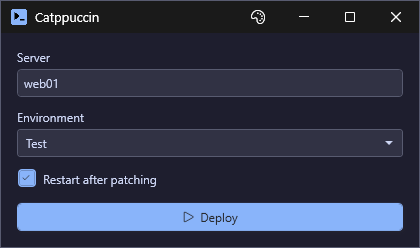
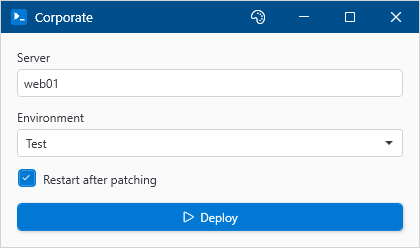

# Register-UiTheme

## SYNOPSIS
Registers a custom theme for use in PsUi windows.

## SYNTAX

```
Register-UiTheme [-Name] <String> [-Colors] <Hashtable> [[-BasedOn] <String>] [-Force]
 [<CommonParameters>]
```

## DESCRIPTION
Adds a user-defined theme to the available set. Once registered, pass the name to -Theme on New-UiWindow (or any Out-* window), or pick it from the theme picker.

Themes are hashtables mapping color keys to hex color values. At minimum, provide Type (Light/Dark), WindowBg, WindowFg, ControlBg, ControlFg, Accent, and Border. Missing colors will fall back to the base Light or Dark theme.

## EXAMPLES

### EXAMPLE 1
```
$myTheme = @{
    Type       = 'Dark'
    WindowBg   = '#1E1E2E'
    WindowFg   = '#CDD6F4'
    ControlBg  = '#313244'
    ControlFg  = '#CDD6F4'
    ButtonBg   = '#45475A'
    ButtonFg   = '#CDD6F4'
    Accent     = '#89B4FA'
    Border     = '#585B70'
}
Register-UiTheme -Name 'Catppuccin' -Colors $myTheme -BasedOn 'Dark'
```

<p align="center"></p>

### EXAMPLE 2
```
# Create a corporate theme based on Light
Register-UiTheme -Name 'Corporate' -Colors @{
    Type   = 'Light'
    Accent = '#0078D4'
    HeaderBackground = '#004E8C'
    HeaderForeground = '#FFFFFF'
} -BasedOn 'Light'
```

<p align="center"></p>

## PARAMETERS

### -Name
The display name for the theme. Used in theme picker menus.

<details><summary>Type: String (required)</summary>

```yaml
Type: String
Parameter Sets: (All)
Aliases:

Required: True
Position: 1
Default value: None
Accept pipeline input: False
Accept wildcard characters: False
```

</details>

### -Colors
Hashtable of color definitions. See Get-UiThemeTemplate for required keys.

<details><summary>Type: Hashtable (required)</summary>

```yaml
Type: Hashtable
Parameter Sets: (All)
Aliases:

Required: True
Position: 2
Default value: None
Accept pipeline input: False
Accept wildcard characters: False
```

</details>

### -BasedOn
Optional theme name to inherit missing values from. Defaults to 'Light'.

<details><summary>Type: String (optional)</summary>

```yaml
Type: String
Parameter Sets: (All)
Aliases:

Required: False
Position: 3
Default value: Light
Accept pipeline input: False
Accept wildcard characters: False
```

</details>

### -Force
Overwrite an existing theme with the same name.

<details><summary>Type: SwitchParameter (optional)</summary>

```yaml
Type: SwitchParameter
Parameter Sets: (All)
Aliases:

Required: False
Position: Named
Default value: False
Accept pipeline input: False
Accept wildcard characters: False
```

</details>

### CommonParameters
This cmdlet supports the common parameters: -Debug, -ErrorAction, -ErrorVariable, -InformationAction, -InformationVariable, -OutVariable, -OutBuffer, -PipelineVariable, -Verbose, -WarningAction, and -WarningVariable. For more information, see [about_CommonParameters](http://go.microsoft.com/fwlink/?LinkID=113216).

## INPUTS

## OUTPUTS

## NOTES

## RELATED LINKS
