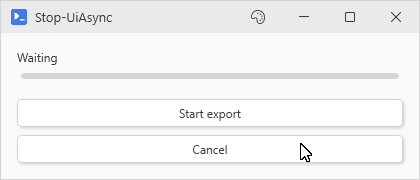

# Stop-UiAsync

## SYNOPSIS
Cancels the currently running async operation.

## SYNTAX

```
Stop-UiAsync [<CommonParameters>]
```

## DESCRIPTION
Stops the active background script running in the current session. If no async operation is running, this function does nothing. The cancelled script's OnComplete handler will not fire.

## EXAMPLES

### EXAMPLE 1
```
New-UiButton -Text 'Cancel' -Action { Stop-UiAsync } -NoAsync
# Cancel button that stops any running async operation
```

<p align="center"></p>

### EXAMPLE 2
```
Register-UiHotkey -Key 'Escape' -Action { Stop-UiAsync } -NoAsync
# Escape key cancels the current operation
```

## PARAMETERS

### CommonParameters
This cmdlet supports the common parameters: -Debug, -ErrorAction, -ErrorVariable, -InformationAction, -InformationVariable, -OutVariable, -OutBuffer, -PipelineVariable, -Verbose, -WarningAction, and -WarningVariable. For more information, see [about_CommonParameters](http://go.microsoft.com/fwlink/?LinkID=113216).

## INPUTS

## OUTPUTS

## NOTES

## RELATED LINKS
