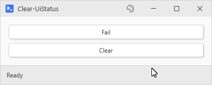

# Clear-UiStatus

## SYNOPSIS
Resets a status bar to its initial state.

## SYNTAX

```
Clear-UiStatus [[-Variable] <String>] [<CommonParameters>]
```

## DESCRIPTION
Puts the status text back to what the bar started with (its -DefaultText, or the first label in its -Content), cancels any pending severity auto-reset, drops the tint back to Info, and zeros the embedded progress bar (if any). Safe to call from any thread.

## EXAMPLES

### EXAMPLE 1
```
Clear-UiStatus
```

<p align="center"></p>

### EXAMPLE 2
```
Clear-UiStatus -Variable 'uploadBar'
```

## PARAMETERS

### -Variable
The variable name the status bar was registered under. When omitted, the active status bar is resolved automatically.

<details><summary>Type: String (optional)</summary>

```yaml
Type: String
Parameter Sets: (All)
Aliases:

Required: False
Position: 1
Default value: None
Accept pipeline input: False
Accept wildcard characters: False
```

</details>

### CommonParameters
This cmdlet supports the common parameters: -Debug, -ErrorAction, -ErrorVariable, -InformationAction, -InformationVariable, -OutVariable, -OutBuffer, -PipelineVariable, -Verbose, -WarningAction, and -WarningVariable. For more information, see [about_CommonParameters](http://go.microsoft.com/fwlink/?LinkID=113216).

## INPUTS

## OUTPUTS

## NOTES

## RELATED LINKS
