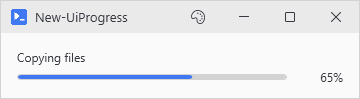
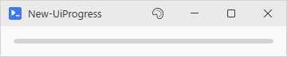
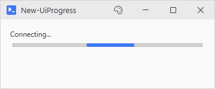
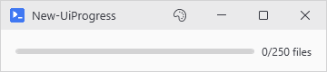
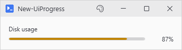
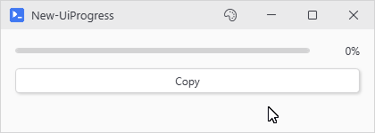

# New-UiProgress

<p align="center"></p>

## SYNOPSIS
Creates a progress bar.

## SYNTAX

```
New-UiProgress [[-Variable] <String>] [[-Label] <String>] [[-Minimum] <Double>] [[-Maximum] <Double>]
 [[-Default] <Double>] [[-Height] <Int32>] [-Indeterminate] [-ShowValue] [[-ValueFormat] <String>]
 [[-Severity] <String>] [[-WPFProperties] <Hashtable>]
 [<CommonParameters>]
```

## DESCRIPTION
Determinate or indeterminate progress bar. Drive it with Set-UiProgress while an action runs, or just assign the hydrated variable and let it sync at action end.

## EXAMPLES

### EXAMPLE 1
```
New-UiProgress -Variable 'progress'
```

<p align="center"></p>

### EXAMPLE 2
```
New-UiProgress -Variable 'loading' -Indeterminate -Label 'Connecting...'
```

<p align="center"></p>

### EXAMPLE 3
```
New-UiProgress -Variable 'files' -Maximum 250 -ShowValue -ValueFormat '{0}/{1} files'
```

<p align="center"></p>

### EXAMPLE 4
```
New-UiProgress -Variable 'disk' -Default 87 -ShowValue -Severity Warning -Label 'Disk usage'
```

<p align="center"></p>

### EXAMPLE 5
```
# Set-UiProgress drives the bar from any action
New-UiProgress -Variable 'copyBar' -ShowValue
New-UiButton -Text 'Copy' -NoOutput -Action {
    foreach ($step in 1..10) {
        Set-UiProgress -Variable 'copyBar' -Value ($step * 10)
        Start-Sleep -Milliseconds 250
    }
}
```

<p align="center"></p>

## PARAMETERS

### -Variable
Variable name to reference the bar later.

<details><summary>Type: String (optional)</summary>

```yaml
Type: String
Parameter Sets: (All)
Aliases:

Required: False
Position: 1
Default value: None
Accept pipeline input: False
Accept wildcard characters: False
```

</details>

### -Label
Optional text shown above the bar. Updateable via Set-UiProgress -Label.

<details><summary>Type: String (optional)</summary>

```yaml
Type: String
Parameter Sets: (All)
Aliases:

Required: False
Position: 2
Default value: None
Accept pipeline input: False
Accept wildcard characters: False
```

</details>

### -Minimum
Lower limit. Default 0.

<details><summary>Type: Double (optional)</summary>

```yaml
Type: Double
Parameter Sets: (All)
Aliases:

Required: False
Position: 3
Default value: 0
Accept pipeline input: False
Accept wildcard characters: False
```

</details>

### -Maximum
Upper limit. Default 100.

<details><summary>Type: Double (optional)</summary>

```yaml
Type: Double
Parameter Sets: (All)
Aliases:

Required: False
Position: 4
Default value: 100
Accept pipeline input: False
Accept wildcard characters: False
```

</details>

### -Default
Initial value. Default 0.

<details><summary>Type: Double (optional)</summary>

```yaml
Type: Double
Parameter Sets: (All)
Aliases:

Required: False
Position: 5
Default value: 0
Accept pipeline input: False
Accept wildcard characters: False
```

</details>

### -Height
Bar height in pixels.

<details><summary>Type: Int32 (optional)</summary>

```yaml
Type: Int32
Parameter Sets: (All)
Aliases:

Required: False
Position: 6
Default value: 6
Accept pipeline input: False
Accept wildcard characters: False
```

</details>

### -Indeterminate
Animated bar instead of a fill.

<details><summary>Type: SwitchParameter (optional)</summary>

```yaml
Type: SwitchParameter
Parameter Sets: (All)
Aliases:

Required: False
Position: Named
Default value: False
Accept pipeline input: False
Accept wildcard characters: False
```

</details>

### -ShowValue
Render the current value as text beside the bar. Pointless with -Indeterminate (the bar has no real value to display), but allowed.

<details><summary>Type: SwitchParameter (optional)</summary>

```yaml
Type: SwitchParameter
Parameter Sets: (All)
Aliases:

Required: False
Position: Named
Default value: False
Accept pipeline input: False
Accept wildcard characters: False
```

</details>

### -ValueFormat
Format string for the value text. {0} is current, {1} is max. Defaults to '{0:N0}%'. '{0}/{1}' gives you the x/y look.

<details><summary>Type: String (optional)</summary>

```yaml
Type: String
Parameter Sets: (All)
Aliases:

Required: False
Position: 7
Default value: {0:N0}%
Accept pipeline input: False
Accept wildcard characters: False
```

</details>

### -Severity
Color tint: Info (default), Success, Warning, Error.

<details><summary>Type: String (optional)</summary>

```yaml
Type: String
Parameter Sets: (All)
Aliases:

Required: False
Position: 8
Default value: Info
Accept pipeline input: False
Accept wildcard characters: False
```

</details>

### -WPFProperties
Hashtable of additional WPF properties.

<details><summary>Type: Hashtable (optional)</summary>

```yaml
Type: Hashtable
Parameter Sets: (All)
Aliases:

Required: False
Position: 9
Default value: None
Accept pipeline input: False
Accept wildcard characters: False
```

</details>

### CommonParameters
This cmdlet supports the common parameters: -Debug, -ErrorAction, -ErrorVariable, -InformationAction, -InformationVariable, -OutVariable, -OutBuffer, -PipelineVariable, -Verbose, -WarningAction, and -WarningVariable. For more information, see [about_CommonParameters](http://go.microsoft.com/fwlink/?LinkID=113216).

## INPUTS

## OUTPUTS

## NOTES

## RELATED LINKS
