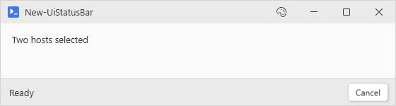
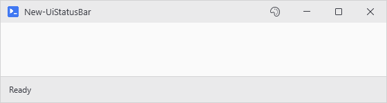
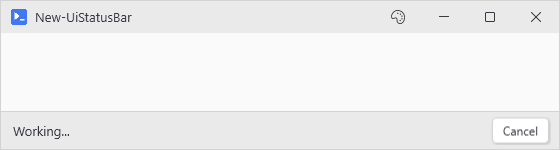
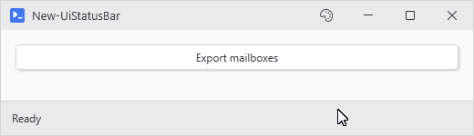
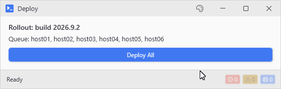
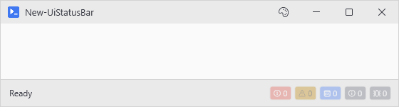

# New-UiStatusBar

<p align="center"></p>

## SYNOPSIS
Creates a status bar docked to the bottom (or top) of the window.

## SYNTAX

```
New-UiStatusBar [[-Content] <ScriptBlock>] [[-Variable] <String>] [[-Location] <String>]
 [[-DefaultText] <String>] [-AutoProgress] [-AutoCancel] [-Intercept] [-CaptureHost] [-CaptureVerbose]
 [-CaptureDebug] [-CaptureAll] [-NoOutputOnly] [-Persist] [[-MaxMessages] <Int32>] [-Inline]
 [[-WPFProperties] <Hashtable>] [<CommonParameters>]
```

## DESCRIPTION
Themed bar with freeform child controls. New-UiSpacer pushes what follows to the right, and -AutoProgress embeds a bar that Write-Progress drives. Inside New-UiTab or New-UiExpander the bar stays there and hides with it. Write-Status without a name goes to the window's own bar, so give an inner bar a -Variable to reach it.

## EXAMPLES

### EXAMPLE 1
```
New-UiStatusBar -DefaultText 'Ready'
```

<p align="center"></p>

### EXAMPLE 2
```
New-UiStatusBar -Content {
    New-UiLabel -Text 'Working...'
    New-UiSpacer
    New-UiButton -Text 'Cancel' -NoAsync -Action { Stop-UiAsync }
}
```

<p align="center"></p>

### EXAMPLE 3
```
New-UiStatusBar -DefaultText 'Ready' -AutoProgress -AutoCancel
```

<p align="center"></p>

### EXAMPLE 4
```
New-UiStatusBar -Intercept -CaptureHost -AutoProgress -DefaultText 'Ready'
```

Intercepts warnings/errors as badge counters and routes Write-Host to the status text. Click a badge to see accumulated messages.

<p align="center"></p>

### EXAMPLE 5
```
New-UiStatusBar -Intercept -CaptureAll -Persist -DefaultText 'Ready'
```

Console-grade capture: warnings, errors, Write-Host and Write-Information, verbose, and debug all land as badges, and counts stack across clicks.

<p align="center"></p>

## PARAMETERS

### -Content
Scriptblock defining the bar's child controls. Optional when -DefaultText is supplied.

<details><summary>Type: ScriptBlock (optional)</summary>

```yaml
Type: ScriptBlock
Parameter Sets: (All)
Aliases:

Required: False
Position: 1
Default value: None
Accept pipeline input: False
Accept wildcard characters: False
```

</details>

### -Variable
Session name for the bar. When omitted, a synthetic name is minted and the bar stays discoverable via the IsStatusBar tag fallback.

<details><summary>Type: String (optional)</summary>

```yaml
Type: String
Parameter Sets: (All)
Aliases: Name

Required: False
Position: 2
Default value: None
Accept pipeline input: False
Accept wildcard characters: False
```

</details>

### -Location
'Bottom' (default) or 'Top'. Inside a tab or expander, Top puts the bar first and Bottom leaves it where it is written.

<details><summary>Type: String (optional)</summary>

```yaml
Type: String
Parameter Sets: (All)
Aliases:

Required: False
Position: 3
Default value: Bottom
Accept pipeline input: False
Accept wildcard characters: False
```

</details>

### -DefaultText
Initial status text. Prepends a TextBlock that becomes the canonical status label Set-UiStatusBar / Write-Status target.

<details><summary>Type: String (optional)</summary>

```yaml
Type: String
Parameter Sets: (All)
Aliases:

Required: False
Position: 4
Default value: None
Accept pipeline input: False
Accept wildcard characters: False
```

</details>

### -AutoProgress
Embeds a right-anchored progress bar that updates from Write-Progress emitted by button actions.

<details><summary>Type: SwitchParameter (optional)</summary>

```yaml
Type: SwitchParameter
Parameter Sets: (All)
Aliases:

Required: False
Position: Named
Default value: False
Accept pipeline input: False
Accept wildcard characters: False
```

</details>

### -AutoCancel
Embeds a Cancel button that becomes visible while an async action is running. Click calls Stop-UiAsync.

<details><summary>Type: SwitchParameter (optional)</summary>

```yaml
Type: SwitchParameter
Parameter Sets: (All)
Aliases:

Required: False
Position: Named
Default value: False
Accept pipeline input: False
Accept wildcard characters: False
```

</details>

### -Intercept
Catches Write-Warning and Write-Error from button actions as badge counters on the bar. Click a badge for the messages. Badges reset each action unless -Persist is set. While the bar shows, -NoOutput and grid action errors land here instead of in a dialog.

<details><summary>Type: SwitchParameter (optional)</summary>

```yaml
Type: SwitchParameter
Parameter Sets: (All)
Aliases:

Required: False
Position: Named
Default value: False
Accept pipeline input: False
Accept wildcard characters: False
```

</details>

### -CaptureHost
Requires -Intercept. Also intercepts Write-Host and Write-Information from button actions, counting them on a console badge and displaying the latest message in the status text label. Captures from every button, output window or not; add -NoOutputOnly to count only the windowless ones.

<details><summary>Type: SwitchParameter (optional)</summary>

```yaml
Type: SwitchParameter
Parameter Sets: (All)
Aliases:

Required: False
Position: Named
Default value: False
Accept pipeline input: False
Accept wildcard characters: False
```

</details>

### -CaptureVerbose
Requires -Intercept. Adds a badge that counts Write-Verbose output from button actions. Records only flow when the action's $VerbosePreference allows them, same as a console.

<details><summary>Type: SwitchParameter (optional)</summary>

```yaml
Type: SwitchParameter
Parameter Sets: (All)
Aliases:

Required: False
Position: Named
Default value: False
Accept pipeline input: False
Accept wildcard characters: False
```

</details>

### -CaptureDebug
Requires -Intercept. Adds a badge that counts Write-Debug output from button actions. Gated by $DebugPreference, same as -CaptureVerbose. Not compatible with New-UiWindow -Debug, which routes debug lines to the real console instead - the badge stays at zero there.

<details><summary>Type: SwitchParameter (optional)</summary>

```yaml
Type: SwitchParameter
Parameter Sets: (All)
Aliases:

Required: False
Position: Named
Default value: False
Accept pipeline input: False
Accept wildcard characters: False
```

</details>

### -CaptureAll
Requires -Intercept. Shorthand for -CaptureHost -CaptureVerbose -CaptureDebug (every stream a console would show lands on the bar).

<details><summary>Type: SwitchParameter (optional)</summary>

```yaml
Type: SwitchParameter
Parameter Sets: (All)
Aliases:

Required: False
Position: Named
Default value: False
Accept pipeline input: False
Accept wildcard characters: False
```

</details>

### -NoOutputOnly
Requires -Intercept. Only intercepts from buttons that do NOT have an output window. Prevents duplicate badge notifications when warnings and errors are already visible in the output window.

<details><summary>Type: SwitchParameter (optional)</summary>

```yaml
Type: SwitchParameter
Parameter Sets: (All)
Aliases:

Required: False
Position: Named
Default value: False
Accept pipeline input: False
Accept wildcard characters: False
```

</details>

### -Persist
Requires -Intercept. Keeps badge counters and popup messages across button actions instead of resetting on each new click. Useful for cumulative tracking across a workflow.

<details><summary>Type: SwitchParameter (optional)</summary>

```yaml
Type: SwitchParameter
Parameter Sets: (All)
Aliases:

Required: False
Position: Named
Default value: False
Accept pipeline input: False
Accept wildcard characters: False
```

</details>

### -MaxMessages
Requires -Intercept. Maximum number of messages per badge popup before oldest entries are dropped. Defaults to 100.

<details><summary>Type: Int32 (optional)</summary>

```yaml
Type: Int32
Parameter Sets: (All)
Aliases:

Required: False
Position: 5
Default value: 100
Accept pipeline input: False
Accept wildcard characters: False
```

</details>

### -Inline
Force docking to the immediate parent instead of the window's outer panel. Tabs and expanders are already auto-detected; this is the override for everything else.

<details><summary>Type: SwitchParameter (optional)</summary>

```yaml
Type: SwitchParameter
Parameter Sets: (All)
Aliases:

Required: False
Position: Named
Default value: False
Accept pipeline input: False
Accept wildcard characters: False
```

</details>

### -WPFProperties
Hashtable of additional WPF properties to set on the bar root.

<details><summary>Type: Hashtable (optional)</summary>

```yaml
Type: Hashtable
Parameter Sets: (All)
Aliases:

Required: False
Position: 6
Default value: None
Accept pipeline input: False
Accept wildcard characters: False
```

</details>

### CommonParameters
This cmdlet supports the common parameters: -Debug, -ErrorAction, -ErrorVariable, -InformationAction, -InformationVariable, -OutVariable, -OutBuffer, -PipelineVariable, -Verbose, -WarningAction, and -WarningVariable. For more information, see [about_CommonParameters](http://go.microsoft.com/fwlink/?LinkID=113216).

## INPUTS

## OUTPUTS

## NOTES

## RELATED LINKS
