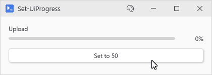
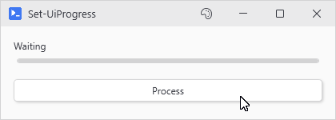
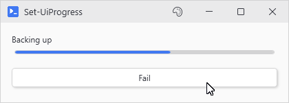

# Set-UiProgress

## SYNOPSIS
Updates a progress bar's value, label, severity tint, or mode.

## SYNTAX

```
Set-UiProgress [-Variable] <String> [[-Value] <Double>] [[-Increment] <Double>] [[-Label] <String>]
 [[-Severity] <String>] [[-Indeterminate] <Boolean>] [<CommonParameters>]
```

## DESCRIPTION
Updates a New-UiProgress bar while an action runs: set or increment the value, swap the label, tint by severity, or flip indeterminate mode. Safe to call from async actions.

## EXAMPLES

### EXAMPLE 1
```
Set-UiProgress -Variable 'progress' -Value 50
```

<p align="center"></p>

### EXAMPLE 2
```
Set-UiProgress -Variable 'files' -Increment 1 -Label "Processed $i of $total"
```

<p align="center"></p>

### EXAMPLE 3
```
Set-UiProgress -Variable 'job' -Severity Error -Label 'Failed'
```

<p align="center"></p>

## PARAMETERS

### -Variable
Name of the progress bar to update.

<details><summary>Type: String (required)</summary>

```yaml
Type: String
Parameter Sets: (All)
Aliases:

Required: True
Position: 1
Default value: None
Accept pipeline input: False
Accept wildcard characters: False
```

</details>

### -Value
New value. Clamped to the bar's Min/Max.

<details><summary>Type: Double (optional)</summary>

```yaml
Type: Double
Parameter Sets: (All)
Aliases:

Required: False
Position: 2
Default value: 0
Accept pipeline input: False
Accept wildcard characters: False
```

</details>

### -Increment
Add this to the current value. If combined with -Value, adds to that.

<details><summary>Type: Double (optional)</summary>

```yaml
Type: Double
Parameter Sets: (All)
Aliases:

Required: False
Position: 3
Default value: 0
Accept pipeline input: False
Accept wildcard characters: False
```

</details>

### -Label
Replace the label text above the bar (only works if built with -Label).

<details><summary>Type: String (optional)</summary>

```yaml
Type: String
Parameter Sets: (All)
Aliases:

Required: False
Position: 4
Default value: None
Accept pipeline input: False
Accept wildcard characters: False
```

</details>

### -Severity
Re-tint the bar: Info, Success, Warning, Error.

<details><summary>Type: String (optional)</summary>

```yaml
Type: String
Parameter Sets: (All)
Aliases:

Required: False
Position: 5
Default value: None
Accept pipeline input: False
Accept wildcard characters: False
```

</details>

### -Indeterminate
Toggle indeterminate mode on/off. Bar template is fixed at construction, so the first toggle starts the animation cold. Pass -Indeterminate to New-UiProgress up front for cleaner motion.

<details><summary>Type: Boolean (optional)</summary>

```yaml
Type: Boolean
Parameter Sets: (All)
Aliases:

Required: False
Position: 6
Default value: False
Accept pipeline input: False
Accept wildcard characters: False
```

</details>

### CommonParameters
This cmdlet supports the common parameters: -Debug, -ErrorAction, -ErrorVariable, -InformationAction, -InformationVariable, -OutVariable, -OutBuffer, -PipelineVariable, -Verbose, -WarningAction, and -WarningVariable. For more information, see [about_CommonParameters](http://go.microsoft.com/fwlink/?LinkID=113216).

## INPUTS

## OUTPUTS

## NOTES

## RELATED LINKS
