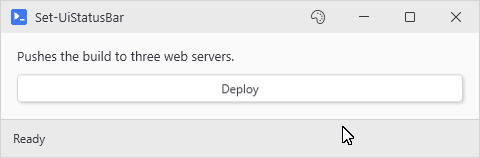

# Set-UiStatusBar

## SYNOPSIS
Updates status bar text, progress, and severity from any thread.

## SYNTAX

```
Set-UiStatusBar [[-Text] <String>] [[-Progress] <Int32>] [[-Increment] <Int32>] [[-Severity] <String>]
 [-Indeterminate] [[-Timeout] <Int32>] [[-Variable] <String>]
 [<CommonParameters>]
```

## DESCRIPTION
Pass any combination of parameters. Only bound parameters take effect. -Severity tint auto-resets to Info after 5 seconds unless -Timeout overrides; pass 0 to keep the tint until the next change.

## EXAMPLES

### EXAMPLE 1
```
Set-UiStatusBar -Text 'Deploying...' -Progress 87 -Severity Warning
```

<p align="center"></p>

### EXAMPLE 2
```
Set-UiStatusBar -Severity Error -Timeout 0 -Text 'Failed'
```

<p align="center"></p>

## PARAMETERS

### -Text
Status text. Sets .Text on the bar's status label (the first non-glyph TextBlock). Pass an empty string to clear.

<details><summary>Type: String (optional)</summary>

```yaml
Type: String
Parameter Sets: (All)
Aliases:

Required: False
Position: 1
Default value: None
Accept pipeline input: False
Accept wildcard characters: False
```

</details>

### -Progress
Progress value (0-100). Sets .Value on the embedded progress bar. If both -Progress and -Increment are bound, -Progress wins. A value above zero holds the bar on screen across actions; zero releases the hold and hides the bar. For a visible not-started state, use -Indeterminate instead of zero.

<details><summary>Type: Int32 (optional)</summary>

```yaml
Type: Int32
Parameter Sets: (All)
Aliases:

Required: False
Position: 2
Default value: 0
Accept pipeline input: False
Accept wildcard characters: False
```

</details>

### -Increment
Adds to the current progress value. Clamps to \[0, 100]. Ignored when -Progress is also bound.

<details><summary>Type: Int32 (optional)</summary>

```yaml
Type: Int32
Parameter Sets: (All)
Aliases:

Required: False
Position: 3
Default value: 0
Accept pipeline input: False
Accept wildcard characters: False
```

</details>

### -Severity
Bar tint: Info, Success, Warning, Error. Survives theme switches.

<details><summary>Type: String (optional)</summary>

```yaml
Type: String
Parameter Sets: (All)
Aliases:

Required: False
Position: 4
Default value: None
Accept pipeline input: False
Accept wildcard characters: False
```

</details>

### -Indeterminate
Toggles indeterminate mode on the embedded progress bar.

<details><summary>Type: SwitchParameter (optional)</summary>

```yaml
Type: SwitchParameter
Parameter Sets: (All)
Aliases:

Required: False
Position: Named
Default value: False
Accept pipeline input: False
Accept wildcard characters: False
```

</details>

### -Timeout
Seconds before severity auto-resets to Info. Defaults to 5 when -Severity is bound. Pass 0 to keep the tint until the next manual change.

<details><summary>Type: Int32 (optional)</summary>

```yaml
Type: Int32
Parameter Sets: (All)
Aliases:

Required: False
Position: 5
Default value: 0
Accept pipeline input: False
Accept wildcard characters: False
```

</details>

### -Variable
Session name the bar was registered under. Resolves the active bar when omitted.

<details><summary>Type: String (optional)</summary>

```yaml
Type: String
Parameter Sets: (All)
Aliases:

Required: False
Position: 6
Default value: None
Accept pipeline input: False
Accept wildcard characters: False
```

</details>

### CommonParameters
This cmdlet supports the common parameters: -Debug, -ErrorAction, -ErrorVariable, -InformationAction, -InformationVariable, -OutVariable, -OutBuffer, -PipelineVariable, -Verbose, -WarningAction, and -WarningVariable. For more information, see [about_CommonParameters](http://go.microsoft.com/fwlink/?LinkID=113216).

## INPUTS

## OUTPUTS

## NOTES

## RELATED LINKS
