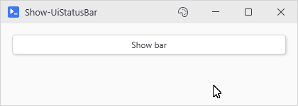

# Show-UiStatusBar

## SYNOPSIS
Restores a previously hidden status bar to view.

## SYNTAX

```
Show-UiStatusBar [[-Variable] <String>] [<CommonParameters>]
```

## DESCRIPTION
Sets Visibility to Visible. Safe to call from any thread.

## EXAMPLES

### EXAMPLE 1
```
Show-UiStatusBar
```

<p align="center"></p>

### EXAMPLE 2
```
Show-UiStatusBar -Variable 'mainBar'
```

## PARAMETERS

### -Variable
Optional session variable name. When omitted, the registered status bar is resolved automatically (window bars win over inline ones).

<details><summary>Type: String (optional)</summary>

```yaml
Type: String
Parameter Sets: (All)
Aliases:

Required: False
Position: 1
Default value: None
Accept pipeline input: False
Accept wildcard characters: False
```

</details>

### CommonParameters
This cmdlet supports the common parameters: -Debug, -ErrorAction, -ErrorVariable, -InformationAction, -InformationVariable, -OutVariable, -OutBuffer, -PipelineVariable, -Verbose, -WarningAction, and -WarningVariable. For more information, see [about_CommonParameters](http://go.microsoft.com/fwlink/?LinkID=113216).

## INPUTS

## OUTPUTS

## NOTES

## RELATED LINKS
