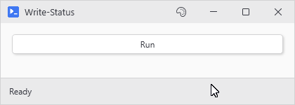
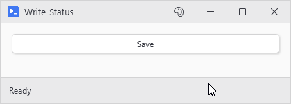

# Write-Status

## SYNOPSIS
Writes a status message to a PsUi status bar from any thread.

## SYNTAX

```
Write-Status [-Message] <String> [-Severity <String>] [-Timeout <Int32>] [-Bar <String>]
 [<CommonParameters>]
```

## DESCRIPTION
Forwards to Set-UiStatusBar with a positional -Message. If no bar is found, Set-UiStatusBar emits a warning and the message is dropped.

## EXAMPLES

### EXAMPLE 1
```
Write-Status 'Processing...'
```

<p align="center"></p>

### EXAMPLE 2
```
Write-Status 'Failed' -Severity Error
```

<p align="center"></p>

### EXAMPLE 3
```
Write-Status 'Saved' -Severity Success -Bar 'mainBar'
```

<p align="center"></p>

## PARAMETERS

### -Message
The status text. Positional, so 'Write-Status "Working..."' works. Pass an empty string to clear.

<details><summary>Type: String (required)</summary>

```yaml
Type: String
Parameter Sets: (All)
Aliases:

Required: True
Position: 1
Default value: None
Accept pipeline input: False
Accept wildcard characters: False
```

</details>

### -Severity
Info, Success, Warning, or Error. Auto-resets after 5 seconds unless -Timeout 0 is also passed.

<details><summary>Type: String (optional)</summary>

```yaml
Type: String
Parameter Sets: (All)
Aliases:

Required: False
Position: Named
Default value: None
Accept pipeline input: False
Accept wildcard characters: False
```

</details>

### -Timeout
Seconds before severity auto-resets. Pass 0 to keep the tint until the next manual change.

<details><summary>Type: Int32 (optional)</summary>

```yaml
Type: Int32
Parameter Sets: (All)
Aliases:

Required: False
Position: Named
Default value: 0
Accept pipeline input: False
Accept wildcard characters: False
```

</details>

### -Bar
Session name of the target bar. Resolves the active bar when omitted.

<details><summary>Type: String (optional)</summary>

```yaml
Type: String
Parameter Sets: (All)
Aliases:

Required: False
Position: Named
Default value: None
Accept pipeline input: False
Accept wildcard characters: False
```

</details>

### CommonParameters
This cmdlet supports the common parameters: -Debug, -ErrorAction, -ErrorVariable, -InformationAction, -InformationVariable, -OutVariable, -OutBuffer, -PipelineVariable, -Verbose, -WarningAction, and -WarningVariable. For more information, see [about_CommonParameters](http://go.microsoft.com/fwlink/?LinkID=113216).

## INPUTS

## OUTPUTS

## NOTES

## RELATED LINKS
