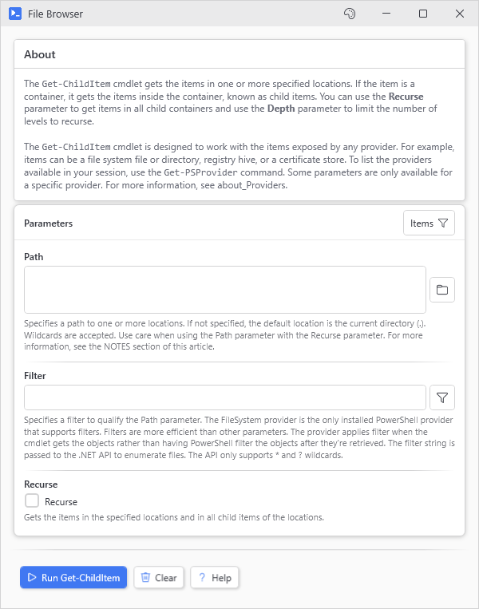
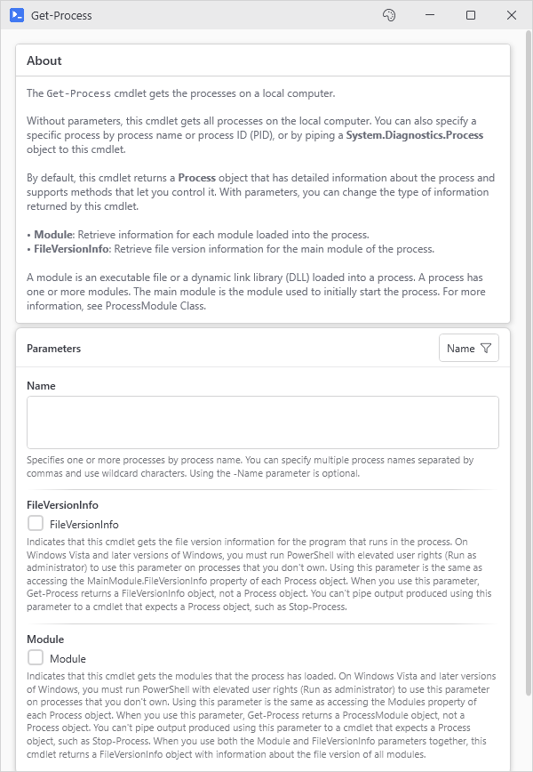
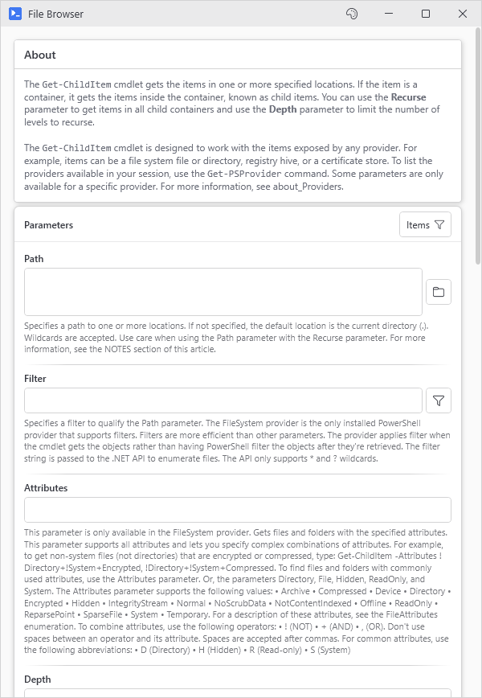
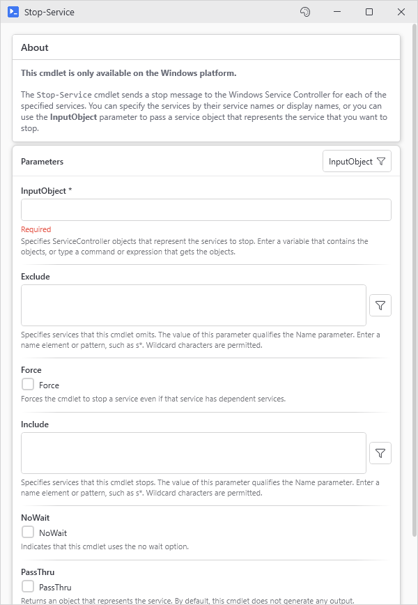
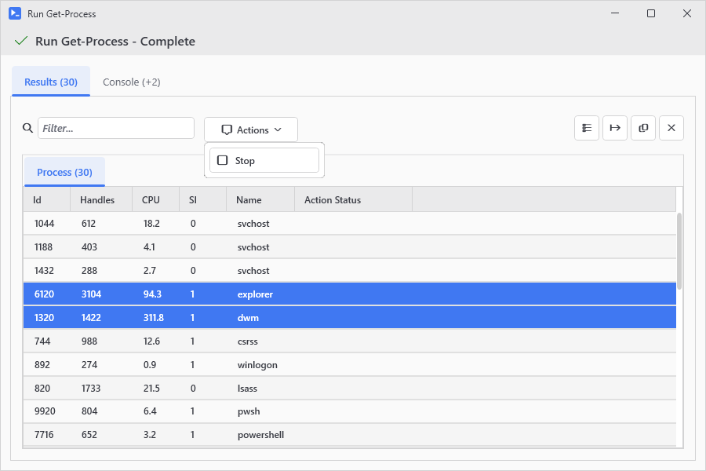
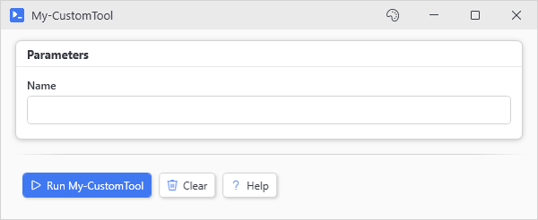
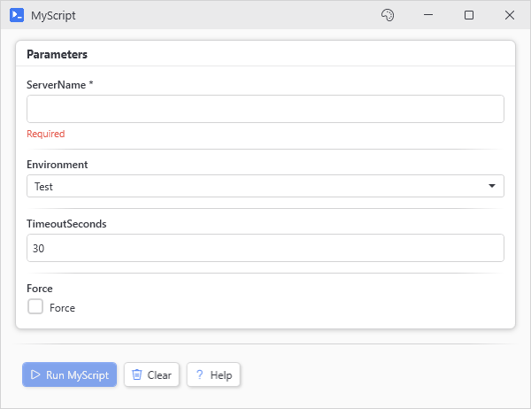

# New-UiTool

<p align="center"></p>

## SYNOPSIS
Builds a form from a command's parameter metadata.

## SYNTAX

```
New-UiTool [-Command] <Object> [-Title <String>] [-Width <Int32>] [-Height <Int32>] [-ParameterSet <String>]
 [-Theme <String>] [-ExcludeParameters <String[]>] [-IncludeCommonParameters] [-HideThemeButton]
 [-ShowParamType] [-ResultActions <Object>] [-SingleSelect] [-FilePickerParameters <String[]>]
 [-FolderPickerParameters <String[]>] [-ComputerPickerParameters <String[]>] [-UserPickerParameters <String[]>]
 [-GroupPickerParameters <String[]>] [-MemberPickerParameters <String[]>] [-OUPickerParameters <String[]>]
 [-NoAutoHelpers] [-LayoutStyle <String>] [-MaxColumns <Int32>]
 [<CommonParameters>]
```

## DESCRIPTION
New-UiTool reads a command's parameter metadata and builds a form with a matching control per parameter:

- \[ValidateSet\] becomes a dropdown
- \[switch\] and \[bool\] become toggles
- \[int\]/\[double\] become number inputs, or a slider when ValidateRange spans 10 steps or fewer
- \[string\] becomes a text input, \[string\[\]\] a multi-line text area
- \[datetime\] becomes a date picker
- \[SecureString\] becomes a password input, \[PSCredential\] a username and password pair
- Mandatory parameters gate the run button
- .PARAMETER help text becomes the caption under each control

Execution runs on a background thread, so the window stays alive during long commands. Results land in a sortable output grid.

All of this reads static parameter metadata. Dynamic parameters and validation that depends on live state don't survive inspection; build those forms by hand with the regular controls. For everything else, "time to GUI" for a script is one line.

## EXAMPLES

### EXAMPLE 1
```
New-UiTool -Command 'Get-Process'
```

Creates a GUI for Get-Process with inputs for Name, Id, etc.

<p align="center"></p>

### EXAMPLE 2
```
New-UiTool -Command 'Get-ChildItem' -Title "File Browser" -ExcludeParameters 'LiteralPath'
```

Creates a file browser tool, excluding the LiteralPath parameter.

<p align="center"></p>

### EXAMPLE 3
```
New-UiTool -Command 'Stop-Service' -ParameterSet 'InputObject'
```

Creates a service stopper using a specific parameter set.

<p align="center"></p>

### EXAMPLE 4
```
New-UiTool -Command 'Get-Process' -ResultActions {
    New-UiResultAction 'Stop' -Icon Stop -Confirm 'Stop {0} processes?' -Action { $_ | Stop-Process -Force }
}
```

Creates a process viewer with a Stop action that kills selected processes after a confirm. The legacy hashtable form still works: -ResultActions @( @{ Text = 'Stop'; Icon = 'Stop'; Action = { $_ | Stop-Process -Force } } )

<p align="center"></p>

### EXAMPLE 5
```
# A local function, so nothing needs registering globally.
function My-CustomTool { param([string]$Name) Write-Host "Hello $Name" }
New-UiTool -Command 'My-CustomTool'
```

Creates a GUI for a function defined in your script (detected from the calling scope).

<p align="center"></p>

### EXAMPLE 6
```
New-UiTool -Command '.\MyScript.ps1'
```

Creates a GUI for a parameterized script file.

<p align="center"></p>

## PARAMETERS

### -Command
The command to wrap: a cmdlet, function, alias, script path, or a CommandInfo object.

Pass a .ps1 that has no param block and only defines functions, and the form wraps its one function, or the one named after the file. Run dot sources the whole file first, so helper functions in the same file work. New-UiTool refuses a file that runs other code at its top level, since every Run would repeat it.

<details><summary>Type: Object (required)</summary>

```yaml
Type: Object
Parameter Sets: (All)
Aliases:

Required: True
Position: 1
Default value: None
Accept pipeline input: False
Accept wildcard characters: False
```

</details>

### -Title
Window title. Defaults to the command name.

<details><summary>Type: String (optional)</summary>

```yaml
Type: String
Parameter Sets: (All)
Aliases:

Required: False
Position: Named
Default value: None
Accept pipeline input: False
Accept wildcard characters: False
```

</details>

### -Width
Window width in pixels. Standalone windows default to 600. Inside a host window the child opens at 800 unless you pass one.

<details><summary>Type: Int32 (optional)</summary>

```yaml
Type: Int32
Parameter Sets: (All)
Aliases:

Required: False
Position: Named
Default value: 600
Accept pipeline input: False
Accept wildcard characters: False
```

</details>

### -Height
Window height in pixels. Only applied when you pass it. Inside a host window the child otherwise opens at 600, standalone the window sizes itself.

<details><summary>Type: Int32 (optional)</summary>

```yaml
Type: Int32
Parameter Sets: (All)
Aliases:

Required: False
Position: Named
Default value: 500
Accept pipeline input: False
Accept wildcard characters: False
```

</details>

### -ParameterSet
If the command has multiple parameter sets, specify which one to use. If not specified, uses the default parameter set or shows a selector.

<details><summary>Type: String (optional)</summary>

```yaml
Type: String
Parameter Sets: (All)
Aliases:

Required: False
Position: Named
Default value: None
Accept pipeline input: False
Accept wildcard characters: False
```

</details>

### -Theme
UI theme (Light, Dark, etc.)

<details><summary>Type: String (optional)</summary>

```yaml
Type: String
Parameter Sets: (All)
Aliases:

Required: False
Position: Named
Default value: None
Accept pipeline input: False
Accept wildcard characters: False
```

</details>

### -ExcludeParameters
Array of parameter names to exclude from the UI.

<details><summary>Type: String[] (optional)</summary>

```yaml
Type: String[]
Parameter Sets: (All)
Aliases:

Required: False
Position: Named
Default value: @()
Accept pipeline input: False
Accept wildcard characters: False
```

</details>

### -IncludeCommonParameters
Include common parameters like -Verbose, -Debug, etc. Default is false.

<details><summary>Type: SwitchParameter (optional)</summary>

```yaml
Type: SwitchParameter
Parameter Sets: (All)
Aliases:

Required: False
Position: Named
Default value: False
Accept pipeline input: False
Accept wildcard characters: False
```

</details>

### -HideThemeButton
Removes the theme switcher from the titlebar.

<details><summary>Type: SwitchParameter (optional)</summary>

```yaml
Type: SwitchParameter
Parameter Sets: (All)
Aliases:

Required: False
Position: Named
Default value: False
Accept pipeline input: False
Accept wildcard characters: False
```

</details>

### -ShowParamType
Displays the parameter type next to each input label.

<details><summary>Type: SwitchParameter (optional)</summary>

```yaml
Type: SwitchParameter
Parameter Sets: (All)
Aliases:

Required: False
Position: Named
Default value: False
Accept pipeline input: False
Accept wildcard characters: False
```

</details>

### -ResultActions
Actions offered against selected rows in the results grid. Pass a { New-UiResultAction ... } definition block, an array of New-UiResultAction output, or the legacy hashtable array (Text + Action required; optional: Icon, Confirm, ObjectType optional). The scriptblock receives $_ as the selected row(s).

<details><summary>Type: Object (optional)</summary>

```yaml
Type: Object
Parameter Sets: (All)
Aliases:

Required: False
Position: Named
Default value: None
Accept pipeline input: False
Accept wildcard characters: False
```

</details>

### -SingleSelect
When used with ResultActions, limits selection to a single row.

<details><summary>Type: SwitchParameter (optional)</summary>

```yaml
Type: SwitchParameter
Parameter Sets: (All)
Aliases:

Required: False
Position: Named
Default value: False
Accept pipeline input: False
Accept wildcard characters: False
```

</details>

### -FilePickerParameters
Parameter names that should get a file browse button.

<details><summary>Type: String[] (optional)</summary>

```yaml
Type: String[]
Parameter Sets: (All)
Aliases:

Required: False
Position: Named
Default value: @()
Accept pipeline input: False
Accept wildcard characters: False
```

</details>

### -FolderPickerParameters
Parameter names that should get a folder browse button.

<details><summary>Type: String[] (optional)</summary>

```yaml
Type: String[]
Parameter Sets: (All)
Aliases:

Required: False
Position: Named
Default value: @()
Accept pipeline input: False
Accept wildcard characters: False
```

</details>

### -ComputerPickerParameters
Parameter names that should get an AD computer picker button.

<details><summary>Type: String[] (optional)</summary>

```yaml
Type: String[]
Parameter Sets: (All)
Aliases:

Required: False
Position: Named
Default value: @()
Accept pipeline input: False
Accept wildcard characters: False
```

</details>

### -UserPickerParameters
Parameter names that should get an AD user picker button.

<details><summary>Type: String[] (optional)</summary>

```yaml
Type: String[]
Parameter Sets: (All)
Aliases:

Required: False
Position: Named
Default value: @()
Accept pipeline input: False
Accept wildcard characters: False
```

</details>

### -GroupPickerParameters
Parameter names that should get an AD group picker button.

<details><summary>Type: String[] (optional)</summary>

```yaml
Type: String[]
Parameter Sets: (All)
Aliases:

Required: False
Position: Named
Default value: @()
Accept pipeline input: False
Accept wildcard characters: False
```

</details>

### -MemberPickerParameters
Parameter names that should get an AD user/group picker button.

<details><summary>Type: String[] (optional)</summary>

```yaml
Type: String[]
Parameter Sets: (All)
Aliases:

Required: False
Position: Named
Default value: @()
Accept pipeline input: False
Accept wildcard characters: False
```

</details>

### -OUPickerParameters
Parameter names that should get an AD OU picker button.

<details><summary>Type: String[] (optional)</summary>

```yaml
Type: String[]
Parameter Sets: (All)
Aliases:

Required: False
Position: Named
Default value: @()
Accept pipeline input: False
Accept wildcard characters: False
```

</details>

### -NoAutoHelpers
Disables automatic helper button detection for common parameter names like Path or ComputerName.

<details><summary>Type: SwitchParameter (optional)</summary>

```yaml
Type: SwitchParameter
Parameter Sets: (All)
Aliases:

Required: False
Position: Named
Default value: False
Accept pipeline input: False
Accept wildcard characters: False
```

</details>

### -LayoutStyle
Control arrangement: Stack (vertical) or Wrap (multi-column).

<details><summary>Type: String (optional)</summary>

```yaml
Type: String
Parameter Sets: (All)
Aliases:

Required: False
Position: Named
Default value: Stack
Accept pipeline input: False
Accept wildcard characters: False
```

</details>

### -MaxColumns
Maximum columns when using Wrap layout. 0 means auto-detect based on window width.

<details><summary>Type: Int32 (optional)</summary>

```yaml
Type: Int32
Parameter Sets: (All)
Aliases:

Required: False
Position: Named
Default value: 0
Accept pipeline input: False
Accept wildcard characters: False
```

</details>

### CommonParameters
This cmdlet supports the common parameters: -Debug, -ErrorAction, -ErrorVariable, -InformationAction, -InformationVariable, -OutVariable, -OutBuffer, -PipelineVariable, -Verbose, -WarningAction, and -WarningVariable. For more information, see [about_CommonParameters](http://go.microsoft.com/fwlink/?LinkID=113216).

## INPUTS

## OUTPUTS

## NOTES

## RELATED LINKS
