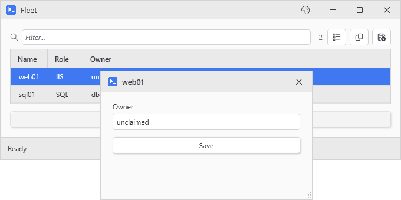
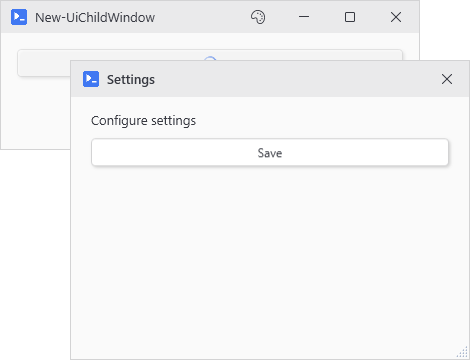
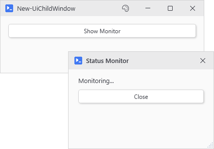
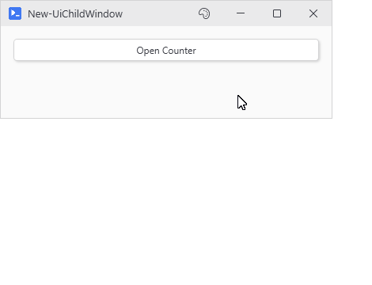

# New-UiChildWindow

<p align="center"></p>

## SYNOPSIS
Creates a child window that automatically inherits the parent's theme.

## SYNTAX

```
New-UiChildWindow [[-Parent] <Window>] [[-Title] <String>] [-Content] <ScriptBlock> [[-Width] <Int32>]
 [[-Height] <Int32>] [-SizeToContent] [-Modal] [[-Position] <String>] [[-Left] <Int32>] [[-Top] <Int32>]
 [-NoResize] [[-OnClosed] <ScriptBlock>] [-PassThru] [[-WPFProperties] <Hashtable>]
 [<CommonParameters>]
```

## DESCRIPTION
Creates a child/nested window that uses the active theme. Supports modal and non-modal display, and allows data passing between parent and child.

Windows are shown automatically:
- Modal windows:  Shown with ShowDialog() and return DialogResult (bool?)
- Non-modal windows: Shown with Show() and return nothing
- PassThru: Returns window object for manual control

Child windows called from buttons run synchronously on the UI thread. No threading gymnastics required.

## EXAMPLES

### EXAMPLE 1
```
# Modal dialog - parent is auto-detected from session
New-UiButton -Text "Open Settings" -NoAsync -Action {
    $result = New-UiChildWindow -Title 'Settings' -Modal -Content {
        New-UiLabel -Text 'Configure settings'
        New-UiButton -Text 'Save' -NoAsync -Action {
            # Setting DialogResult closes a modal by itself. Do NOT also call Close(). The second close lands on a window mid teardown and throws.
            (Get-UiSession).Window.DialogResult = $true
        }
    }
    if ($result) { Write-Host "User clicked Save" }
}
```

<p align="center"></p>

### EXAMPLE 2
```
# Non-modal window - parent auto-detected
New-UiButton -Text "Show Monitor" -NoAsync -Action {
    New-UiChildWindow -Title 'Status Monitor' -Width 300 -Height 200 -Content {
        New-UiLabel -Text 'Monitoring...'
        New-UiButton -Text "Close" -NoAsync -Action { Close-UiWindow }
    }
}
```

<p align="center"></p>

### EXAMPLE 3
```
# Shared data between windows via reference type
$counter = @{ Value = 0 }
New-UiButton -Text "Open Counter" -LinkedVariables 'counter' -NoAsync -Action {
    New-UiChildWindow -Title "Counter" -Content {
        New-UiButton -Text "Increment" -NoAsync -Action {
            $counter.Value++
            (Get-UiSession).Window.Title = "Counter: $($counter.Value)"
        }
    }
}
```

<p align="center"></p>

## PARAMETERS

### -Parent
Parent window. Omit it and the session's window is picked up automatically; with no session window open, the child stands alone.

<details><summary>Type: Window (optional)</summary>

```yaml
Type: Window
Parameter Sets: (All)
Aliases:

Required: False
Position: 1
Default value: None
Accept pipeline input: False
Accept wildcard characters: False
```

</details>

### -Title
Window title bar text.

<details><summary>Type: String (optional)</summary>

```yaml
Type: String
Parameter Sets: (All)
Aliases:

Required: False
Position: 2
Default value: Child Window
Accept pipeline input: False
Accept wildcard characters: False
```

</details>

### -Content
ScriptBlock containing child controls.

<details><summary>Type: ScriptBlock (required)</summary>

```yaml
Type: ScriptBlock
Parameter Sets: (All)
Aliases:

Required: True
Position: 3
Default value: None
Accept pipeline input: False
Accept wildcard characters: False
```

</details>

### -Width
Window width in pixels (150-2000).

<details><summary>Type: Int32 (optional)</summary>

```yaml
Type: Int32
Parameter Sets: (All)
Aliases:

Required: False
Position: 4
Default value: 400
Accept pipeline input: False
Accept wildcard characters: False
```

</details>

### -Height
Window height in pixels (100-1500). Ignored when -SizeToContent is set.

<details><summary>Type: Int32 (optional)</summary>

```yaml
Type: Int32
Parameter Sets: (All)
Aliases:

Required: False
Position: 5
Default value: 300
Accept pipeline input: False
Accept wildcard characters: False
```

</details>

### -SizeToContent
Base the height on the content instead of -Height, capped at the avaiable screen area. The window sets that height once it is on screen, so the grip and the edges still drag.

<details><summary>Type: SwitchParameter (optional)</summary>

```yaml
Type: SwitchParameter
Parameter Sets: (All)
Aliases:

Required: False
Position: Named
Default value: False
Accept pipeline input: False
Accept wildcard characters: False
```

</details>

### -Modal
Display as modal dialog (blocks parent until closed).

<details><summary>Type: SwitchParameter (optional)</summary>

```yaml
Type: SwitchParameter
Parameter Sets: (All)
Aliases:

Required: False
Position: Named
Default value: False
Accept pipeline input: False
Accept wildcard characters: False
```

</details>

### -Position
Window position:  CenterOnParent, CenterOnScreen, or Manual.

<details><summary>Type: String (optional)</summary>

```yaml
Type: String
Parameter Sets: (All)
Aliases:

Required: False
Position: 6
Default value: CenterOnParent
Accept pipeline input: False
Accept wildcard characters: False
```

</details>

### -Left
Left position (for Manual positioning).

<details><summary>Type: Int32 (optional)</summary>

```yaml
Type: Int32
Parameter Sets: (All)
Aliases:

Required: False
Position: 7
Default value: None
Accept pipeline input: False
Accept wildcard characters: False
```

</details>

### -Top
Top position (for Manual positioning).

<details><summary>Type: Int32 (optional)</summary>

```yaml
Type: Int32
Parameter Sets: (All)
Aliases:

Required: False
Position: 8
Default value: None
Accept pipeline input: False
Accept wildcard characters: False
```

</details>

### -NoResize
Prevent user from resizing the window. Windows are resizable by default.

<details><summary>Type: SwitchParameter (optional)</summary>

```yaml
Type: SwitchParameter
Parameter Sets: (All)
Aliases:

Required: False
Position: Named
Default value: False
Accept pipeline input: False
Accept wildcard characters: False
```

</details>

### -OnClosed
ScriptBlock to execute when window closes.

<details><summary>Type: ScriptBlock (optional)</summary>

```yaml
Type: ScriptBlock
Parameter Sets: (All)
Aliases:

Required: False
Position: 9
Default value: None
Accept pipeline input: False
Accept wildcard characters: False
```

</details>

### -PassThru
Return the window object instead of displaying it automatically.

<details><summary>Type: SwitchParameter (optional)</summary>

```yaml
Type: SwitchParameter
Parameter Sets: (All)
Aliases:

Required: False
Position: Named
Default value: False
Accept pipeline input: False
Accept wildcard characters: False
```

</details>

### -WPFProperties
Hashtable of additional WPF properties to set on the control. Allows setting any valid WPF property not explicitly exposed as a parameter. Bad values warn and get skipped. A property name that does not exist on the control is skipped silently (-Verbose shows it). Nothing stops execution. Supports attached properties using dot notation (e.g., "Grid.Row").

<details><summary>Type: Hashtable (optional)</summary>

```yaml
Type: Hashtable
Parameter Sets: (All)
Aliases:

Required: False
Position: 10
Default value: None
Accept pipeline input: False
Accept wildcard characters: False
```

</details>

### CommonParameters
This cmdlet supports the common parameters: -Debug, -ErrorAction, -ErrorVariable, -InformationAction, -InformationVariable, -OutVariable, -OutBuffer, -PipelineVariable, -Verbose, -WarningAction, and -WarningVariable. For more information, see [about_CommonParameters](http://go.microsoft.com/fwlink/?LinkID=113216).

## INPUTS

## OUTPUTS

## NOTES
Closing a child closes the windows it owns first and an output window still running asks before it closes. A Closing handler of your own that cancels keeps them all open only if it was attached before the child was shown.

## RELATED LINKS
