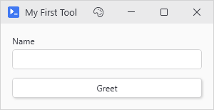
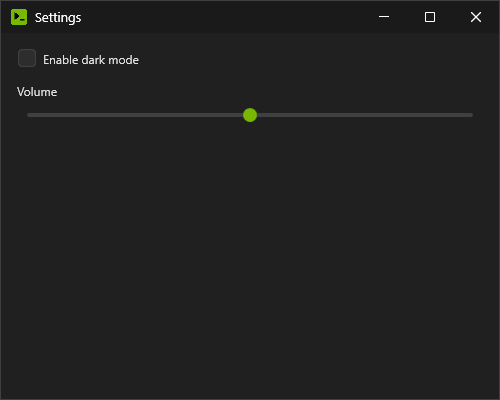
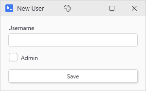

# New-UiWindow

## SYNOPSIS
Creates the main application window from a scriptblock of PsUi controls and waits until it's closed.

## SYNTAX

```
New-UiWindow [[-Title] <String>] -Content <ScriptBlock> [-Width <Int32>] [-Height <Int32>]
 [-MaxWidth <Int32>] [-MaxHeight <Int32>] [-Theme <String>] [-ThemePath <String>] [-IconFont <String>]
 [-NoIconFontFallback] [-NoResize] [-Icon <String>] [-LayoutMode <String>] [-MaxColumns <Int32>]
 [-TabAlignment <String>] [-MinimizeConsole] [-WPFProperties <Hashtable>] [-HideThemeButton]
 [-AsyncApartment <String>] [-NoImplicitCapture] [-PassThru] [-ExportOnClose] [-Splash] [-Logo <String>]
 [<CommonParameters>]
```

## DESCRIPTION
Builds a themed window from the controls declared in -Content and displays it. The call blocks the terminal until the window closes. The window itself runs on its own thread with its own session (control registry and captured values) so a second window opened from another console can't see the first one's controls. The theme is set for the whole process.
 
Variables and functions from the calling scope are captured at creation and injected where actions run, which is why a button can read $server from your script without any plumbing. Functions are copied across as text and redeclared. Values are not: runspaces are in process so a hashtable an action mutates is the same hashtable your script holds. The full model lives on the Threading and Variable Hydration page.

Without -Width or -Height the window sizes itself to its content, capped by -MaxWidth and -MaxHeight. -Width alone keeps the self-sizing for height.

## EXAMPLES

### EXAMPLE 1
```
# The smallest useful tool. Blocks here until the window is closed.
New-UiWindow -Title 'My First Tool' -Content {
    New-UiInput -Label 'Name' -Variable 'userName'
    New-UiButton -Text 'Greet' -Action {
        Write-Host "Hello, $userName!"
    }
}
```

<p align="center"></p>

### EXAMPLE 2
```
# Fixed size, dark theme, and no palette button so users can't restyle it
New-UiWindow -Title 'Settings' -Width 500 -Height 400 -Theme Dark -HideThemeButton -Content {
    New-UiToggle -Label 'Enable dark mode' -Variable 'darkMode'
    New-UiSlider -Label 'Volume' -Variable 'volume' -Minimum 0 -Maximum 100 -Default 50
}
```

<p align="center"></p>

### EXAMPLE 3
```
# A splash with the company logo while a heavy window builds; the logo doubles as the window icon
New-UiWindow -Title 'Inventory' -Splash -Logo 'C:\Tools\logo.png' -Content {
    Get-HotFix | New-UiDataGrid -Variable 'hotfixes' -Fill
}
```

### EXAMPLE 4
```
# -PassThru hands back the Window object immediately instead of blocking the console
$window = New-UiWindow -Title 'Monitor' -PassThru -Content {
    New-UiLabel -Text 'Watching...'
}
```

### EXAMPLE 5
```
# Click Save, close the window, and the captured values come back to the console
New-UiWindow -Title 'New User' -ExportOnClose -Content {
    New-UiInput -Label 'Username' -Variable 'user'
    New-UiToggle -Label 'Admin' -Variable 'isAdmin'
    New-UiButton -Text 'Save' -Capture 'savedUser', 'savedAdmin' -Action {
        $savedUser  = $user
        $savedAdmin = $isAdmin
        Write-Host "Saved $user"
    }
}
Write-Host "Creating $savedUser (admin: $savedAdmin)"
```

<p align="center"></p>

## PARAMETERS

### -Title
Titlebar text.

<details><summary>Type: String (optional)</summary>

```yaml
Type: String
Parameter Sets: (All)
Aliases:

Required: False
Position: 0
Default value: PowerShell GUI
Accept pipeline input: False
Accept wildcard characters: False
```

</details>

### -Content
A scriptblock of PsUi controls laid out in the order declared. Layout containers (New-UiPanel, New-UiGrid, New-UiTab) nest freely. An empty block is a terminating error, caught before any window appears.

When a command in the block writes a non-terminating error such as Get-ChildItem on a missing folder, New-UiWindow writes it out with the file and line in front of it and the window opens anyway. PsUi's own commands stop the window when they fail since a window missing a control is worse than no window, and so does a throw or a command run with -ErrorAction Stop. A failed expression such as 1 / 0 stops it too and so does a .NET method that throws. Passing -ErrorAction Continue to that PsUi command writes its error and opens the window without the control.

The block starts from New-UiWindow's own error action which is -ErrorAction when it is passed and the calling script's $ErrorActionPreference when it isn't. Under Stop the first error of any kind ends the block on that line and the window never opens. New-UiWindow then fails the way any command run with -ErrorAction Stop fails. Under SilentlyContinue or Ignore the errors stay hidden, and a PsUi control that fails to build, such as New-UiImage on a missing file, is left out while the rest of the block builds. Setting $ErrorActionPreference inside the block, or passing -ErrorAction to a single command, decides what happens to the errors a command writes, the way it does in any script. New-UiWindow's -ErrorVariable collects every error it writes.

A PsUi command given a parameter it rejects, such as New-UiProgress with -Maximum below -Minimum or New-UiLabel with a -Style outside its set, stops the window under any preference since the script called it wrong. When the calling script itself runs under SilentlyContinue, a window that stops that way prints no error, like any command that fails under that preference, and the error is waiting in $Error. -ErrorAction on a container such as New-UiPanel doesn't reach the commands inside its block, the same as -ErrorAction on ForEach-Object. 5.1 doesn't accept Ignore as $ErrorActionPreference, and a PsUi control given -ErrorAction Ignore sets that preference inside itself, so on 5.1 use SilentlyContinue in both places. -ErrorAction Ignore on New-UiWindow itself works on 5.1 and 7 alike.

<details><summary>Type: ScriptBlock (required)</summary>

```yaml
Type: ScriptBlock
Parameter Sets: (All)
Aliases:

Required: True
Position: Named
Default value: None
Accept pipeline input: False
Accept wildcard characters: False
```

</details>

### -Width
Width in pixels, 200 to 2000. Leave out both -Width and -Height and the window sizes itself to its content instead.

<details><summary>Type: Int32 (optional)</summary>

```yaml
Type: Int32
Parameter Sets: (All)
Aliases:

Required: False
Position: Named
Default value: None
Accept pipeline input: False
Accept wildcard characters: False
```

</details>

### -Height
Height in pixels, 150 to 1500. Giving -Width without -Height keeps the self-sizing behavior for height alone.

<details><summary>Type: Int32 (optional)</summary>

```yaml
Type: Int32
Parameter Sets: (All)
Aliases:

Required: False
Position: Named
Default value: None
Accept pipeline input: False
Accept wildcard characters: False
```

</details>

### -MaxWidth
Ceiling for the self-sized width, 300 to 2000. Only matters when the window is sizing itself to content.

<details><summary>Type: Int32 (optional)</summary>

```yaml
Type: Int32
Parameter Sets: (All)
Aliases:

Required: False
Position: Named
Default value: 800
Accept pipeline input: False
Accept wildcard characters: False
```

</details>

### -MaxHeight
Ceiling for the self-sized height, 200 to 1500.

<details><summary>Type: Int32 (optional)</summary>

```yaml
Type: Int32
Parameter Sets: (All)
Aliases:

Required: False
Position: Named
Default value: 900
Accept pipeline input: False
Accept wildcard characters: False
```

</details>

### -Theme
The theme name, any of the built-in ones or one registered with Register-UiTheme. Auto, the default, follows the OS light or dark setting.

<details><summary>Type: String (optional)</summary>

```yaml
Type: String
Parameter Sets: (All)
Aliases:

Required: False
Position: Named
Default value: Auto
Accept pipeline input: False
Accept wildcard characters: False
```

</details>

### -ThemePath
Path to a theme JSON file (the key set Get-UiThemeTemplate prints). The theme registers under the file's base name and this window opens in it.

<details><summary>Type: String (optional)</summary>

```yaml
Type: String
Parameter Sets: (All)
Aliases:

Required: False
Position: Named
Default value: None
Accept pipeline input: False
Accept wildcard characters: False
```

</details>

### -IconFont
Icon font for this window: Inherit (default, keeps whatever Set-PsUiIconFont last established), Auto (re-detects), SegoeMDL2, or SegoeFluentIcons. The previous active font comes back when the window closes.

<details><summary>Type: String (optional)</summary>

```yaml
Type: String
Parameter Sets: (All)
Aliases:
Accepted values: Inherit, Auto, SegoeMDL2, SegoeFluentIcons

Required: False
Position: Named
Default value: Inherit
Accept pipeline input: False
Accept wildcard characters: False
```

</details>

### -NoIconFontFallback
Pins the chosen icon font without a fallback chain so glyphs missing from it render as tofu instead of borrowing from the other Segoe font. On a Windows 10 box with only MDL2 installed there is no secondary font anyway. The remaining effect is tighter IntelliSense for -Icon names.

<details><summary>Type: SwitchParameter (optional)</summary>

```yaml
Type: SwitchParameter
Parameter Sets: (All)
Aliases:

Required: False
Position: Named
Default value: False
Accept pipeline input: False
Accept wildcard characters: False
```

</details>

### -NoResize
Locks the window size without a resize grip or edge dragging.

<details><summary>Type: SwitchParameter (optional)</summary>

```yaml
Type: SwitchParameter
Parameter Sets: (All)
Aliases:

Required: False
Position: Named
Default value: False
Accept pipeline input: False
Accept wildcard characters: False
```

</details>

### -Icon
Accepted for scripts written against an earlier build and currently unused. The titlebar icon comes from -Logo or from a generated icon in the theme colors when there is none.

<details><summary>Type: String (optional)</summary>

```yaml
Type: String
Parameter Sets: (All)
Aliases:

Required: False
Position: Named
Default value: None
Accept pipeline input: False
Accept wildcard characters: False
```

</details>

### -LayoutMode
Stack (default) lays controls out in a single column. Responsive wraps them side by side as the width allows, up to -MaxColumns across.

<details><summary>Type: String (optional)</summary>

```yaml
Type: String
Parameter Sets: (All)
Aliases:
Accepted values: Responsive, Stack

Required: False
Position: Named
Default value: Stack
Accept pipeline input: False
Accept wildcard characters: False
```

</details>

### -MaxColumns
Column ceiling for -LayoutMode Responsive, 1 to 4.

<details><summary>Type: Int32 (optional)</summary>

```yaml
Type: Int32
Parameter Sets: (All)
Aliases:

Required: False
Position: Named
Default value: 2
Accept pipeline input: False
Accept wildcard characters: False
```

</details>

### -TabAlignment
Left or Center placement for the tab headers when the content declares New-UiTab blocks.

<details><summary>Type: String (optional)</summary>

```yaml
Type: String
Parameter Sets: (All)
Aliases:
Accepted values: Left, Center

Required: False
Position: Named
Default value: Left
Accept pipeline input: False
Accept wildcard characters: False
```

</details>

### -MinimizeConsole
Minimizes the console window while the window is open and restores it on close.

<details><summary>Type: SwitchParameter (optional)</summary>

```yaml
Type: SwitchParameter
Parameter Sets: (All)
Aliases:

Required: False
Position: Named
Default value: False
Accept pipeline input: False
Accept wildcard characters: False
```

</details>

### -WPFProperties
Hashtable of extra WPF properties to set on the window, for anything not exposed as a parameter. Similar to every control's -WPFProperties. Dot notation reaches attached properties, and string values convert to the target type, so `Cursor = 'Hand'` and `ResizeMode = 'NoResize'` work as written. Tag is reserved (it holds the window chrome) and gets stripped with a warning. If a value won't convert, a [PsUi] Warning line prints on the console, and if a name doesn't resolve it's skipped silently.

<details><summary>Type: Hashtable (optional)</summary>

```yaml
Type: Hashtable
Parameter Sets: (All)
Aliases:

Required: False
Position: Named
Default value: None
Accept pipeline input: False
Accept wildcard characters: False
```

</details>

### -HideThemeButton
Removes the titlebar palette button when you'd rather users not restyle your tool.

<details><summary>Type: SwitchParameter (optional)</summary>

```yaml
Type: SwitchParameter
Parameter Sets: (All)
Aliases:

Required: False
Position: Named
Default value: False
Accept pipeline input: False
Accept wildcard characters: False
```

</details>

### -AsyncApartment
Which thread waits on each async action. MTA, the default, uses a thread pool thread. STA starts a new STA thread for every run, which is slower. The action itself runs on an STA thread in both modes so Windows Forms dialogs and COM objects that need one work under the default. The parameter stays for scripts that already pass it.

<details><summary>Type: String (optional)</summary>

```yaml
Type: String
Parameter Sets: (All)
Aliases:
Accepted values: STA, MTA

Required: False
Position: Named
Default value: MTA
Accept pipeline input: False
Accept wildcard characters: False
```

</details>

### -NoImplicitCapture
Skips capturing the calling scope's variables and functions at window creation. Startup gets faster in a console holding a large session, at a price: neither -Content nor the actions see your script's variables or functions. Control values still hydrate.

<details><summary>Type: SwitchParameter (optional)</summary>

```yaml
Type: SwitchParameter
Parameter Sets: (All)
Aliases: NoCapture

Required: False
Position: Named
Default value: False
Accept pipeline input: False
Accept wildcard characters: False
```

</details>

### -PassThru
Returns the Window object as soon as the window is up instead of blocking until it closes. The console stays usable while the window runs on its own thread.

<details><summary>Type: SwitchParameter (optional)</summary>

```yaml
Type: SwitchParameter
Parameter Sets: (All)
Aliases:

Required: False
Position: Named
Default value: False
Accept pipeline input: False
Accept wildcard characters: False
```

</details>

### -ExportOnClose
Writes the window's captured values back into the calling scope when the window closes. That covers what -Capture on a button or Invoke-UiAsync collected and anything stored with Set-UiCapturedVariable. Control values aren't collected at close. Ignored with -PassThru which returns before there is anything to export.

<details><summary>Type: SwitchParameter (optional)</summary>

```yaml
Type: SwitchParameter
Parameter Sets: (All)
Aliases:

Required: False
Position: Named
Default value: False
Accept pipeline input: False
Accept wildcard characters: False
```

</details>

### -Splash
Shows a small themed splash with an indeterminate progress bar while the window builds. Use it for a window that takes a moment to construct.

<details><summary>Type: SwitchParameter (optional)</summary>

```yaml
Type: SwitchParameter
Parameter Sets: (All)
Aliases: Loading

Required: False
Position: Named
Default value: False
Accept pipeline input: False
Accept wildcard characters: False
```

</details>

### -Logo
Path to an image used as the titlebar and taskbar icon, and as the splash centerpiece under -Splash. Without one, PsUi generates an icon from the theme colors.

<details><summary>Type: String (optional)</summary>

```yaml
Type: String
Parameter Sets: (All)
Aliases:

Required: False
Position: Named
Default value: None
Accept pipeline input: False
Accept wildcard characters: False
```

</details>

### CommonParameters
This cmdlet supports the common parameters: -Debug, -ErrorAction, -ErrorVariable, -InformationAction, -InformationVariable, -OutVariable, -OutBuffer, -PipelineVariable, -Verbose, -WarningAction, and -WarningVariable. For more information, see [about_CommonParameters](http://go.microsoft.com/fwlink/?LinkID=113216).

## INPUTS

## OUTPUTS

### System.Windows.Window

Only with -PassThru. Without it, the call has no output.

## NOTES

-Debug flips on PsUi's internal diagnostic stream for everything the window runs. -Verbose does the same for verbose output. Both are the first thing to reach for when a window misbehaves.

## RELATED LINKS

[Getting Started](Getting-Started)

[Threading and Variable Hydration](Threading-and-Variable-Hydration)

[Sessions and Window Isolation](Sessions-and-Window-Isolation)

[Theming and Custom Themes](Theming-and-Custom-Themes)

[New-UiChildWindow](New-UiChildWindow)

[Close-UiWindow](Close-UiWindow)
